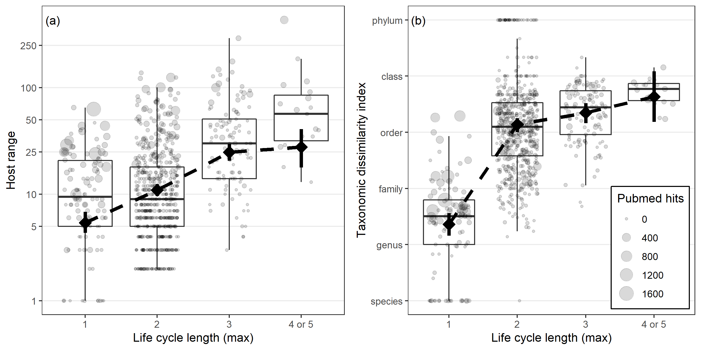
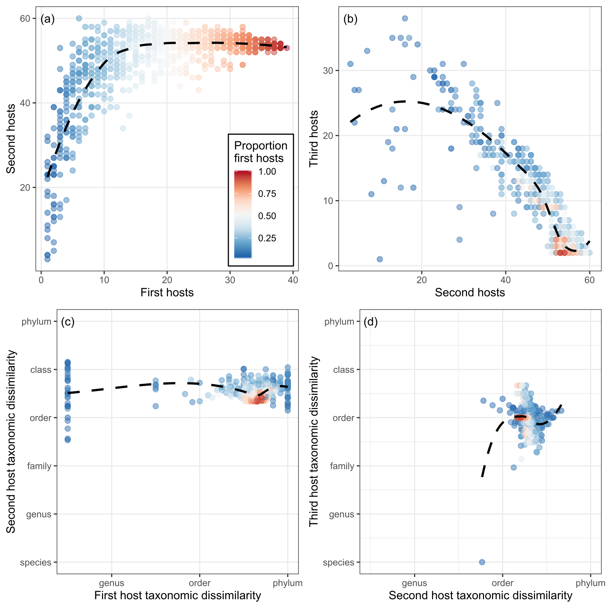

In this repository, we explore the evolution of generalism in complex life cycle parasites.

# Background

Parasitic worms with complex life cycles like tapeworms, flukes, nematodes and acanthocephalans must infect multiple hosts in succession, and the host used by one stage is often quite different from the host used by the next stage. For example, parasite larvae typically infect invertebrates while adults generally infect vertebrates. Infecting hosts with different physiologies and immune systems presumably entails challenges. We explore patterns of host use by complex life cycle parasites, define expected patterns with food webs, and assess the costs of being a generalist.

# Data

The main data source for this study is a [database](https://esajournals.onlinelibrary.wiley.com/doi/full/10.1002/ecy.1680) I published on the life cycles of parasitic worms. To that, I added data from a large set of [host-parasite records](https://www.nhm.ac.uk/research-curation/scientific-resources/taxonomy-systematics/host-parasites/) maintained by the Natural History Museum in London. Taxonomic information was obtained from [NCBI taxonomy](https://www.ncbi.nlm.nih.gov/taxonomy) and the [Open Tree of Life](https://tree.opentreeoflife.org/). Finally, food webs, which were used for simulating parasite life cycles, were obtained mainly from a [large compilation of webs](https://www.nature.com/articles/s41559-019-0899-x) as well as several other [published webs](data/webs).

# Analyses

Our study involved several analyses, and in each we examined two measures of generalism: (i) the number of host species a parasite has been recorded in and (ii) a taxonomic dissimilarity index proposed by Poulin and Mouillot [(2003)](https://doi.org/10.1017/S0031182003002993) that accounts for the relatedness of a parasite's hosts.

## Generalism at the parasite species level

First, we examined the relationship between generalism and life cycle length at the parasite species level. The detailed analysis can be found [here](analyses/species_level_analyses/sp_level_analysis_host_range_freq.md) for the number of host species and [here](analyses/species_level_analyses/sp_level_analysis_tax_dissim_freq.md) for the taxonomic dissimilarity index. The analysis confirmed that parasites with longer life cycles (i.e. they infect more obligate, successive hosts before reproducing) are more generalist.

## Generalism at the parasite stage level

Parasites may be generalists at the species level even when specializing at the stage level. We explored how generalism differs across the multiple stages of parasite life cycles; by stage we mean 'host in the life cycle', such as the first intermediate host, second intermediate host, third definitive host, etc. The detailed analysis can be found [here](analyses/stage_level_analyses/stage_level_analysis_host_range_freq.md) for the number of host species and [here](analyses/stage_level_analyses/stage_level_analysis_tax_dissim_freq.md) for the taxonomic dissimilarity index. We found that generalism was higher in the middle stages of long life cycles, such as the second intermediate host.

## Expected generalism from food webs

Are the trends we see across stages expected? These worms are transmitted trophically, i.e. one host is eaten by the next host, so we derived expectations by simulating parasite life cycles in real food webs. Our goal was see how well encounter-driven life cycles mimicked actual cycles. [These simulations](analyses/transmission_opportunity_foodwebs/quantifying_trans_opportunity_revised.md) recreated at least one notable feature of the data - a peak in generalism after one or two life cycles steps. This can be seen in the next plot, which has expected generalism overlaid on observed generalism; the expectations were color coded by whether a simulated cycle started in many or few of the available first hosts. Simulated cycles usually had higher generalism that observed ones.

Our analysis demonstrates how food webs determine potential host ranges and it suggests that realized ranges are smaller and thus presumably shaped by additional things besides just trophic ecology, such as tradeoffs that favor specialization. 

## Costs of generalism

At the parasite stage level, we assessed tradeoffs between generalism and two life history traits, growth and development time. The analyses are [here](analyses/tradeoffs_w_growth/growth_TO_host_range.md) and [here](analyses/tradeoffs_w_growth/growth_TO_tax_dissim.md). We found that parasite stages that spend less time developing and grow less in their host tended to infect a more taxonomically broad set of hosts. This is consistent with a tradeoff between generalism and parasite growth. 

# Conclusions

Our study showed that complex life cycle parasites are generalists - the longer the life cycle, the more generalist the parasite on average. Generalism at the parasite stage level peaked in 'middle' life stages (second and third intermediate hosts), which may follow from food web properties. Simulated life cycles suggested that real parasites infect fewer hosts than they likely encounter. One potential reason for this is that generalism bears a cost. Accordingly, we found that parasites grow less in life stages where they exhibit broad host use.

# Reference

Add when appropriate...