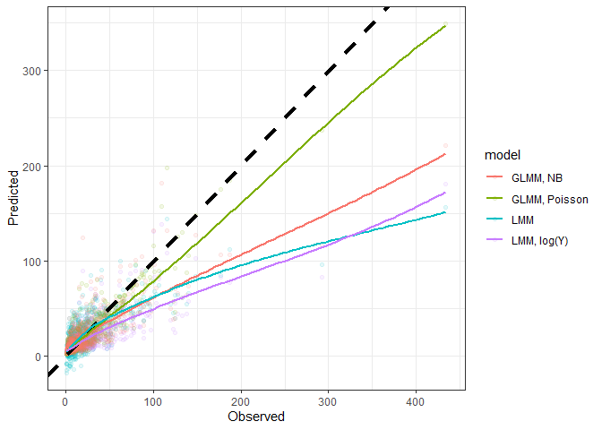
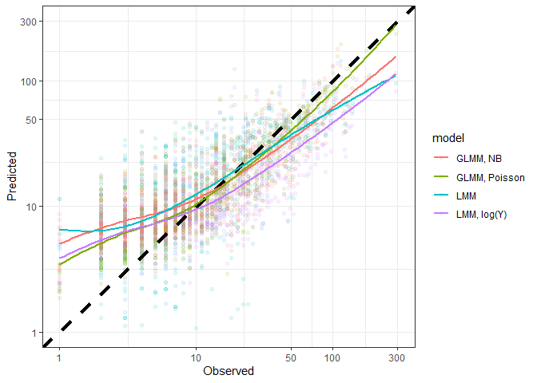
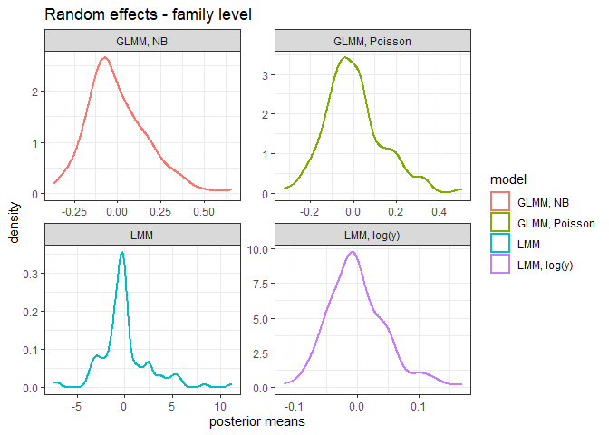
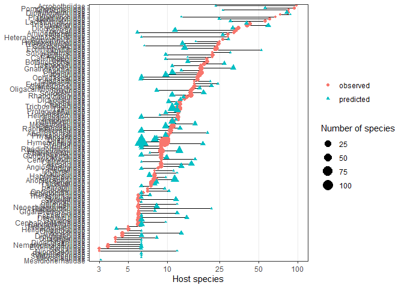

Species-level regression for host range
================
Dan Benesh
12/06/2020

# Background

One constraint on the evolution of complex life cycles is that parasites
need to infect diverse hosts with different physiologies and immune
systems. In other words, it is presumed to be costly to be a generalist.
However, whether complex life cycle parasites actually infect a wider
range of hosts has never been tested. The goal of this script is to test
whether longer life cycles (i.e. more successive hosts before
reproduction) are associated with a wider host range.

I used data from several sources: (1) [life cycle
database](https://esajournals.onlinelibrary.wiley.com/doi/full/10.1002/ecy.1680)
(for parasite life cycle lengths and host records), (2) host-parasite
database from the NHM London (to acquire a more exhaustive list of host
records for each parasite), (3) genbank sequences (to make a parasite
phylogeny), (4) NCBI taxonomy database (to get the basic taxonomic
hierarchy for every host species), and (5) PubMed (to estimate study
effort on each parasite species).

# Taxonomic regressions

Exploratory analyses were conducted
[elsewhere](sp_level_exploratory.Rmd), and we’ll test the significance
of the patterns observed with a series of mixed models. For both
measures of host specificity, I fit and compare models of increasing
complexity: (0) intercept-only, (1) allow taxonomically correlated
errors, (2) add study effort, (3) add life cycle length (max), and (4)
add life cycle length (min). In step 3, adding life cycle length, I
added the term as either a continuous predictor or as a factor. By
adding it as a factor, I am looking for evidence of non-linearity,
e.g. the difference between one- and two-host cycle parasites is not
the same as the difference between two- and three-host cycle parasites.

I used parasite taxonomy instead of phylogeny in the model because (1)
it is faster, (2) it is easier to explore where signal comes from
(i.e. which taxon instead of which tree node), and (3) describing how
the phylogeny was produced takes a lot of space in the manuscript.
[Elsewhere](sp_level_compareTax_Phylo.Rmd) I show that models with
phylogeny vs taxonomy as essentially the same.

## Host range

First, here are some stats reported in the tables of the manuscript. The
total number of unique host records was 17322 for 842 species. We start
by fitting the models to host range.

#### Model type

But before fitting a series of models for hypothesis testing, let’s try
different model formulations. We’ll try four different models: (1)
standard linear mixed model with untransformed response variable
(identity link), Gaussian errors, (2) same as model 1 but with log
transformed response, (3) generalized linear mixed model with a log
link, Poisson errors, and (4) same as model 3 but with negative binomial
errors allowing for overdispersion. These can all be fit with `lme4`.
For comparison of model structures, we fit the ‘best’ model identified
below, specifically one including taxonomy, study effort, and life cycle
length.

Given their different assumptions about data structure and expected
error distributions, these models cannot be compared with information
criteria or ratio tests. Rather, let’s visualize how well they
approximate the actual data.

Here is a plot with the predicted values on the y and the observed
values on the x. The dashed line is the 1:1 line (i.e. model predicts
data perfectly). It looks like the Poisson model comes closest to
matching the predictions. However, this relationship could be obscured
by a few high values, so we’ll log-transform the axes. Note that the
standard LMM model predicts negative values, which does not make sense.

<!-- -->

After log-transformation, we see that the Poisson model still seems to
perform best. All the models have trouble predicting low generalism
values, probably because there are an excess of ones or twos in the data
(just one or two known hosts in poorly studied species).

<!-- -->

Next, let’s look at the unstandardized residual plots. Again the Poisson
model seems to do best, as it has the most homogenous scatter around
zero.

<!-- -->

Another way to check model fit is to compare the distribution of
predictions with that of the observations. Here are density plots for
the predicted values. We can see that some models yield predictions more
closely matching the data than others, but it is a little hard to tell
with the substantial right-skew in the data.

<!-- -->

The differences may be easier to see on a log-scale. The LMM peaks at
values that are too high, while the neg binomial and log-transformed LMM
are both probably overconfident with too narrow a distribution. The
Poisson model appears best, though as stated before, seems to
overestimate low values.

<!-- -->

The main trend of interest is the increase in host range with life cycle
length. Let’s see what the models predict for this relationship,
compared to the observed pattern.

We can also look at whether variation in predicted values matches the
observed values. The next plot shows boxplots of the predicted and
observed values at every level of life cycle length. We see the closest
match with the observed values for the Poisson model. Other models
underestimate the variance (LMM) or do not match the medians well
(negative binomial regression).

<!-- -->

As a final model check, let’s look at the distribution of random
effects. Random effects are assumed to be normally distributed. We’ll
plot the estimated random effects for parasite family and genus, because
the model summarys suggested they had the largest effect on host range.

Here is a density plot for the distribution of random effects at the
family level. The family effects in all models seem to have a slight
positive skew. All these distributions appear ok, with the exception of
the standard LMM.

<!-- -->

Here is the density plot for the random genus effects. Again, the LMM
seems to stand out as poor, while the largest effects are seem for the
Poisson model.

<!-- -->

The Poisson model seems to be best, as its predictions best approximate
the observed data. A final consideration for Poisson models is
overdispersion, specifically that there is more variation in the data
than suggested by a Poisson distribution. This is common and probably
applies to these data, given that model predictions were generally less
variable than actual data. One way to address this is to fit an
observation-level random effect (see
[here](https://peerj.com/articles/616/)). If this observation-level
random effect is positive it indicates the residuals are more variable
than expected, i.e. overdispersion. When this model is fitted, we can
see if the observation-level random effect is positive. It is.

    ## Generalized linear mixed model fit by maximum likelihood (Laplace
    ##   Approximation) [glmerMod]
    ##  Family: poisson  ( log )
    ## Formula: 
    ## num_hosts_lcdb_nhm ~ zstudy_effort + lcl_max_fac + (1 | parasite_genus) +  
    ##     (1 | parasite_family) + (1 | parasite_order) + (1 | parasite_class) +  
    ##     (1 | parasite_phylum) + (1 | obs)
    ##    Data: dat
    ## 
    ##      AIC      BIC   logLik deviance df.resid 
    ##   6146.1   6198.2  -3062.0   6124.1      831 
    ## 
    ## Scaled residuals: 
    ##      Min       1Q   Median       3Q      Max 
    ## -1.24829 -0.36277 -0.02161  0.19065  0.87759 
    ## 
    ## Random effects:
    ##  Groups          Name        Variance  Std.Dev.
    ##  obs             (Intercept) 4.045e-01 0.636042
    ##  parasite_genus  (Intercept) 6.132e-02 0.247637
    ##  parasite_family (Intercept) 6.443e-02 0.253833
    ##  parasite_order  (Intercept) 6.641e-05 0.008149
    ##  parasite_class  (Intercept) 1.300e-06 0.001140
    ##  parasite_phylum (Intercept) 3.983e-06 0.001996
    ## Number of obs: 842, groups:  
    ## obs, 842; parasite_genus, 368; parasite_family, 115; parasite_order, 29; parasite_class, 6; parasite_phylum, 3
    ## 
    ## Fixed effects:
    ##               Estimate Std. Error z value Pr(>|z|)    
    ## (Intercept)     1.6879     0.1009  16.720  < 2e-16 ***
    ## zstudy_effort   0.9076     0.0440  20.629  < 2e-16 ***
    ## lcl_max_fac2    0.7150     0.1128   6.339 2.31e-10 ***
    ## lcl_max_fac3    1.5193     0.1267  11.991  < 2e-16 ***
    ## lcl_max_fac3+   1.6232     0.2261   7.178 7.10e-13 ***
    ## ---
    ## Signif. codes:  0 '***' 0.001 '**' 0.01 '*' 0.05 '.' 0.1 ' ' 1
    ## 
    ## Correlation of Fixed Effects:
    ##             (Intr) zstdy_ lcl__2 lcl__3
    ## zstudy_ffrt -0.259                     
    ## lcl_max_fc2 -0.890  0.255              
    ## lcl_max_fc3 -0.768  0.118  0.768       
    ## lcl_mx_fc3+ -0.408 -0.040  0.386  0.386
    ## convergence code: 0
    ## Model failed to converge with max|grad| = 0.10262 (tol = 0.001, component 1)

Accordingly, the model with overdispersion is considered better.

    ## Data: dat
    ## Models:
    ## reg3x: num_hosts_lcdb_nhm ~ zstudy_effort + lcl_max_fac + (1 | parasite_genus) + 
    ## reg3x:     (1 | parasite_family) + (1 | parasite_order) + (1 | parasite_class) + 
    ## reg3x:     (1 | parasite_phylum)
    ## reg5x: num_hosts_lcdb_nhm ~ zstudy_effort + lcl_max_fac + (1 | parasite_genus) + 
    ## reg5x:     (1 | parasite_family) + (1 | parasite_order) + (1 | parasite_class) + 
    ## reg5x:     (1 | parasite_phylum) + (1 | obs)
    ##       Df    AIC    BIC  logLik deviance  Chisq Chi Df Pr(>Chisq)    
    ## reg3x 10 8318.5 8365.9 -4149.3   8298.5                             
    ## reg5x 11 6146.1 6198.2 -3062.0   6124.1 2174.4      1  < 2.2e-16 ***
    ## ---
    ## Signif. codes:  0 '***' 0.001 '**' 0.01 '*' 0.05 '.' 0.1 ' ' 1

We can also calculate a dispersion factor, which is the ratio of the sum
squared pearson residuals to the residual df. When this ratio is \> 1,
it is an indication of overdispersion.

    ## Dispersion factor: 4.27

This is moderate overdispersion. A motivation to account for
overdispersion is that it can affect parameter estimates. Let’s look at
the estimated effect of life cycle length in the model with an
observation-level random effect, as compared to the other model
formulations. This ‘overdispersed’ model estimates mean host ranges that
are somewhat in between the standard Poisson and negative binomial
distribution, which seems reasonable. It is worth keeping in mind,
though, that observation-level random effects might not work well with
zero-inflation (see [here](https://peerj.com/articles/616/)), which
applies to this case (i.e. many parasites with low host ranges).

<!-- -->

Moving on to hypothesis testing, let’s include the observation-level
random effect in our model, but keep in mind that we might want to look
at models without this effect as well.

### Model building

As a reminder, I fit the following models: (0) intercept-only, with
observation-level random effect for residuals, (1) allow taxonomically
correlated errors, (2) add study effort, (3) add life cycle length
(max), and (4) add facultative life cycle (equivalent to adding min life
cycle length). In step 3, adding life cycle length, I added the term as
either a continuous predictor or as a factor. By adding it as a factor,
I am looking for evidence of non-linearity, e.g. the difference between
one- and two-host cycle parasites is not the same as the difference
between two- and three-host cycle parasites.

    ## Data: dat
    ## Models:
    ## reg1f: num_hosts_lcdb_nhm ~ (1 | obs) + (1 | parasite_genus) + (1 | 
    ## reg1f:     parasite_family) + (1 | parasite_order) + (1 | parasite_class) + 
    ## reg1f:     (1 | parasite_phylum)
    ## reg2f: num_hosts_lcdb_nhm ~ (1 | obs) + (1 | parasite_genus) + (1 | 
    ## reg2f:     parasite_family) + (1 | parasite_order) + (1 | parasite_class) + 
    ## reg2f:     (1 | parasite_phylum) + zstudy_effort
    ## reg3f: num_hosts_lcdb_nhm ~ (1 | obs) + (1 | parasite_genus) + (1 | 
    ## reg3f:     parasite_family) + (1 | parasite_order) + (1 | parasite_class) + 
    ## reg3f:     (1 | parasite_phylum) + zstudy_effort + lcl_max
    ## reg3.1f: num_hosts_lcdb_nhm ~ (1 | obs) + (1 | parasite_genus) + (1 | 
    ## reg3.1f:     parasite_family) + (1 | parasite_order) + (1 | parasite_class) + 
    ## reg3.1f:     (1 | parasite_phylum) + zstudy_effort + lcl_max_fac
    ## reg4f: num_hosts_lcdb_nhm ~ (1 | obs) + (1 | parasite_genus) + (1 | 
    ## reg4f:     parasite_family) + (1 | parasite_order) + (1 | parasite_class) + 
    ## reg4f:     (1 | parasite_phylum) + zstudy_effort + lcl_max_fac + facultative_lc
    ## reg5f: num_hosts_lcdb_nhm ~ (1 | obs) + (1 | parasite_genus) + (1 | 
    ## reg5f:     parasite_family) + (1 | parasite_order) + (1 | parasite_class) + 
    ## reg5f:     (1 | parasite_phylum) + zstudy_effort + lcl_max_fac + facultative_lc + 
    ## reg5f:     lcl_max_fac:facultative_lc
    ##         Df    AIC    BIC  logLik deviance    Chisq Chi Df Pr(>Chisq)    
    ## reg1f    7 6626.1 6659.2 -3306.0   6612.1                               
    ## reg2f    8 6270.0 6307.9 -3127.0   6254.0 358.1003      1  < 2.2e-16 ***
    ## reg3f    9 6153.3 6195.9 -3067.7   6135.3 118.6655      1  < 2.2e-16 ***
    ## reg3.1f 11 6146.1 6198.2 -3062.0   6124.1  11.2518      2   0.003603 ** 
    ## reg4f   12 6147.7 6204.5 -3061.8   6123.7   0.4005      1   0.526836    
    ## reg5f   13 6148.9 6210.5 -3061.4   6122.9   0.7749      1   0.378700    
    ## ---
    ## Signif. codes:  0 '***' 0.001 '**' 0.01 '*' 0.05 '.' 0.1 ' ' 1

These models are nested, so we can compare them with likelihood ratio
tests (table above). All model terms added are an improvement, except
the facultative life cycle terms. The best model as judged by AIC is the
one treating life cycle length as a categorical variable.

The estimated slope for life cycle length was 0.682, which corresponds
to a percent change of 97.87% total hosts per additional transmission
event.

However, the non-linear model was better, indicating this change is not
consistent across the life cycle. When we calculate the expected percent
change across the life cycle, we get the following values.

    ## 1st to 2nd host 2nd to 3rd host 3rd to 4th host 
    ##            1.04            1.24            0.11

The host range approximately doubles over the first two transmissions,
but it does not increase as much when a 4th host is added.

Here’s the summary of the “best” model

    ## Generalized linear mixed model fit by maximum likelihood (Laplace
    ##   Approximation) [glmerMod]
    ##  Family: poisson  ( log )
    ## Formula: num_hosts_lcdb_nhm ~ (1 | obs) + (1 | parasite_genus) + (1 |  
    ##     parasite_family) + (1 | parasite_order) + (1 | parasite_class) +  
    ##     (1 | parasite_phylum) + zstudy_effort + lcl_max_fac
    ##    Data: dat
    ## 
    ##      AIC      BIC   logLik deviance df.resid 
    ##   6146.1   6198.2  -3062.0   6124.1      831 
    ## 
    ## Scaled residuals: 
    ##      Min       1Q   Median       3Q      Max 
    ## -1.24829 -0.36277 -0.02161  0.19065  0.87759 
    ## 
    ## Random effects:
    ##  Groups          Name        Variance  Std.Dev.
    ##  obs             (Intercept) 4.045e-01 0.636042
    ##  parasite_genus  (Intercept) 6.132e-02 0.247637
    ##  parasite_family (Intercept) 6.443e-02 0.253833
    ##  parasite_order  (Intercept) 6.641e-05 0.008149
    ##  parasite_class  (Intercept) 1.300e-06 0.001140
    ##  parasite_phylum (Intercept) 3.983e-06 0.001996
    ## Number of obs: 842, groups:  
    ## obs, 842; parasite_genus, 368; parasite_family, 115; parasite_order, 29; parasite_class, 6; parasite_phylum, 3
    ## 
    ## Fixed effects:
    ##               Estimate Std. Error z value Pr(>|z|)    
    ## (Intercept)     1.6879     0.1009  16.720  < 2e-16 ***
    ## zstudy_effort   0.9076     0.0440  20.629  < 2e-16 ***
    ## lcl_max_fac2    0.7150     0.1128   6.339 2.31e-10 ***
    ## lcl_max_fac3    1.5193     0.1267  11.991  < 2e-16 ***
    ## lcl_max_fac3+   1.6232     0.2261   7.178 7.10e-13 ***
    ## ---
    ## Signif. codes:  0 '***' 0.001 '**' 0.01 '*' 0.05 '.' 0.1 ' ' 1
    ## 
    ## Correlation of Fixed Effects:
    ##             (Intr) zstdy_ lcl__2 lcl__3
    ## zstudy_ffrt -0.259                     
    ## lcl_max_fc2 -0.890  0.255              
    ## lcl_max_fc3 -0.768  0.118  0.768       
    ## lcl_mx_fc3+ -0.408 -0.040  0.386  0.386
    ## convergence code: 0
    ## Model failed to converge with max|grad| = 0.10262 (tol = 0.001, component 1)

Now let’s look explicitly at effect sizes by making an R2
table.

    ## # A tibble: 6 x 5
    ##   step                      df_used marg_r2 cond_r2 tax_var_explained
    ##   <chr>                       <dbl>   <dbl>   <dbl>             <dbl>
    ## 1 taxonomy                       NA   0       0.307             0.307
    ## 2 study effort                    1   0.348   0.615             0.267
    ## 3 life cycle length               1   0.451   0.570             0.119
    ## 4 life cycle length, factor       2   0.453   0.565             0.112
    ## 5 facultative life cycle          1   0.453   0.564             0.111
    ## 6 facultative x lcl               1   0.451   0.564             0.113

The R2 table suggests that even after accounting for life
cycle length, there is still an effect of taxonomy, explaining about 11%
of the variation. Let’s examine this a little more closely. At what
level is the variation? The parasite genus or family tends to be most
‘explanatory’.

<!-- -->

This suggests parasite genera and families exhibit different levels of
generalism, while at higher taxonomic levels this variance gets averaged
out, such that orders are not very different on average. Another way to
check this is by adding taxonomic levels sequentially, either forwards
or backwards and seeing how the variance explained changed. First, we go
from tips to root, starting with genus and adding additional levels.
Relatively little additional variation is explained beyond genus.

    ## # A tibble: 5 x 5
    ##   step   df_used marg_r2 cond_r2 tax_var_explained
    ##   <chr>    <dbl>   <dbl>   <dbl>             <dbl>
    ## 1 genus       NA   0.448   0.554             0.106
    ## 2 family       0   0.453   0.565             0.112
    ## 3 order        0   0.453   0.565             0.112
    ## 4 class        0   0.453   0.565             0.112
    ## 5 phylum       0   0.453   0.565             0.112

Here’s the same table, but the terms are adding in the opposite order,
so we’re going from root (phyla) to tips (genera). The biggest jumps
happen towards the tips with families and genera.

    ## # A tibble: 5 x 5
    ##   step   df_used marg_r2 cond_r2 tax_var_explained
    ##   <chr>    <dbl>   <dbl>   <dbl>             <dbl>
    ## 1 phylum      NA   0.437   0.437             0    
    ## 2 class        0   0.432   0.444             0.012
    ## 3 order        0   0.433   0.468             0.035
    ## 4 family       0   0.45    0.522             0.072
    ## 5 genus        0   0.453   0.565             0.112

Here is the same information, but plotted.

<!-- -->

So to understand what drives the taxonomic effect in the model, let’s
look at families. We’ll take the random effect estimates for parasite
family from the model accounting for study effort and life cycle length.
Then, we’ll sort them to see which families rank high (generalists) or
low (specialists).

Here are the families above the 90th percentile for generalism.

    ##           re           family re_quantile parasite_phylum
    ## 1  0.4885606  Amidostomatidae     top 10%        Nematoda
    ## 2  0.3799421       Acuariidae     top 10%        Nematoda
    ## 3  0.3795896 Echinorhynchidae     top 10%  Acanthocephala
    ## 4  0.3784180    Capillariidae     top 10%        Nematoda
    ## 5  0.3107453   Rhabdochonidae     top 10%        Nematoda
    ## 6  0.2907029  Hymenolepididae     top 10% Platyhelminthes
    ## 7  0.2861398    Paruterinidae     top 10% Platyhelminthes
    ## 8  0.2360812   Ophidascaridae     top 10%        Nematoda
    ## 9  0.1960244 Plagiorhynchidae     top 10%  Acanthocephala
    ## 10 0.1934122       Syngamidae     top 10%        Nematoda
    ## 11 0.1820773       Spiruridae     top 10%        Nematoda
    ## 12 0.1788819      Thelaziidae     top 10%        Nematoda

Here are the families below the 10th percentile for generalism
(specialists).

    ##            re              family re_quantile parasite_phylum
    ## 1  -0.2934192        Filaroididae  bottom 10%        Nematoda
    ## 2  -0.2536936        Lytocestidae  bottom 10% Platyhelminthes
    ## 3  -0.2334343        Strongylidae  bottom 10%        Nematoda
    ## 4  -0.2322263         Ascarididae  bottom 10%        Nematoda
    ## 5  -0.1951009       Dracunculidae  bottom 10%        Nematoda
    ## 6  -0.1947555    Metastrongylidae  bottom 10%        Nematoda
    ## 7  -0.1877008   Angiostrongylidae  bottom 10%        Nematoda
    ## 8  -0.1712635 Neoechinorhynchidae  bottom 10%  Acanthocephala
    ## 9  -0.1633503          Seuratidae  bottom 10%        Nematoda
    ## 10 -0.1539368    Echinobothriidae  bottom 10% Platyhelminthes
    ## 11 -0.1515080        Haemonchidae  bottom 10%        Nematoda
    ## 12 -0.1475625       Quadrigyridae  bottom 10%  Acanthocephala

In both lists, there are nematodes and cestodes, which shouldn’t be
surprising, since phyla had little explanatory value. There is also not
anything that obviously unites the groups. In other words, it is hard to
say why some families are more specialized than others.

Let’s plot the individual species in these family groups.

We can see that species from generalist or specialist families can still
be quite variable. That is, they do not consistently score higher or
lower than expected based on their life cycle length. Partly, this is
due to differences in study effort - families will be considered
generalists if they have many hosts and low study effort, and
specialists with few hosts and high study efforts. Also, the variability
is a reminder that taxonomy only explained 10% of the variation in
generalism in the final model.

<!-- -->

The patterns are clearer when we have boxplots for each family, but even
here the differences between generalist and specialist families are not
extremely pronounced.

<!-- -->

Not all specialist families (bottom 10%) have more restricted host
ranges than generalist families (top 10%). Rather than looking at raw
values, perhaps we can compare the median predicted value for a family
(given life cycle length and study effort) to the observed median host
range. That is the next plot, and it demonstrates how many more hosts
some families exhibit, on average, compared to expectations.

<!-- -->

Here’s a similar plot, but for all families, ordered by the observed
host range.

<!-- -->

Finally, I checked whether the random effect estimates are influenced by
the other taxonomic variables. I re-fit the model with only parasite
family, extracted the estimated family effects, and then compared them
to those from the full model. They are quite well correlated, suggesting
family-level generalism is estimated similarly, regardless of whether
other taxonomic levels are included in the model.

<!-- -->

# Conclusions

We determined that a generalized linear mixed model with Poisson errors
performs better on host counts than other models. Moreover, we found
that a model accounting for overdispersion was an improvement. Using
this as the model structure, we fit a series of models to test
hypotheses. We found that, after accounting for study effort, generalism
increased with life cycle length. However, this increase levels off,
such that parasites with the longest life cycles are not even more
extreme generalists. After accounting for study effort and life cycle
length, taxonomy still explained some of the variation in host range.
This mainly occurs due to differences among genera and families.
