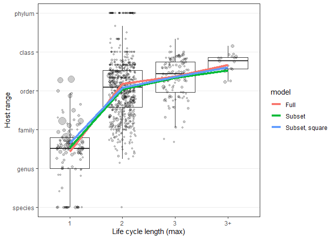
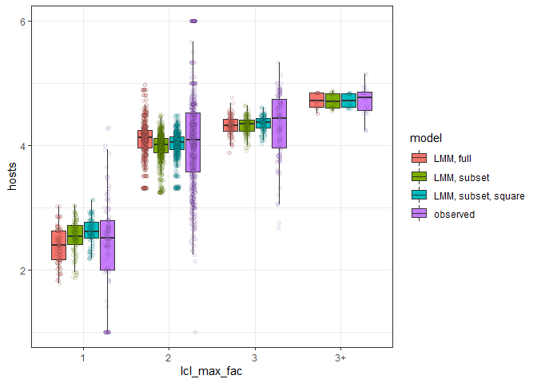
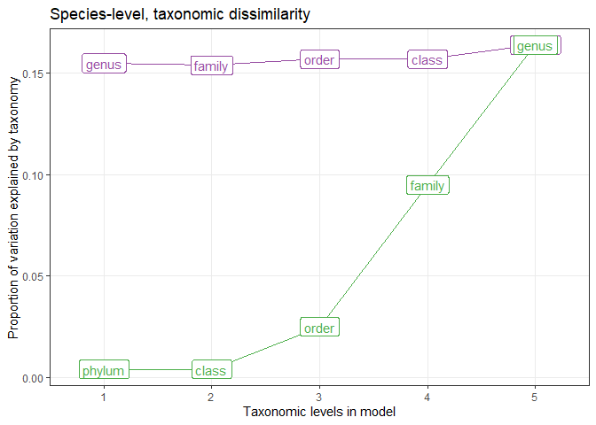
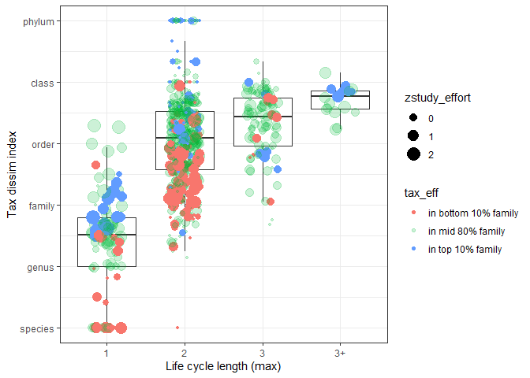
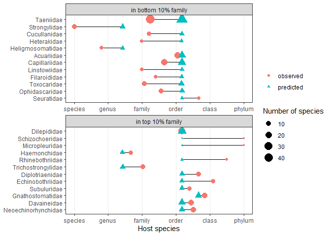

Species-level regression for taxonomic dissimilarity
================
Dan Benesh
12/06/2020

# Background

One constraint on the evolution of complex life cycles is that parasites
need to infect diverse hosts with different physiologies and immune
systems. In other words, it is presumed to be costly to be a generalist.
However, whether complex life cycle parasites actually infect a wider
range of hosts has never been tested. The goal of this script is to test
whether longer life cycles (i.e. more successive hosts before
reproduction) are associated with a wider host range.

I used data from several sources: (1) [life cycle
database](https://esajournals.onlinelibrary.wiley.com/doi/full/10.1002/ecy.1680)
(for parasite life cycle lengths and host records), (2) host-parasite
database from the NHM London (to acquire a more exhaustive list of host
records for each parasite), (3) genbank sequences (to make a parasite
phylogeny), (4) NCBI taxonomy database (to get the basic taxonomic
hierarchy for every host species), and (5) PubMed (to estimate study
effort on each parasite species).

# Taxonomic regressions

Exploratory analyses were conducted
[elsewhere](sp_level_exploratory.Rmd), and we’ll test the significance
of the patterns observed with a series of mixed models. For both
measures of host specificity, I fit and compare models of increasing
complexity: (0) intercept-only, (1) allow taxonomically correlated
errors, (2) add study effort, (3) add life cycle length (max), and (4)
add life cycle length (min). In step 3, adding life cycle length, I
added the term as either a continuous predictor or as a factor. By
adding it as a factor, I am looking for evidence of non-linearity,
e.g. the difference between one- and two-host cycle parasites is not
the same as the difference between two- and three-host cycle parasites.

I used parasite taxonomy instead of phylogeny in the model because (1)
it is faster, (2) it is easier to explore where signal comes from
(i.e. which taxon instead of which tree node), and (3) describing how
the phylogeny was produced takes a lot of space in the manuscript. Later
I show that models with phylogeny vs taxonomy as essentially the same.

## Model structure

In this notebook, I examine the taxonomic dissimilarity metric of
generalism. Before fitting the series of models to test hypotheses, I
would like to see how well the model structure captures patterns in
taxonomic dissimilarity. This metric is continuous between 1 (parasite
typically infects different species within genera) and 6 (parasite
infects different host phyla). However, there are a couple peaks at the
‘edges’ of the distribution.

<!-- -->

These peaks are mainly due to sampling biases. For example, a parasite
species is given a value of 6 if it has been recorded from just 2 hosts
from different phyla. To some degree, the study effort variable should
capture this variation. However, these peaks are offset from the overall
mean, so they may be difficult for a standard linear mixed model to
capture. I’m not sure what other model might capture this variation,
like zero-inflation (doesn’t account for both peaks) or censoring (the
variable is not censored, it has a fixed range by definition).

One possible solution is to exclude species with few recorded hosts,
which is probably due to sampling effort more than host specificity. We
can see this when we separate species that have 2 or more recorded hosts
or not. Those with few recorded hosts are particularly likely to be in
the extreme peaks, which is just a consequence of how the index is
calculated.

<!-- -->

There is a slight left skew in the data. This is somewhat improved by
square transformation.

<!-- -->

Thus, let’s compare three standard mixed models, one with the full data,
one excluding parasite species with few host species, and one with a
square transformation. The models include taxonomy, study effort, and
life cycle length.

    ## Linear mixed model fit by REML ['lmerMod']
    ## Formula: hsi_comb ~ zstudy_effort + lcl_max_fac + (1 | parasite_genus) +  
    ##     (1 | parasite_family) + (1 | parasite_order) + (1 | parasite_class) +  
    ##     (1 | parasite_phylum)
    ##    Data: dat
    ## 
    ## REML criterion at convergence: 1915
    ## 
    ## Scaled residuals: 
    ##     Min      1Q  Median      3Q     Max 
    ## -3.4654 -0.5191 -0.0004  0.5224  2.8752 
    ## 
    ## Random effects:
    ##  Groups          Name        Variance  Std.Dev. 
    ##  parasite_genus  (Intercept) 1.285e-01 3.585e-01
    ##  parasite_family (Intercept) 1.763e-02 1.328e-01
    ##  parasite_order  (Intercept) 8.601e-03 9.274e-02
    ##  parasite_class  (Intercept) 2.076e-09 4.557e-05
    ##  parasite_phylum (Intercept) 7.108e-03 8.431e-02
    ##  Residual                    4.517e-01 6.721e-01
    ## Number of obs: 842, groups:  
    ## parasite_genus, 368; parasite_family, 115; parasite_order, 29; parasite_class, 6; parasite_phylum, 3
    ## 
    ## Fixed effects:
    ##                Estimate Std. Error t value
    ## (Intercept)    2.427687   0.118680  20.456
    ## zstudy_effort -0.005445   0.043140  -0.126
    ## lcl_max_fac2   1.745713   0.112088  15.575
    ## lcl_max_fac3   1.940617   0.128566  15.094
    ## lcl_max_fac3+  2.241478   0.235274   9.527
    ## 
    ## Correlation of Fixed Effects:
    ##             (Intr) zstdy_ lcl__2 lcl__3
    ## zstudy_ffrt -0.145                     
    ## lcl_max_fc2 -0.797  0.199              
    ## lcl_max_fc3 -0.693  0.066  0.768       
    ## lcl_mx_fc3+ -0.352 -0.078  0.369  0.366
    ## convergence code: 0
    ## boundary (singular) fit: see ?isSingular

Here is a plot with the predicted values on the y and the observed
values on the x. The dashed line is the 1:1 line (i.e. model predicts
data perfectly). We can see that all models over- and under-estimate
extreme values.

<!-- -->

Next, let’s look at the unstandardized residual plots. They all look
quite similar. It is not too bad, though the model weaknesses are still
apparent (over- and under-estimating particular values).

<!-- -->

Another way to check model fit is to compare the distribution of
predictions with that of the observations. Here are density plots for
the predicted values. We can see that all model formulations yield
similar predicted distributions, suggesting transformations and removing
data do not have large effects. All predicted distributions are narrower
than the observed distribution.

<!-- -->

The pattern is perhaps better visualized without panelling. All models
appear similar.

<!-- -->

The main trend of interest is the increase in host range with life cycle
length. Let’s see what the models predict for this relationship,
compared to the observed pattern. They are all quite similar.

<!-- -->

However, when we make boxplots of the predicteds instead of just the
means, we see that the full model yields more variable predictions,
which is what we would expect given the inclusion of extreme values.

<!-- -->

As a final model check, let’s look at the distribution of random
effects. Random effects are assumed to be normally distributed. We’ll
plot the estimated random effects for parasite family and genus, because
the model summarys suggested they had the largest effect on host range.

Here is a density plot for the distribution of random effects at the
family level…

<!-- -->

…and here is the density plot for the random genus effects. In both
cases the patterns are pretty similar.

<!-- -->

Overall, the three tested model types are similar. Therefore, I would
opt for the most inclusive (no data subsetting) without transformations.

## Hypothesis testing

As a reminder, I fit the following models: (0) intercept-only, with
observation-level random effect for residuals, (1) allow taxonomically
correlated errors, (2) add study effort, (3) add life cycle length
(max), and (4) add whether cycle is facultative (equivalent to adding
min life cycle length). In step 3, adding life cycle length, I added the
term as either a continuous predictor or as a factor.

    ## Data: dat
    ## Models:
    ## reg1: hsi_comb ~ 1 + (1 | parasite_genus) + (1 | parasite_family) + 
    ## reg1:     (1 | parasite_order) + (1 | parasite_class) + (1 | parasite_phylum)
    ## reg2: hsi_comb ~ (1 | parasite_genus) + (1 | parasite_family) + (1 | 
    ## reg2:     parasite_order) + (1 | parasite_class) + (1 | parasite_phylum) + 
    ## reg2:     log10(pubs_pubmed_spname_group + 1)
    ## reg3: hsi_comb ~ (1 | parasite_genus) + (1 | parasite_family) + (1 | 
    ## reg3:     parasite_order) + (1 | parasite_class) + (1 | parasite_phylum) + 
    ## reg3:     log10(pubs_pubmed_spname_group + 1) + lcl_max
    ## reg3.1: hsi_comb ~ (1 | parasite_genus) + (1 | parasite_family) + (1 | 
    ## reg3.1:     parasite_order) + (1 | parasite_class) + (1 | parasite_phylum) + 
    ## reg3.1:     log10(pubs_pubmed_spname_group + 1) + lcl_max_fac
    ## reg4: hsi_comb ~ (1 | parasite_genus) + (1 | parasite_family) + (1 | 
    ## reg4:     parasite_order) + (1 | parasite_class) + (1 | parasite_phylum) + 
    ## reg4:     log10(pubs_pubmed_spname_group + 1) + lcl_max_fac + facultative_lc
    ## reg5: hsi_comb ~ (1 | parasite_genus) + (1 | parasite_family) + (1 | 
    ## reg5:     parasite_order) + (1 | parasite_class) + (1 | parasite_phylum) + 
    ## reg5:     log10(pubs_pubmed_spname_group + 1) + lcl_max_fac + facultative_lc + 
    ## reg5:     lcl_max_fac:facultative_lc
    ##        Df    AIC    BIC   logLik deviance   Chisq Chi Df Pr(>Chisq)    
    ## reg1    7 2078.4 2111.6 -1032.22   2064.4                              
    ## reg2    8 2080.4 2118.3 -1032.21   2064.4  0.0233      1    0.87863    
    ## reg3    9 2013.0 2055.7  -997.52   1995.0 69.3724      1    < 2e-16 ***
    ## reg3.1 11 1921.4 1973.5  -949.69   1899.4 95.6676      2    < 2e-16 ***
    ## reg4   12 1922.5 1979.4  -949.27   1898.5  0.8244      1    0.36390    
    ## reg5   13 1921.7 1983.2  -947.84   1895.7  2.8582      1    0.09091 .  
    ## ---
    ## Signif. codes:  0 '***' 0.001 '**' 0.01 '*' 0.05 '.' 0.1 ' ' 1

These models are nested, so we can compare them with likelihood ratio
tests (table above). Adding study effort is not an improvement, but
adding life cycle length, particularly as a factor, is a major
improvement. Splitting out the facultative species was not an
improvement. The best model as judged by AIC is the one treating life
cycle length as a categorical variable.

Here’s the summary of the “best” model

    ## Linear mixed model fit by REML ['lmerMod']
    ## Formula: hsi_comb ~ (1 | parasite_genus) + (1 | parasite_family) + (1 |  
    ##     parasite_order) + (1 | parasite_class) + (1 | parasite_phylum) +  
    ##     log10(pubs_pubmed_spname_group + 1) + lcl_max_fac
    ##    Data: dat
    ## 
    ## REML criterion at convergence: 1915
    ## 
    ## Scaled residuals: 
    ##     Min      1Q  Median      3Q     Max 
    ## -3.4654 -0.5191 -0.0004  0.5224  2.8752 
    ## 
    ## Random effects:
    ##  Groups          Name        Variance  Std.Dev. 
    ##  parasite_genus  (Intercept) 1.285e-01 3.585e-01
    ##  parasite_family (Intercept) 1.763e-02 1.328e-01
    ##  parasite_order  (Intercept) 8.601e-03 9.274e-02
    ##  parasite_class  (Intercept) 2.076e-09 4.557e-05
    ##  parasite_phylum (Intercept) 7.108e-03 8.431e-02
    ##  Residual                    4.517e-01 6.721e-01
    ## Number of obs: 842, groups:  
    ## parasite_genus, 368; parasite_family, 115; parasite_order, 29; parasite_class, 6; parasite_phylum, 3
    ## 
    ## Fixed effects:
    ##                                      Estimate Std. Error t value
    ## (Intercept)                          2.431073   0.125408  19.385
    ## log10(pubs_pubmed_spname_group + 1) -0.005445   0.043140  -0.126
    ## lcl_max_fac2                         1.745713   0.112088  15.575
    ## lcl_max_fac3                         1.940617   0.128566  15.094
    ## lcl_max_fac3+                        2.241478   0.235274   9.527
    ## 
    ## Correlation of Fixed Effects:
    ##             (Intr) l10(+1 lcl__2 lcl__3
    ## lg10(___+1) -0.351                     
    ## lcl_max_fc2 -0.796  0.199              
    ## lcl_max_fc3 -0.670  0.066  0.768       
    ## lcl_mx_fc3+ -0.317 -0.078  0.369  0.366
    ## convergence code: 0
    ## boundary (singular) fit: see ?isSingular

Now let’s look explicitly at effect sizes by making an R2
table.

    ## # A tibble: 6 x 5
    ##   step                      df_used marg_r2 cond_r2 tax_var_explained
    ##   <chr>                       <dbl>   <dbl>   <dbl>             <dbl>
    ## 1 taxonomy                       NA   0       0.598             0.598
    ## 2 study effort                    1   0       0.599             0.599
    ## 3 life cycle length               1   0.129   0.516             0.387
    ## 4 life cycle length, factor       2   0.379   0.543             0.164
    ## 5 facultative life cycle          1   0.383   0.543             0.16 
    ## 6 facultative x lcl               1   0.39    0.548             0.158

The most important factor is life cycle length - as a factor it explains
38% of the variation. Even after accounting for this, there is still an
appreciable amount of taxonomic variation, about 16%. Hopefully, this
taxonomic variation does not reflect certain taxa having extreme values.

Let’s check that. We re-fit the models excluding poorly studied
parasites (\< 3 recorded hosts) and then reproduce the R2
table.

    ## # A tibble: 5 x 5
    ##   step                      df_used marg_r2 cond_r2 tax_var_explained
    ##   <chr>                       <dbl>   <dbl>   <dbl>             <dbl>
    ## 1 taxonomy                       NA   0       0.617             0.617
    ## 2 study effort                    1   0.002   0.63              0.628
    ## 3 life cycle length               1   0.141   0.53              0.389
    ## 4 life cycle length, factor       2   0.402   0.54              0.138
    ## 5 facultative life cycle          1   0.403   0.54              0.137

The taxonomic effect decreases, but not much. Thus, we can be confident
that there is real variation among parasite taxa in this generalism
metric. Let’s explore that further. At what level does this variation
arise? Mainly between parasite genera.

<!-- -->

Another way to check this is by adding taxonomic levels sequentially,
either forwards or backwards and seeing how the variance explained
changed. First, we go from tips to root, starting with genus and adding
additional levels. Relatively little additional variation is explained
beyond genus.

    ## # A tibble: 5 x 5
    ##   step   df_used marg_r2 cond_r2 tax_var_explained
    ##   <chr>    <dbl>   <dbl>   <dbl>             <dbl>
    ## 1 genus       NA   0.396   0.551             0.155
    ## 2 family       0   0.393   0.547             0.154
    ## 3 order        0   0.389   0.546             0.157
    ## 4 class        0   0.389   0.546             0.157
    ## 5 phylum       0   0.379   0.543             0.164

Here’s the same table, but the terms are adding in the opposite order,
so we’re going from root (phyla) to tips (genera). The biggest jumps
happen towards the tips with families and genera.

    ## # A tibble: 5 x 5
    ##   step   df_used marg_r2 cond_r2 tax_var_explained
    ##   <chr>    <dbl>   <dbl>   <dbl>             <dbl>
    ## 1 phylum      NA   0.377   0.381             0.004
    ## 2 class        0   0.377   0.381             0.004
    ## 3 order        0   0.366   0.391             0.025
    ## 4 family       0   0.359   0.454             0.095
    ## 5 genus        0   0.379   0.543             0.164

Here is the same information, but plotted. Taxonomic dissimilarity
varies mostly between families and genera.

<!-- -->

Let’s look more closely at families, because with genera, there are
quite a few with just one or two species, such that the random effect
estimate are imprecise. We’ll take the random effect estimates for
parasite family from the model accounting for study effort and life
cycle length. Then, we’ll sort them to see which families rank high
(generalists) or low (specialists).

Here are the families above the 90th percentile for generalism.

    ##            re              family re_quantile parasite_phylum
    ## 1  0.10744536 Neoechinorhynchidae     top 10%  Acanthocephala
    ## 2  0.07867267         Davaineidae     top 10% Platyhelminthes
    ## 3  0.07648831    Gnathostomatidae     top 10%        Nematoda
    ## 4  0.07553458         Subuluridae     top 10%        Nematoda
    ## 5  0.07115942    Echinobothriidae     top 10% Platyhelminthes
    ## 6  0.06281480     Diplotriaenidae     top 10%        Nematoda
    ## 7  0.06175841  Trichostrongylidae     top 10%        Nematoda
    ## 8  0.06081608     Rhinebothriidae     top 10% Platyhelminthes
    ## 9  0.05660845        Haemonchidae     top 10%        Nematoda
    ## 10 0.05462376      Micropleuridae     top 10%        Nematoda
    ## 11 0.05268218     Schizochoeridae     top 10% Platyhelminthes
    ## 12 0.05260405         Dilepididae     top 10% Platyhelminthes

Here are the families below the 10th percentile for generalism
(specialists).

    ##             re           family re_quantile parasite_phylum
    ## 1  -0.19706127        Taeniidae  bottom 10% Platyhelminthes
    ## 2  -0.15449871     Strongylidae  bottom 10%        Nematoda
    ## 3  -0.09633162     Cucullanidae  bottom 10%        Nematoda
    ## 4  -0.07606337      Heterakidae  bottom 10%        Nematoda
    ## 5  -0.07344472 Heligmosomatidae  bottom 10%        Nematoda
    ## 6  -0.06894505       Acuariidae  bottom 10%        Nematoda
    ## 7  -0.05854610    Capillariidae  bottom 10%        Nematoda
    ## 8  -0.05731108     Linstowiidae  bottom 10% Platyhelminthes
    ## 9  -0.05461241     Filaroididae  bottom 10%        Nematoda
    ## 10 -0.05263023      Toxocaridae  bottom 10%        Nematoda
    ## 11 -0.05039012   Ophidascaridae  bottom 10%        Nematoda
    ## 12 -0.04902362       Seuratidae  bottom 10%        Nematoda

In both lists, there are nematodes and cestodes, which shouldn’t be
surprising, since phyla had little explanatory value. There is also not
anything that obviously unites the groups. In other words, it is hard to
say why some families are more specialized than others.

Let’s plot the individual species in these family groups.

We can see that species from generalist or specialist families separate
along the y-axis as expected, though they can still be quite variable.
The variability is a reminder that taxonomy only explained \<20% of the
variation in generalism in the final model.

<!-- -->

The patterns are clearer when we have boxplots for each family, but even
here the differences between generalist and specialist families are not
extremely pronounced.

<!-- -->

Not all specialist families (bottom 10%) have more restricted host
ranges than generalist families (top 10%). Rather than looking at raw
values, perhaps we can compare the median predicted value for a family
(given life cycle length and study effort) to the observed median
dissimilarity. That is the next plot, and it demonstrates how many more
hosts some families exhibit, on average, compared to expectations.

<!-- -->

Here’s a similar plot, but for all families, ordered by the observed
host range. This shows how the model predicts differences due to life
cycle lengths, but not the variation within life cycle lengths.

<!-- -->

Finally, I checked whether the random effect estimates are influenced by
the other taxonomic variables. I re-fit the model with only parasite
family, extracted the estimated family effects, and then compared them
to those from the full model. They are quite well correlated, though the
effect is much stronger (steeper) in the family-only model, because the
variance due to generic differences is assigned to family.

<!-- -->

# Conclusions

We compared three ways to structure the model and found that a standard
linear mixed model performed about as well as a model excluding
troublesome data or a model in which the response metric was square
transformed. Then, we fit a series of models to test hypotheses. We
found that taxonomic dissimilarity among hosts increases with parasite
life cycle length, but mainly from 1 to 2 hosts, and not much after
that. After accounting for life cycle length, taxonomy still explained
some of the variation in host range. Taxonomic variation mainly occurs
at the level of genera and families, i.e towards the tips.
