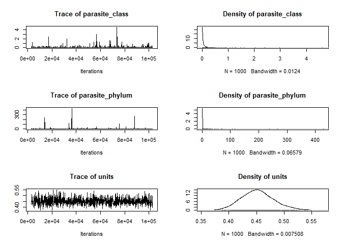

Comparing phylogenetic and taxonomic models
================
Dan Benesh
12/23/2019

In species-level analyses [here](sp_level_analysis_host_range_freq.Rmd)
and [here](sp_level_analysis_tax_dissim_freq.Rmd), I fit taxonomic mixed
models. That is, I treat taxonomic levels as random effects. A main
motivation for this is the ability to determine at what taxonomic level
variation in parasite generalism is observed. However, taxonomy is an
imperfect representation of the evolutionary relationships among
species. The goal of this notebook is to ensure that taxonomic and
phylogenetic models yield similar parameter estimates for what we’re
most interested in (the effect of life cycle length). For this, I turn
to `MCMCglmm`. It can fit both phylogenetic and taxonomic mixed models
in the same framework.

# Comparing phylogenetic and taxonomic mixed models with MCMCglmm

I’m not interested in testing a series of models. Rather, I’m interested
in comparing parameter estimates for the best model that uses either
taxonomy or phylogeny as random effects. That best model was the one
with life cycle length as a factor.

## Host range

We’ll start by fitting the taxonomic model.

### Taxonomic mixed model

    ## 
    ##                        MCMC iteration = 0
    ## 
    ##  Acceptance ratio for liability set 1 = 0.000385
    ## 
    ##                        MCMC iteration = 1000
    ## 
    ##  Acceptance ratio for liability set 1 = 0.389061
    ## 
    ##                        MCMC iteration = 2000
    ## 
    ##  Acceptance ratio for liability set 1 = 0.392640
    ## 
    ##                        MCMC iteration = 3000
    ## 
    ##  Acceptance ratio for liability set 1 = 0.397747
    ## 
    ##                        MCMC iteration = 4000
    ## 
    ##  Acceptance ratio for liability set 1 = 0.380733
    ## 
    ##                        MCMC iteration = 5000
    ## 
    ##  Acceptance ratio for liability set 1 = 0.379450
    ## 
    ##                        MCMC iteration = 6000
    ## 
    ##  Acceptance ratio for liability set 1 = 0.379531
    ## 
    ##                        MCMC iteration = 7000
    ## 
    ##  Acceptance ratio for liability set 1 = 0.380102
    ## 
    ##                        MCMC iteration = 8000
    ## 
    ##  Acceptance ratio for liability set 1 = 0.379605
    ## 
    ##                        MCMC iteration = 9000
    ## 
    ##  Acceptance ratio for liability set 1 = 0.380249
    ## 
    ##                        MCMC iteration = 10000
    ## 
    ##  Acceptance ratio for liability set 1 = 0.381329
    ## 
    ##                        MCMC iteration = 11000
    ## 
    ##  Acceptance ratio for liability set 1 = 0.380605
    ## 
    ##                        MCMC iteration = 12000
    ## 
    ##  Acceptance ratio for liability set 1 = 0.379139
    ## 
    ##                        MCMC iteration = 13000
    ## 
    ##  Acceptance ratio for liability set 1 = 0.380732
    ## 
    ##                        MCMC iteration = 14000
    ## 
    ##  Acceptance ratio for liability set 1 = 0.379490
    ## 
    ##                        MCMC iteration = 15000
    ## 
    ##  Acceptance ratio for liability set 1 = 0.379477
    ## 
    ##                        MCMC iteration = 16000
    ## 
    ##  Acceptance ratio for liability set 1 = 0.380605
    ## 
    ##                        MCMC iteration = 17000
    ## 
    ##  Acceptance ratio for liability set 1 = 0.379861
    ## 
    ##                        MCMC iteration = 18000
    ## 
    ##  Acceptance ratio for liability set 1 = 0.380075
    ## 
    ##                        MCMC iteration = 19000
    ## 
    ##  Acceptance ratio for liability set 1 = 0.380185
    ## 
    ##                        MCMC iteration = 20000
    ## 
    ##  Acceptance ratio for liability set 1 = 0.380920
    ## 
    ##                        MCMC iteration = 21000
    ## 
    ##  Acceptance ratio for liability set 1 = 0.380268
    ## 
    ##                        MCMC iteration = 22000
    ## 
    ##  Acceptance ratio for liability set 1 = 0.380330
    ## 
    ##                        MCMC iteration = 23000
    ## 
    ##  Acceptance ratio for liability set 1 = 0.379686
    ## 
    ##                        MCMC iteration = 24000
    ## 
    ##  Acceptance ratio for liability set 1 = 0.379868
    ## 
    ##                        MCMC iteration = 25000
    ## 
    ##  Acceptance ratio for liability set 1 = 0.380094
    ## 
    ##                        MCMC iteration = 26000
    ## 
    ##  Acceptance ratio for liability set 1 = 0.379413
    ## 
    ##                        MCMC iteration = 27000
    ## 
    ##  Acceptance ratio for liability set 1 = 0.378425
    ## 
    ##                        MCMC iteration = 28000
    ## 
    ##  Acceptance ratio for liability set 1 = 0.378904
    ## 
    ##                        MCMC iteration = 29000
    ## 
    ##  Acceptance ratio for liability set 1 = 0.380316
    ## 
    ##                        MCMC iteration = 30000
    ## 
    ##  Acceptance ratio for liability set 1 = 0.379574
    ## 
    ##                        MCMC iteration = 31000
    ## 
    ##  Acceptance ratio for liability set 1 = 0.378354
    ## 
    ##                        MCMC iteration = 32000
    ## 
    ##  Acceptance ratio for liability set 1 = 0.379652
    ## 
    ##                        MCMC iteration = 33000
    ## 
    ##  Acceptance ratio for liability set 1 = 0.380682
    ## 
    ##                        MCMC iteration = 34000
    ## 
    ##  Acceptance ratio for liability set 1 = 0.379538
    ## 
    ##                        MCMC iteration = 35000
    ## 
    ##  Acceptance ratio for liability set 1 = 0.380841
    ## 
    ##                        MCMC iteration = 36000
    ## 
    ##  Acceptance ratio for liability set 1 = 0.379988
    ## 
    ##                        MCMC iteration = 37000
    ## 
    ##  Acceptance ratio for liability set 1 = 0.380371
    ## 
    ##                        MCMC iteration = 38000
    ## 
    ##  Acceptance ratio for liability set 1 = 0.380861
    ## 
    ##                        MCMC iteration = 39000
    ## 
    ##  Acceptance ratio for liability set 1 = 0.380150
    ## 
    ##                        MCMC iteration = 40000
    ## 
    ##  Acceptance ratio for liability set 1 = 0.379873
    ## 
    ##                        MCMC iteration = 41000
    ## 
    ##  Acceptance ratio for liability set 1 = 0.378907
    ## 
    ##                        MCMC iteration = 42000
    ## 
    ##  Acceptance ratio for liability set 1 = 0.380325
    ## 
    ##                        MCMC iteration = 43000
    ## 
    ##  Acceptance ratio for liability set 1 = 0.379952
    ## 
    ##                        MCMC iteration = 44000
    ## 
    ##  Acceptance ratio for liability set 1 = 0.378574
    ## 
    ##                        MCMC iteration = 45000
    ## 
    ##  Acceptance ratio for liability set 1 = 0.379843
    ## 
    ##                        MCMC iteration = 46000
    ## 
    ##  Acceptance ratio for liability set 1 = 0.380603
    ## 
    ##                        MCMC iteration = 47000
    ## 
    ##  Acceptance ratio for liability set 1 = 0.380268
    ## 
    ##                        MCMC iteration = 48000
    ## 
    ##  Acceptance ratio for liability set 1 = 0.381159
    ## 
    ##                        MCMC iteration = 49000
    ## 
    ##  Acceptance ratio for liability set 1 = 0.379716
    ## 
    ##                        MCMC iteration = 50000
    ## 
    ##  Acceptance ratio for liability set 1 = 0.379846
    ## 
    ##                        MCMC iteration = 51000
    ## 
    ##  Acceptance ratio for liability set 1 = 0.380008
    ## 
    ##                        MCMC iteration = 52000
    ## 
    ##  Acceptance ratio for liability set 1 = 0.379012
    ## 
    ##                        MCMC iteration = 53000
    ## 
    ##  Acceptance ratio for liability set 1 = 0.380968
    ## 
    ##                        MCMC iteration = 54000
    ## 
    ##  Acceptance ratio for liability set 1 = 0.380561
    ## 
    ##                        MCMC iteration = 55000
    ## 
    ##  Acceptance ratio for liability set 1 = 0.380051
    ## 
    ##                        MCMC iteration = 56000
    ## 
    ##  Acceptance ratio for liability set 1 = 0.380735
    ## 
    ##                        MCMC iteration = 57000
    ## 
    ##  Acceptance ratio for liability set 1 = 0.379407
    ## 
    ##                        MCMC iteration = 58000
    ## 
    ##  Acceptance ratio for liability set 1 = 0.380124
    ## 
    ##                        MCMC iteration = 59000
    ## 
    ##  Acceptance ratio for liability set 1 = 0.380143
    ## 
    ##                        MCMC iteration = 60000
    ## 
    ##  Acceptance ratio for liability set 1 = 0.379605
    ## 
    ##                        MCMC iteration = 61000
    ## 
    ##  Acceptance ratio for liability set 1 = 0.379616
    ## 
    ##                        MCMC iteration = 62000
    ## 
    ##  Acceptance ratio for liability set 1 = 0.379736
    ## 
    ##                        MCMC iteration = 63000
    ## 
    ##  Acceptance ratio for liability set 1 = 0.380023
    ## 
    ##                        MCMC iteration = 64000
    ## 
    ##  Acceptance ratio for liability set 1 = 0.379866
    ## 
    ##                        MCMC iteration = 65000
    ## 
    ##  Acceptance ratio for liability set 1 = 0.379841
    ## 
    ##                        MCMC iteration = 66000
    ## 
    ##  Acceptance ratio for liability set 1 = 0.380083
    ## 
    ##                        MCMC iteration = 67000
    ## 
    ##  Acceptance ratio for liability set 1 = 0.380363
    ## 
    ##                        MCMC iteration = 68000
    ## 
    ##  Acceptance ratio for liability set 1 = 0.380063
    ## 
    ##                        MCMC iteration = 69000
    ## 
    ##  Acceptance ratio for liability set 1 = 0.380234
    ## 
    ##                        MCMC iteration = 70000
    ## 
    ##  Acceptance ratio for liability set 1 = 0.379960
    ## 
    ##                        MCMC iteration = 71000
    ## 
    ##  Acceptance ratio for liability set 1 = 0.379327
    ## 
    ##                        MCMC iteration = 72000
    ## 
    ##  Acceptance ratio for liability set 1 = 0.379659
    ## 
    ##                        MCMC iteration = 73000
    ## 
    ##  Acceptance ratio for liability set 1 = 0.380004
    ## 
    ##                        MCMC iteration = 74000
    ## 
    ##  Acceptance ratio for liability set 1 = 0.380443
    ## 
    ##                        MCMC iteration = 75000
    ## 
    ##  Acceptance ratio for liability set 1 = 0.379361
    ## 
    ##                        MCMC iteration = 76000
    ## 
    ##  Acceptance ratio for liability set 1 = 0.378947
    ## 
    ##                        MCMC iteration = 77000
    ## 
    ##  Acceptance ratio for liability set 1 = 0.379270
    ## 
    ##                        MCMC iteration = 78000
    ## 
    ##  Acceptance ratio for liability set 1 = 0.380220
    ## 
    ##                        MCMC iteration = 79000
    ## 
    ##  Acceptance ratio for liability set 1 = 0.380285
    ## 
    ##                        MCMC iteration = 80000
    ## 
    ##  Acceptance ratio for liability set 1 = 0.379880
    ## 
    ##                        MCMC iteration = 81000
    ## 
    ##  Acceptance ratio for liability set 1 = 0.379886
    ## 
    ##                        MCMC iteration = 82000
    ## 
    ##  Acceptance ratio for liability set 1 = 0.380574
    ## 
    ##                        MCMC iteration = 83000
    ## 
    ##  Acceptance ratio for liability set 1 = 0.380328
    ## 
    ##                        MCMC iteration = 84000
    ## 
    ##  Acceptance ratio for liability set 1 = 0.380392
    ## 
    ##                        MCMC iteration = 85000
    ## 
    ##  Acceptance ratio for liability set 1 = 0.379860
    ## 
    ##                        MCMC iteration = 86000
    ## 
    ##  Acceptance ratio for liability set 1 = 0.379713
    ## 
    ##                        MCMC iteration = 87000
    ## 
    ##  Acceptance ratio for liability set 1 = 0.381127
    ## 
    ##                        MCMC iteration = 88000
    ## 
    ##  Acceptance ratio for liability set 1 = 0.380042
    ## 
    ##                        MCMC iteration = 89000
    ## 
    ##  Acceptance ratio for liability set 1 = 0.379841
    ## 
    ##                        MCMC iteration = 90000
    ## 
    ##  Acceptance ratio for liability set 1 = 0.381240
    ## 
    ##                        MCMC iteration = 91000
    ## 
    ##  Acceptance ratio for liability set 1 = 0.379391
    ## 
    ##                        MCMC iteration = 92000
    ## 
    ##  Acceptance ratio for liability set 1 = 0.380519
    ## 
    ##                        MCMC iteration = 93000
    ## 
    ##  Acceptance ratio for liability set 1 = 0.380838
    ## 
    ##                        MCMC iteration = 94000
    ## 
    ##  Acceptance ratio for liability set 1 = 0.380261
    ## 
    ##                        MCMC iteration = 95000
    ## 
    ##  Acceptance ratio for liability set 1 = 0.380040
    ## 
    ##                        MCMC iteration = 96000
    ## 
    ##  Acceptance ratio for liability set 1 = 0.379753
    ## 
    ##                        MCMC iteration = 97000
    ## 
    ##  Acceptance ratio for liability set 1 = 0.380777
    ## 
    ##                        MCMC iteration = 98000
    ## 
    ##  Acceptance ratio for liability set 1 = 0.380938
    ## 
    ##                        MCMC iteration = 99000
    ## 
    ##  Acceptance ratio for liability set 1 = 0.380234
    ## 
    ##                        MCMC iteration = 100000
    ## 
    ##  Acceptance ratio for liability set 1 = 0.379593
    ## 
    ##                        MCMC iteration = 101000
    ## 
    ##  Acceptance ratio for liability set 1 = 0.380633
    ## 
    ##                        MCMC iteration = 102000
    ## 
    ##  Acceptance ratio for liability set 1 = 0.379374
    ## 
    ##                        MCMC iteration = 103000
    ## 
    ##  Acceptance ratio for liability set 1 = 0.379841

The chains for the random effects do not mix very well, which is not
surprising because the taxonomic terms are nested - if one explains more
variance, the other explains less. The fixed parameters (our interest)
mix well.

<!-- --><!-- -->

    ## 
    ##  Iterations = 3001:102901
    ##  Thinning interval  = 100
    ##  Sample size  = 1000 
    ## 
    ##  DIC: 5119.053 
    ## 
    ##  G-structure:  ~parasite_genus
    ## 
    ##                post.mean l-95% CI u-95% CI eff.samp
    ## parasite_genus   0.06503  0.01089   0.1264     1000
    ## 
    ##                ~parasite_family
    ## 
    ##                 post.mean l-95% CI u-95% CI eff.samp
    ## parasite_family   0.06206  0.01106   0.1202     1000
    ## 
    ##                ~parasite_order
    ## 
    ##                post.mean l-95% CI u-95% CI eff.samp
    ## parasite_order   0.02783 1.93e-08  0.09492     1000
    ## 
    ##                ~parasite_class
    ## 
    ##                post.mean  l-95% CI u-95% CI eff.samp
    ## parasite_class    0.2661 1.104e-07   0.5871    687.3
    ## 
    ##                ~parasite_phylum
    ## 
    ##                 post.mean l-95% CI u-95% CI eff.samp
    ## parasite_phylum     5.432 3.87e-08    15.97    113.8
    ## 
    ##  R-structure:  ~units
    ## 
    ##       post.mean l-95% CI u-95% CI eff.samp
    ## units    0.4099   0.3517   0.4765    745.4
    ## 
    ##  Location effects: num_hosts_lcdb_nhm ~ zstudy_effort + lcl_max_fac 
    ## 
    ##               post.mean l-95% CI u-95% CI eff.samp  pMCMC    
    ## (Intercept)     1.64954  0.04565  3.05239     2304  0.048 *  
    ## zstudy_effort   0.90910  0.82563  0.99593     1000 <0.001 ***
    ## lcl_max_fac2    0.67249  0.42394  0.91475     1263 <0.001 ***
    ## lcl_max_fac3    1.48052  1.20391  1.75681     1000 <0.001 ***
    ## lcl_max_fac3+   1.58023  1.09074  2.03260     1309 <0.001 ***
    ## ---
    ## Signif. codes:  0 '***' 0.001 '**' 0.01 '*' 0.05 '.' 0.1 ' ' 1

## Phylogenetic mixed model

Now we’ll fit the same model, but have the phylogeny as our random
effect.

    ## 
    ##                        MCMC iteration = 0
    ## 
    ##  Acceptance ratio for liability set 1 = 0.000416
    ## 
    ##                        MCMC iteration = 1000
    ## 
    ##  Acceptance ratio for liability set 1 = 0.381347
    ## 
    ##                        MCMC iteration = 2000
    ## 
    ##  Acceptance ratio for liability set 1 = 0.386726
    ## 
    ##                        MCMC iteration = 3000
    ## 
    ##  Acceptance ratio for liability set 1 = 0.395481
    ## 
    ##                        MCMC iteration = 4000
    ## 
    ##  Acceptance ratio for liability set 1 = 0.417268
    ## 
    ##                        MCMC iteration = 5000
    ## 
    ##  Acceptance ratio for liability set 1 = 0.418137
    ## 
    ##                        MCMC iteration = 6000
    ## 
    ##  Acceptance ratio for liability set 1 = 0.417356
    ## 
    ##                        MCMC iteration = 7000
    ## 
    ##  Acceptance ratio for liability set 1 = 0.418310
    ## 
    ##                        MCMC iteration = 8000
    ## 
    ##  Acceptance ratio for liability set 1 = 0.418344
    ## 
    ##                        MCMC iteration = 9000
    ## 
    ##  Acceptance ratio for liability set 1 = 0.419165
    ## 
    ##                        MCMC iteration = 10000
    ## 
    ##  Acceptance ratio for liability set 1 = 0.417536
    ## 
    ##                        MCMC iteration = 11000
    ## 
    ##  Acceptance ratio for liability set 1 = 0.418753
    ## 
    ##                        MCMC iteration = 12000
    ## 
    ##  Acceptance ratio for liability set 1 = 0.417930
    ## 
    ##                        MCMC iteration = 13000
    ## 
    ##  Acceptance ratio for liability set 1 = 0.418097
    ## 
    ##                        MCMC iteration = 14000
    ## 
    ##  Acceptance ratio for liability set 1 = 0.417448
    ## 
    ##                        MCMC iteration = 15000
    ## 
    ##  Acceptance ratio for liability set 1 = 0.416876
    ## 
    ##                        MCMC iteration = 16000
    ## 
    ##  Acceptance ratio for liability set 1 = 0.417518
    ## 
    ##                        MCMC iteration = 17000
    ## 
    ##  Acceptance ratio for liability set 1 = 0.418733
    ## 
    ##                        MCMC iteration = 18000
    ## 
    ##  Acceptance ratio for liability set 1 = 0.418753
    ## 
    ##                        MCMC iteration = 19000
    ## 
    ##  Acceptance ratio for liability set 1 = 0.418030
    ## 
    ##                        MCMC iteration = 20000
    ## 
    ##  Acceptance ratio for liability set 1 = 0.418088
    ## 
    ##                        MCMC iteration = 21000
    ## 
    ##  Acceptance ratio for liability set 1 = 0.417970
    ## 
    ##                        MCMC iteration = 22000
    ## 
    ##  Acceptance ratio for liability set 1 = 0.418969
    ## 
    ##                        MCMC iteration = 23000
    ## 
    ##  Acceptance ratio for liability set 1 = 0.417448
    ## 
    ##                        MCMC iteration = 24000
    ## 
    ##  Acceptance ratio for liability set 1 = 0.419042
    ## 
    ##                        MCMC iteration = 25000
    ## 
    ##  Acceptance ratio for liability set 1 = 0.418357
    ## 
    ##                        MCMC iteration = 26000
    ## 
    ##  Acceptance ratio for liability set 1 = 0.417378
    ## 
    ##                        MCMC iteration = 27000
    ## 
    ##  Acceptance ratio for liability set 1 = 0.418970
    ## 
    ##                        MCMC iteration = 28000
    ## 
    ##  Acceptance ratio for liability set 1 = 0.417808
    ## 
    ##                        MCMC iteration = 29000
    ## 
    ##  Acceptance ratio for liability set 1 = 0.416323
    ## 
    ##                        MCMC iteration = 30000
    ## 
    ##  Acceptance ratio for liability set 1 = 0.418131
    ## 
    ##                        MCMC iteration = 31000
    ## 
    ##  Acceptance ratio for liability set 1 = 0.417100
    ## 
    ##                        MCMC iteration = 32000
    ## 
    ##  Acceptance ratio for liability set 1 = 0.418423
    ## 
    ##                        MCMC iteration = 33000
    ## 
    ##  Acceptance ratio for liability set 1 = 0.417830
    ## 
    ##                        MCMC iteration = 34000
    ## 
    ##  Acceptance ratio for liability set 1 = 0.417754
    ## 
    ##                        MCMC iteration = 35000
    ## 
    ##  Acceptance ratio for liability set 1 = 0.418576
    ## 
    ##                        MCMC iteration = 36000
    ## 
    ##  Acceptance ratio for liability set 1 = 0.417960
    ## 
    ##                        MCMC iteration = 37000
    ## 
    ##  Acceptance ratio for liability set 1 = 0.417962
    ## 
    ##                        MCMC iteration = 38000
    ## 
    ##  Acceptance ratio for liability set 1 = 0.416888
    ## 
    ##                        MCMC iteration = 39000
    ## 
    ##  Acceptance ratio for liability set 1 = 0.418118
    ## 
    ##                        MCMC iteration = 40000
    ## 
    ##  Acceptance ratio for liability set 1 = 0.418496
    ## 
    ##                        MCMC iteration = 41000
    ## 
    ##  Acceptance ratio for liability set 1 = 0.417239
    ## 
    ##                        MCMC iteration = 42000
    ## 
    ##  Acceptance ratio for liability set 1 = 0.417724
    ## 
    ##                        MCMC iteration = 43000
    ## 
    ##  Acceptance ratio for liability set 1 = 0.418002
    ## 
    ##                        MCMC iteration = 44000
    ## 
    ##  Acceptance ratio for liability set 1 = 0.418006
    ## 
    ##                        MCMC iteration = 45000
    ## 
    ##  Acceptance ratio for liability set 1 = 0.418210
    ## 
    ##                        MCMC iteration = 46000
    ## 
    ##  Acceptance ratio for liability set 1 = 0.418314
    ## 
    ##                        MCMC iteration = 47000
    ## 
    ##  Acceptance ratio for liability set 1 = 0.417548
    ## 
    ##                        MCMC iteration = 48000
    ## 
    ##  Acceptance ratio for liability set 1 = 0.417409
    ## 
    ##                        MCMC iteration = 49000
    ## 
    ##  Acceptance ratio for liability set 1 = 0.418673
    ## 
    ##                        MCMC iteration = 50000
    ## 
    ##  Acceptance ratio for liability set 1 = 0.417863
    ## 
    ##                        MCMC iteration = 51000
    ## 
    ##  Acceptance ratio for liability set 1 = 0.417670
    ## 
    ##                        MCMC iteration = 52000
    ## 
    ##  Acceptance ratio for liability set 1 = 0.417933
    ## 
    ##                        MCMC iteration = 53000
    ## 
    ##  Acceptance ratio for liability set 1 = 0.417759
    ## 
    ##                        MCMC iteration = 54000
    ## 
    ##  Acceptance ratio for liability set 1 = 0.417666
    ## 
    ##                        MCMC iteration = 55000
    ## 
    ##  Acceptance ratio for liability set 1 = 0.417734
    ## 
    ##                        MCMC iteration = 56000
    ## 
    ##  Acceptance ratio for liability set 1 = 0.417077
    ## 
    ##                        MCMC iteration = 57000
    ## 
    ##  Acceptance ratio for liability set 1 = 0.418202
    ## 
    ##                        MCMC iteration = 58000
    ## 
    ##  Acceptance ratio for liability set 1 = 0.417722
    ## 
    ##                        MCMC iteration = 59000
    ## 
    ##  Acceptance ratio for liability set 1 = 0.417745
    ## 
    ##                        MCMC iteration = 60000
    ## 
    ##  Acceptance ratio for liability set 1 = 0.418337
    ## 
    ##                        MCMC iteration = 61000
    ## 
    ##  Acceptance ratio for liability set 1 = 0.418372
    ## 
    ##                        MCMC iteration = 62000
    ## 
    ##  Acceptance ratio for liability set 1 = 0.417963
    ## 
    ##                        MCMC iteration = 63000
    ## 
    ##  Acceptance ratio for liability set 1 = 0.417449
    ## 
    ##                        MCMC iteration = 64000
    ## 
    ##  Acceptance ratio for liability set 1 = 0.418952
    ## 
    ##                        MCMC iteration = 65000
    ## 
    ##  Acceptance ratio for liability set 1 = 0.418603
    ## 
    ##                        MCMC iteration = 66000
    ## 
    ##  Acceptance ratio for liability set 1 = 0.418160
    ## 
    ##                        MCMC iteration = 67000
    ## 
    ##  Acceptance ratio for liability set 1 = 0.417906
    ## 
    ##                        MCMC iteration = 68000
    ## 
    ##  Acceptance ratio for liability set 1 = 0.416316
    ## 
    ##                        MCMC iteration = 69000
    ## 
    ##  Acceptance ratio for liability set 1 = 0.418106
    ## 
    ##                        MCMC iteration = 70000
    ## 
    ##  Acceptance ratio for liability set 1 = 0.418931
    ## 
    ##                        MCMC iteration = 71000
    ## 
    ##  Acceptance ratio for liability set 1 = 0.417658
    ## 
    ##                        MCMC iteration = 72000
    ## 
    ##  Acceptance ratio for liability set 1 = 0.417847
    ## 
    ##                        MCMC iteration = 73000
    ## 
    ##  Acceptance ratio for liability set 1 = 0.418172
    ## 
    ##                        MCMC iteration = 74000
    ## 
    ##  Acceptance ratio for liability set 1 = 0.418247
    ## 
    ##                        MCMC iteration = 75000
    ## 
    ##  Acceptance ratio for liability set 1 = 0.417662
    ## 
    ##                        MCMC iteration = 76000
    ## 
    ##  Acceptance ratio for liability set 1 = 0.417958
    ## 
    ##                        MCMC iteration = 77000
    ## 
    ##  Acceptance ratio for liability set 1 = 0.417745
    ## 
    ##                        MCMC iteration = 78000
    ## 
    ##  Acceptance ratio for liability set 1 = 0.417074
    ## 
    ##                        MCMC iteration = 79000
    ## 
    ##  Acceptance ratio for liability set 1 = 0.417354
    ## 
    ##                        MCMC iteration = 80000
    ## 
    ##  Acceptance ratio for liability set 1 = 0.417362
    ## 
    ##                        MCMC iteration = 81000
    ## 
    ##  Acceptance ratio for liability set 1 = 0.417369
    ## 
    ##                        MCMC iteration = 82000
    ## 
    ##  Acceptance ratio for liability set 1 = 0.417242
    ## 
    ##                        MCMC iteration = 83000
    ## 
    ##  Acceptance ratio for liability set 1 = 0.418379
    ## 
    ##                        MCMC iteration = 84000
    ## 
    ##  Acceptance ratio for liability set 1 = 0.417391
    ## 
    ##                        MCMC iteration = 85000
    ## 
    ##  Acceptance ratio for liability set 1 = 0.417928
    ## 
    ##                        MCMC iteration = 86000
    ## 
    ##  Acceptance ratio for liability set 1 = 0.417876
    ## 
    ##                        MCMC iteration = 87000
    ## 
    ##  Acceptance ratio for liability set 1 = 0.417758
    ## 
    ##                        MCMC iteration = 88000
    ## 
    ##  Acceptance ratio for liability set 1 = 0.418409
    ## 
    ##                        MCMC iteration = 89000
    ## 
    ##  Acceptance ratio for liability set 1 = 0.417272
    ## 
    ##                        MCMC iteration = 90000
    ## 
    ##  Acceptance ratio for liability set 1 = 0.418461
    ## 
    ##                        MCMC iteration = 91000
    ## 
    ##  Acceptance ratio for liability set 1 = 0.418232
    ## 
    ##                        MCMC iteration = 92000
    ## 
    ##  Acceptance ratio for liability set 1 = 0.418821
    ## 
    ##                        MCMC iteration = 93000
    ## 
    ##  Acceptance ratio for liability set 1 = 0.418376
    ## 
    ##                        MCMC iteration = 94000
    ## 
    ##  Acceptance ratio for liability set 1 = 0.417519
    ## 
    ##                        MCMC iteration = 95000
    ## 
    ##  Acceptance ratio for liability set 1 = 0.417637
    ## 
    ##                        MCMC iteration = 96000
    ## 
    ##  Acceptance ratio for liability set 1 = 0.417584
    ## 
    ##                        MCMC iteration = 97000
    ## 
    ##  Acceptance ratio for liability set 1 = 0.417751
    ## 
    ##                        MCMC iteration = 98000
    ## 
    ##  Acceptance ratio for liability set 1 = 0.417728
    ## 
    ##                        MCMC iteration = 99000
    ## 
    ##  Acceptance ratio for liability set 1 = 0.417843
    ## 
    ##                        MCMC iteration = 100000
    ## 
    ##  Acceptance ratio for liability set 1 = 0.417519
    ## 
    ##                        MCMC iteration = 101000
    ## 
    ##  Acceptance ratio for liability set 1 = 0.417403
    ## 
    ##                        MCMC iteration = 102000
    ## 
    ##  Acceptance ratio for liability set 1 = 0.417441
    ## 
    ##                        MCMC iteration = 103000
    ## 
    ##  Acceptance ratio for liability set 1 = 0.417014

The phylogenetic effect mixes ok, though it could be run longer, and the
fixed effects look ok.

<!-- -->

    ## 
    ##  Iterations = 3001:102901
    ##  Thinning interval  = 100
    ##  Sample size  = 1000 
    ## 
    ##  DIC: 5123.176 
    ## 
    ##  G-structure:  ~tree_tips
    ## 
    ##           post.mean l-95% CI u-95% CI eff.samp
    ## tree_tips    0.3118  0.08272   0.5998     1000
    ## 
    ##  R-structure:  ~units
    ## 
    ##       post.mean l-95% CI u-95% CI eff.samp
    ## units    0.4629    0.404   0.5221     1000
    ## 
    ##  Location effects: num_hosts_lcdb_nhm ~ zstudy_effort + lcl_max_fac 
    ## 
    ##               post.mean l-95% CI u-95% CI eff.samp  pMCMC    
    ## (Intercept)      1.5886   1.0122   2.1565     1000 <0.001 ***
    ## zstudy_effort    0.8759   0.7925   0.9614     1229 <0.001 ***
    ## lcl_max_fac2     0.7350   0.4875   0.9613     1000 <0.001 ***
    ## lcl_max_fac3     1.5824   1.3298   1.8648     1000 <0.001 ***
    ## lcl_max_fac3+    1.8097   1.3623   2.3030     1000 <0.001 ***
    ## ---
    ## Signif. codes:  0 '***' 0.001 '**' 0.01 '*' 0.05 '.' 0.1 ' ' 1

Now let’s compare the parameter estimates from these models. They are
very similar, both in their value and their uncertainty, indicating that
the taxonomic and phylogenetic models returned very similar results.

<!-- -->

Given the similar fixed effect values, we would expect the variance
explained by taxonomy and phylogeny to be similar. Here is the chain for
the phylogenetic heritability, i.e. the variance explained by the tree
as a portion of the total variance. It is clearly positive (\>0).

<!-- -->

    ## 
    ## Iterations = 3001:102901
    ## Thinning interval = 100 
    ## Number of chains = 1 
    ## Sample size per chain = 1000 
    ## 
    ## 1. Empirical mean and standard deviation for each variable,
    ##    plus standard error of the mean:
    ## 
    ##           Mean             SD       Naive SE Time-series SE 
    ##       0.386131       0.108581       0.003434       0.003434 
    ## 
    ## 2. Quantiles for each variable:
    ## 
    ##   2.5%    25%    50%    75%  97.5% 
    ## 0.1732 0.3132 0.3901 0.4627 0.5955

Now we look at the same metric from the taxonomic model. It is a little
lower, maybe closer to 0.2. Nonetheless, their closeness is reassuring,
as it indicates the information content in parasite taxonomy and
phylogeny is similar with regards to host range.

<!-- -->

    ## 
    ## Iterations = 3001:102901
    ## Thinning interval = 100 
    ## Number of chains = 1 
    ## Sample size per chain = 1000 
    ## 
    ## 1. Empirical mean and standard deviation for each variable,
    ##    plus standard error of the mean:
    ## 
    ##           Mean             SD       Naive SE Time-series SE 
    ##       0.531622       0.227110       0.007182       0.012781 
    ## 
    ## 2. Quantiles for each variable:
    ## 
    ##   2.5%    25%    50%    75%  97.5% 
    ## 0.2183 0.3517 0.4756 0.6882 0.9922

## Host taxonomic dissimilarity

Now we’ll conduct the same exercise with our second generalism metric,
taxonomic dissimilarity.

### Taxonomic mixed model

    ## 
    ##                        MCMC iteration = 0
    ## 
    ##                        MCMC iteration = 1000
    ## 
    ##                        MCMC iteration = 2000
    ## 
    ##                        MCMC iteration = 3000
    ## 
    ##                        MCMC iteration = 4000
    ## 
    ##                        MCMC iteration = 5000
    ## 
    ##                        MCMC iteration = 6000
    ## 
    ##                        MCMC iteration = 7000
    ## 
    ##                        MCMC iteration = 8000
    ## 
    ##                        MCMC iteration = 9000
    ## 
    ##                        MCMC iteration = 10000
    ## 
    ##                        MCMC iteration = 11000
    ## 
    ##                        MCMC iteration = 12000
    ## 
    ##                        MCMC iteration = 13000
    ## 
    ##                        MCMC iteration = 14000
    ## 
    ##                        MCMC iteration = 15000
    ## 
    ##                        MCMC iteration = 16000
    ## 
    ##                        MCMC iteration = 17000
    ## 
    ##                        MCMC iteration = 18000
    ## 
    ##                        MCMC iteration = 19000
    ## 
    ##                        MCMC iteration = 20000
    ## 
    ##                        MCMC iteration = 21000
    ## 
    ##                        MCMC iteration = 22000
    ## 
    ##                        MCMC iteration = 23000
    ## 
    ##                        MCMC iteration = 24000
    ## 
    ##                        MCMC iteration = 25000
    ## 
    ##                        MCMC iteration = 26000
    ## 
    ##                        MCMC iteration = 27000
    ## 
    ##                        MCMC iteration = 28000
    ## 
    ##                        MCMC iteration = 29000
    ## 
    ##                        MCMC iteration = 30000
    ## 
    ##                        MCMC iteration = 31000
    ## 
    ##                        MCMC iteration = 32000
    ## 
    ##                        MCMC iteration = 33000
    ## 
    ##                        MCMC iteration = 34000
    ## 
    ##                        MCMC iteration = 35000
    ## 
    ##                        MCMC iteration = 36000
    ## 
    ##                        MCMC iteration = 37000
    ## 
    ##                        MCMC iteration = 38000
    ## 
    ##                        MCMC iteration = 39000
    ## 
    ##                        MCMC iteration = 40000
    ## 
    ##                        MCMC iteration = 41000
    ## 
    ##                        MCMC iteration = 42000
    ## 
    ##                        MCMC iteration = 43000
    ## 
    ##                        MCMC iteration = 44000
    ## 
    ##                        MCMC iteration = 45000
    ## 
    ##                        MCMC iteration = 46000
    ## 
    ##                        MCMC iteration = 47000
    ## 
    ##                        MCMC iteration = 48000
    ## 
    ##                        MCMC iteration = 49000
    ## 
    ##                        MCMC iteration = 50000
    ## 
    ##                        MCMC iteration = 51000
    ## 
    ##                        MCMC iteration = 52000
    ## 
    ##                        MCMC iteration = 53000
    ## 
    ##                        MCMC iteration = 54000
    ## 
    ##                        MCMC iteration = 55000
    ## 
    ##                        MCMC iteration = 56000
    ## 
    ##                        MCMC iteration = 57000
    ## 
    ##                        MCMC iteration = 58000
    ## 
    ##                        MCMC iteration = 59000
    ## 
    ##                        MCMC iteration = 60000
    ## 
    ##                        MCMC iteration = 61000
    ## 
    ##                        MCMC iteration = 62000
    ## 
    ##                        MCMC iteration = 63000
    ## 
    ##                        MCMC iteration = 64000
    ## 
    ##                        MCMC iteration = 65000
    ## 
    ##                        MCMC iteration = 66000
    ## 
    ##                        MCMC iteration = 67000
    ## 
    ##                        MCMC iteration = 68000
    ## 
    ##                        MCMC iteration = 69000
    ## 
    ##                        MCMC iteration = 70000
    ## 
    ##                        MCMC iteration = 71000
    ## 
    ##                        MCMC iteration = 72000
    ## 
    ##                        MCMC iteration = 73000
    ## 
    ##                        MCMC iteration = 74000
    ## 
    ##                        MCMC iteration = 75000
    ## 
    ##                        MCMC iteration = 76000
    ## 
    ##                        MCMC iteration = 77000
    ## 
    ##                        MCMC iteration = 78000
    ## 
    ##                        MCMC iteration = 79000
    ## 
    ##                        MCMC iteration = 80000
    ## 
    ##                        MCMC iteration = 81000
    ## 
    ##                        MCMC iteration = 82000
    ## 
    ##                        MCMC iteration = 83000
    ## 
    ##                        MCMC iteration = 84000
    ## 
    ##                        MCMC iteration = 85000
    ## 
    ##                        MCMC iteration = 86000
    ## 
    ##                        MCMC iteration = 87000
    ## 
    ##                        MCMC iteration = 88000
    ## 
    ##                        MCMC iteration = 89000
    ## 
    ##                        MCMC iteration = 90000
    ## 
    ##                        MCMC iteration = 91000
    ## 
    ##                        MCMC iteration = 92000
    ## 
    ##                        MCMC iteration = 93000
    ## 
    ##                        MCMC iteration = 94000
    ## 
    ##                        MCMC iteration = 95000
    ## 
    ##                        MCMC iteration = 96000
    ## 
    ##                        MCMC iteration = 97000
    ## 
    ##                        MCMC iteration = 98000
    ## 
    ##                        MCMC iteration = 99000
    ## 
    ##                        MCMC iteration = 100000
    ## 
    ##                        MCMC iteration = 101000
    ## 
    ##                        MCMC iteration = 102000
    ## 
    ##                        MCMC iteration = 103000

<!-- --><!-- -->

    ## 
    ##  Iterations = 3001:102901
    ##  Thinning interval  = 100
    ##  Sample size  = 1000 
    ## 
    ##  DIC: 1861.25 
    ## 
    ##  G-structure:  ~parasite_genus
    ## 
    ##                post.mean l-95% CI u-95% CI eff.samp
    ## parasite_genus    0.1315  0.06865   0.2065     1485
    ## 
    ##                ~parasite_family
    ## 
    ##                 post.mean  l-95% CI u-95% CI eff.samp
    ## parasite_family   0.02092 1.956e-09  0.06128     1213
    ## 
    ##                ~parasite_order
    ## 
    ##                post.mean  l-95% CI u-95% CI eff.samp
    ## parasite_order   0.02355 1.363e-06  0.07627     1282
    ## 
    ##                ~parasite_class
    ## 
    ##                post.mean  l-95% CI u-95% CI eff.samp
    ## parasite_class   0.08082 7.829e-08   0.3099     1000
    ## 
    ##                ~parasite_phylum
    ## 
    ##                 post.mean l-95% CI u-95% CI eff.samp
    ## parasite_phylum     2.485 1.42e-07     7.64    716.8
    ## 
    ##  R-structure:  ~units
    ## 
    ##       post.mean l-95% CI u-95% CI eff.samp
    ## units    0.4524   0.3922   0.5091     1000
    ## 
    ##  Location effects: hsi_comb ~ zstudy_effort + lcl_max_fac 
    ## 
    ##               post.mean  l-95% CI  u-95% CI eff.samp  pMCMC    
    ## (Intercept)    2.493604  1.255362  3.693758     1283  0.016 *  
    ## zstudy_effort -0.001759 -0.090909  0.079816     1000  0.954    
    ## lcl_max_fac2   1.718869  1.461198  1.942228     1000 <0.001 ***
    ## lcl_max_fac3   1.912616  1.666921  2.185426     1000 <0.001 ***
    ## lcl_max_fac3+  2.207168  1.765378  2.723201     1000 <0.001 ***
    ## ---
    ## Signif. codes:  0 '***' 0.001 '**' 0.01 '*' 0.05 '.' 0.1 ' ' 1

## Phylogenetic mixed model

    ## 
    ##                        MCMC iteration = 0
    ## 
    ##                        MCMC iteration = 1000
    ## 
    ##                        MCMC iteration = 2000
    ## 
    ##                        MCMC iteration = 3000
    ## 
    ##                        MCMC iteration = 4000
    ## 
    ##                        MCMC iteration = 5000
    ## 
    ##                        MCMC iteration = 6000
    ## 
    ##                        MCMC iteration = 7000
    ## 
    ##                        MCMC iteration = 8000
    ## 
    ##                        MCMC iteration = 9000
    ## 
    ##                        MCMC iteration = 10000
    ## 
    ##                        MCMC iteration = 11000
    ## 
    ##                        MCMC iteration = 12000
    ## 
    ##                        MCMC iteration = 13000
    ## 
    ##                        MCMC iteration = 14000
    ## 
    ##                        MCMC iteration = 15000
    ## 
    ##                        MCMC iteration = 16000
    ## 
    ##                        MCMC iteration = 17000
    ## 
    ##                        MCMC iteration = 18000
    ## 
    ##                        MCMC iteration = 19000
    ## 
    ##                        MCMC iteration = 20000
    ## 
    ##                        MCMC iteration = 21000
    ## 
    ##                        MCMC iteration = 22000
    ## 
    ##                        MCMC iteration = 23000
    ## 
    ##                        MCMC iteration = 24000
    ## 
    ##                        MCMC iteration = 25000
    ## 
    ##                        MCMC iteration = 26000
    ## 
    ##                        MCMC iteration = 27000
    ## 
    ##                        MCMC iteration = 28000
    ## 
    ##                        MCMC iteration = 29000
    ## 
    ##                        MCMC iteration = 30000
    ## 
    ##                        MCMC iteration = 31000
    ## 
    ##                        MCMC iteration = 32000
    ## 
    ##                        MCMC iteration = 33000
    ## 
    ##                        MCMC iteration = 34000
    ## 
    ##                        MCMC iteration = 35000
    ## 
    ##                        MCMC iteration = 36000
    ## 
    ##                        MCMC iteration = 37000
    ## 
    ##                        MCMC iteration = 38000
    ## 
    ##                        MCMC iteration = 39000
    ## 
    ##                        MCMC iteration = 40000
    ## 
    ##                        MCMC iteration = 41000
    ## 
    ##                        MCMC iteration = 42000
    ## 
    ##                        MCMC iteration = 43000
    ## 
    ##                        MCMC iteration = 44000
    ## 
    ##                        MCMC iteration = 45000
    ## 
    ##                        MCMC iteration = 46000
    ## 
    ##                        MCMC iteration = 47000
    ## 
    ##                        MCMC iteration = 48000
    ## 
    ##                        MCMC iteration = 49000
    ## 
    ##                        MCMC iteration = 50000
    ## 
    ##                        MCMC iteration = 51000
    ## 
    ##                        MCMC iteration = 52000
    ## 
    ##                        MCMC iteration = 53000
    ## 
    ##                        MCMC iteration = 54000
    ## 
    ##                        MCMC iteration = 55000
    ## 
    ##                        MCMC iteration = 56000
    ## 
    ##                        MCMC iteration = 57000
    ## 
    ##                        MCMC iteration = 58000
    ## 
    ##                        MCMC iteration = 59000
    ## 
    ##                        MCMC iteration = 60000
    ## 
    ##                        MCMC iteration = 61000
    ## 
    ##                        MCMC iteration = 62000
    ## 
    ##                        MCMC iteration = 63000
    ## 
    ##                        MCMC iteration = 64000
    ## 
    ##                        MCMC iteration = 65000
    ## 
    ##                        MCMC iteration = 66000
    ## 
    ##                        MCMC iteration = 67000
    ## 
    ##                        MCMC iteration = 68000
    ## 
    ##                        MCMC iteration = 69000
    ## 
    ##                        MCMC iteration = 70000
    ## 
    ##                        MCMC iteration = 71000
    ## 
    ##                        MCMC iteration = 72000
    ## 
    ##                        MCMC iteration = 73000
    ## 
    ##                        MCMC iteration = 74000
    ## 
    ##                        MCMC iteration = 75000
    ## 
    ##                        MCMC iteration = 76000
    ## 
    ##                        MCMC iteration = 77000
    ## 
    ##                        MCMC iteration = 78000
    ## 
    ##                        MCMC iteration = 79000
    ## 
    ##                        MCMC iteration = 80000
    ## 
    ##                        MCMC iteration = 81000
    ## 
    ##                        MCMC iteration = 82000
    ## 
    ##                        MCMC iteration = 83000
    ## 
    ##                        MCMC iteration = 84000
    ## 
    ##                        MCMC iteration = 85000
    ## 
    ##                        MCMC iteration = 86000
    ## 
    ##                        MCMC iteration = 87000
    ## 
    ##                        MCMC iteration = 88000
    ## 
    ##                        MCMC iteration = 89000
    ## 
    ##                        MCMC iteration = 90000
    ## 
    ##                        MCMC iteration = 91000
    ## 
    ##                        MCMC iteration = 92000
    ## 
    ##                        MCMC iteration = 93000
    ## 
    ##                        MCMC iteration = 94000
    ## 
    ##                        MCMC iteration = 95000
    ## 
    ##                        MCMC iteration = 96000
    ## 
    ##                        MCMC iteration = 97000
    ## 
    ##                        MCMC iteration = 98000
    ## 
    ##                        MCMC iteration = 99000
    ## 
    ##                        MCMC iteration = 100000
    ## 
    ##                        MCMC iteration = 101000
    ## 
    ##                        MCMC iteration = 102000
    ## 
    ##                        MCMC iteration = 103000

Chain mixing diagnositics looked similar to ‘host range’ above,
i.e. taxonomic groups mix poorly, tree mixes ok, and the fixed effects
mix well.

<!-- -->

    ## 
    ##  Iterations = 3001:102991
    ##  Thinning interval  = 30
    ##  Sample size  = 3334 
    ## 
    ##  DIC: 1952.119 
    ## 
    ##  G-structure:  ~tree_tips
    ## 
    ##           post.mean  l-95% CI u-95% CI eff.samp
    ## tree_tips    0.2647 1.322e-09   0.5986     2783
    ## 
    ##  R-structure:  ~units
    ## 
    ##       post.mean l-95% CI u-95% CI eff.samp
    ## units    0.5625   0.5001   0.6352     3096
    ## 
    ##  Location effects: hsi_comb ~ zstudy_effort + lcl_max_fac 
    ## 
    ##               post.mean l-95% CI u-95% CI eff.samp  pMCMC    
    ## (Intercept)     2.53009  2.05865  3.08387     3122 <3e-04 ***
    ## zstudy_effort  -0.03509 -0.11915  0.04808     3760   0.43    
    ## lcl_max_fac2    1.68406  1.45057  1.90704     3334 <3e-04 ***
    ## lcl_max_fac3    1.86223  1.58547  2.13080     3334 <3e-04 ***
    ## lcl_max_fac3+   2.18979  1.70526  2.65989     2942 <3e-04 ***
    ## ---
    ## Signif. codes:  0 '***' 0.001 '**' 0.01 '*' 0.05 '.' 0.1 ' ' 1

Again let’s compare the parameter estimates. They are very similar, both
in their value and their uncertainty, indicating that the taxonomic and
phylogenetic models returned very similar results.

<!-- -->

Given the similar fixed effect values, we would expect the variance
explained by taxonomy and phylogeny to be similar. Here is the chain for
the phylogenetic heritability, i.e. the variance explained by the tree
as a portion of the total variance. It is not obviously different from
zero.

<!-- -->

    ## 
    ## Iterations = 3001:102991
    ## Thinning interval = 30 
    ## Number of chains = 1 
    ## Sample size per chain = 3334 
    ## 
    ## 1. Empirical mean and standard deviation for each variable,
    ##    plus standard error of the mean:
    ## 
    ##           Mean             SD       Naive SE Time-series SE 
    ##       0.294761       0.139869       0.002422       0.002700 
    ## 
    ## 2. Quantiles for each variable:
    ## 
    ##    2.5%     25%     50%     75%   97.5% 
    ## 0.03631 0.19097 0.29287 0.39378 0.56463

Now we look at the same metric from the taxonomic model. It is higher,
close to 0.2. I’m not sure why parasite taxonomy explains variation in
this metric that the tree does not. My guess is it has to do with branch
lengths (there are some short ones in the tree). The main thing is that
they return similar fixed effect parameter estimates, which is what I
wanted to ensure.

<!-- -->

    ## 
    ## Iterations = 3001:102901
    ## Thinning interval = 100 
    ## Number of chains = 1 
    ## Sample size per chain = 1000 
    ## 
    ## 1. Empirical mean and standard deviation for each variable,
    ##    plus standard error of the mean:
    ## 
    ##           Mean             SD       Naive SE Time-series SE 
    ##       0.479490       0.210391       0.006653       0.007744 
    ## 
    ## 2. Quantiles for each variable:
    ## 
    ##   2.5%    25%    50%    75%  97.5% 
    ## 0.2289 0.3208 0.4098 0.5949 0.9733

# Conclusions

Phylogenetic and taxonomic models return similar results for the fixed
effect of life cycle length. However, they may differ in how much
variation they explain in our second generalism metric, taxonomic
dissimilarity.
