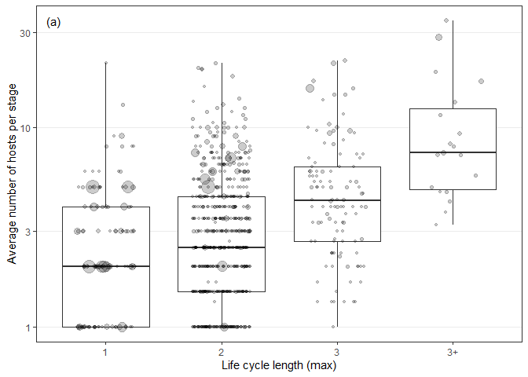
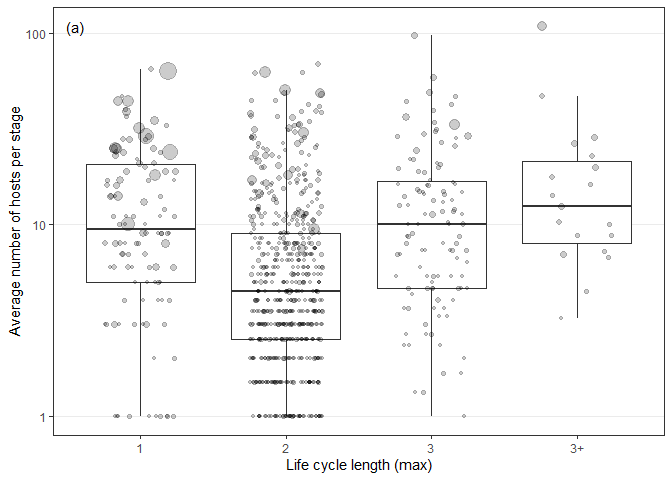

Cross-stage tradeoffs
================
Dan Benesh
12/06/2020

This notebook tests the idea that there is an organism-level constraint
on generality. If there is a ‘ceiling’ on the total number of hosts a
parasite can infect, i.e. there are tradeoffs within a life cycle, then
the average number of hosts per stage should decrease with life cycle
length. If the relationship is constant or positive, then the
species-level generality will increase with life cycle complexity.

From the stage-level data table, the average generality per stage was
calculated for each species. The stage-level data were produced from
just the life cycle database, so it does not include the additional host
records from the NHM database. We excluded species that did not have
full life cycle data.

Number of species:

    ## [1] 842

Number of host records:

    ## [1] 7362

Here is the plot of the average number of hosts per stage as a function
of life cycle length.

<!-- -->

Here is the same plot but for taxonomic dissimilarity.

<!-- -->

Both plots are inconsistent with a ‘ceiling’ on generalism. Instead
average generalism per stage increases with longer life cycles, because
these cycles include low-growth, high-generalism stages.

Now, we’ll make the same statistical models that we did for tests of
[species-level generalism](sp_level_analysis_host_range_freq.md), except
we are modeling average generalism per stage instead of total
generalism. We follow the same model-building sequence. We add parasite
taxonomy, then study effort, and finally life cycle length as either a
continuous or categorical variable.

# Host range

Our first generalism metric, number of hosts, is a count, which is why
we analyzed it with a generalized linear mixed model with Poisson
errors. However, when averaged across stages it is no longer an integer.
We’ll therefore analyze this generalism metric first as a continuous
variable (linear mixed model with Gaussian errors) and then as a count
(rounded to be an integer and then tested with a GLMM, Poisson errors).

Likelihood ratio tests indicate that study effort and life cycle length
improve the model, but the categorical life cycle length does not. This
suggests the positive relationship between average generality and life
cycle length is linear.

    ## Data: stage_avg
    ## Models:
    ## reg1f: log(hr) ~ 1 + (1 | parasite_genus) + (1 | parasite_family) + 
    ## reg1f:     (1 | parasite_order) + (1 | parasite_class) + (1 | parasite_phylum)
    ## reg2f: log(hr) ~ (1 | parasite_genus) + (1 | parasite_family) + (1 | 
    ## reg2f:     parasite_order) + (1 | parasite_class) + (1 | parasite_phylum) + 
    ## reg2f:     zstudy_effort
    ## reg3f: log(hr) ~ (1 | parasite_genus) + (1 | parasite_family) + (1 | 
    ## reg3f:     parasite_order) + (1 | parasite_class) + (1 | parasite_phylum) + 
    ## reg3f:     zstudy_effort + lcl_max
    ## reg3.1f: log(hr) ~ (1 | parasite_genus) + (1 | parasite_family) + (1 | 
    ## reg3.1f:     parasite_order) + (1 | parasite_class) + (1 | parasite_phylum) + 
    ## reg3.1f:     zstudy_effort + lcl_max_fac
    ## reg4f: log(hr) ~ (1 | parasite_genus) + (1 | parasite_family) + (1 | 
    ## reg4f:     parasite_order) + (1 | parasite_class) + (1 | parasite_phylum) + 
    ## reg4f:     zstudy_effort + lcl_max_fac + facultative_lc
    ##         Df    AIC    BIC  logLik deviance    Chisq Chi Df Pr(>Chisq)    
    ## reg1f    7 1805.8 1838.9 -895.87   1791.8                               
    ## reg2f    8 1696.3 1734.2 -840.13   1680.3 111.4798      1  < 2.2e-16 ***
    ## reg3f    9 1643.5 1686.2 -812.78   1625.5  54.7129      1  1.395e-13 ***
    ## reg3.1f 11 1646.6 1698.7 -812.31   1624.6   0.9352      2     0.6265    
    ## reg4f   12 1648.6 1705.4 -812.30   1624.6   0.0255      1     0.8731    
    ## ---
    ## Signif. codes:  0 '***' 0.001 '**' 0.01 '*' 0.05 '.' 0.1 ' ' 1

The estimated slope for life cycle length was 0.387, which corresponds
to a percent change of 47.25% hosts per stage with each additional step
in the life cycle.

The residual plot (not shown) does not look terrible, but let’s make
sure the results are robust to the model structure. We’ll now fit the
same series of models, but as generalized linear mixed models, in which
the response (average generalism) is rounded to the nearest integer.
Here is the table of likelihood ratio tests. Essentially, the results
are the same.

    ## Data: stage_avg
    ## Models:
    ## reg1p: round(hr, 0) ~ (1 | obs) + (1 | parasite_genus) + (1 | parasite_family) + 
    ## reg1p:     (1 | parasite_order) + (1 | parasite_class) + (1 | parasite_phylum)
    ## reg2p: round(hr, 0) ~ (1 | obs) + (1 | parasite_genus) + (1 | parasite_family) + 
    ## reg2p:     (1 | parasite_order) + (1 | parasite_class) + (1 | parasite_phylum) + 
    ## reg2p:     zstudy_effort
    ## reg3p: round(hr, 0) ~ (1 | obs) + (1 | parasite_genus) + (1 | parasite_family) + 
    ## reg3p:     (1 | parasite_order) + (1 | parasite_class) + (1 | parasite_phylum) + 
    ## reg3p:     zstudy_effort + lcl_max
    ## reg3.1p: round(hr, 0) ~ (1 | obs) + (1 | parasite_genus) + (1 | parasite_family) + 
    ## reg3.1p:     (1 | parasite_order) + (1 | parasite_class) + (1 | parasite_phylum) + 
    ## reg3.1p:     zstudy_effort + lcl_max_fac
    ## reg4p: round(hr, 0) ~ (1 | obs) + (1 | parasite_genus) + (1 | parasite_family) + 
    ## reg4p:     (1 | parasite_order) + (1 | parasite_class) + (1 | parasite_phylum) + 
    ## reg4p:     zstudy_effort + lcl_max_fac + facultative_lc
    ##         Df    AIC    BIC  logLik deviance    Chisq Chi Df Pr(>Chisq)    
    ## reg1p    7 3837.3 3870.5 -1911.7   3823.3                               
    ## reg2p    8 3716.2 3754.1 -1850.1   3700.2 123.0907      1  < 2.2e-16 ***
    ## reg3p    9 3679.3 3721.9 -1830.7   3661.3  38.9355      1   4.38e-10 ***
    ## reg3.1p 11 3681.8 3733.9 -1829.9   3659.8   1.4918      2     0.4743    
    ## reg4p   12 3683.8 3740.6 -1829.9   3659.8   0.0054      1     0.9415    
    ## ---
    ## Signif. codes:  0 '***' 0.001 '**' 0.01 '*' 0.05 '.' 0.1 ' ' 1

Therefore, we’ll take the results from the LMM that do not involve
rounding. Let’s creat the R2 table for average generalism.

    ## # A tibble: 5 x 5
    ##   step                      df_used marg_r2 cond_r2 tax_var_explained
    ##   <chr>                       <dbl>   <dbl>   <dbl>             <dbl>
    ## 1 taxonomy                       NA   0       0.264             0.264
    ## 2 study effort                    1   0.138   0.429             0.291
    ## 3 life cycle length               1   0.195   0.383             0.188
    ## 4 life cycle length, factor       2   0.193   0.386             0.193
    ## 5 facultative life cycle          1   0.193   0.386             0.193

# Taxonomic dissimilarity

What about the second generalism metric, taxonomic dissimilarity? We fit
the same series of models (linear mixed models, Gaussian errors). Like
for host range, average taxonomic dissimilarity is affected by study
effort and life cycle length. The relationship with life cycle length
appears linear, as treating lcl as a categorical variable was not an
improvement.

    ## Data: stage_avg
    ## Models:
    ## reg1f: hsi ~ 1 + (1 | parasite_genus) + (1 | parasite_family) + (1 | 
    ## reg1f:     parasite_order) + (1 | parasite_class) + (1 | parasite_phylum)
    ## reg2f: hsi ~ (1 | parasite_genus) + (1 | parasite_family) + (1 | parasite_order) + 
    ## reg2f:     (1 | parasite_class) + (1 | parasite_phylum) + zstudy_effort
    ## reg3f: hsi ~ (1 | parasite_genus) + (1 | parasite_family) + (1 | parasite_order) + 
    ## reg3f:     (1 | parasite_class) + (1 | parasite_phylum) + zstudy_effort + 
    ## reg3f:     lcl_max
    ## reg3.1f: hsi ~ (1 | parasite_genus) + (1 | parasite_family) + (1 | parasite_order) + 
    ## reg3.1f:     (1 | parasite_class) + (1 | parasite_phylum) + zstudy_effort + 
    ## reg3.1f:     lcl_max_fac
    ## reg4f: hsi ~ (1 | parasite_genus) + (1 | parasite_family) + (1 | parasite_order) + 
    ## reg4f:     (1 | parasite_class) + (1 | parasite_phylum) + zstudy_effort + 
    ## reg4f:     lcl_max_fac + facultative_lc
    ##         Df    AIC    BIC  logLik deviance   Chisq Chi Df Pr(>Chisq)    
    ## reg1f    7 1972.1 2005.3 -979.06   1958.1                              
    ## reg2f    8 1892.7 1930.5 -938.33   1876.7 81.4589      1  < 2.2e-16 ***
    ## reg3f    9 1850.9 1893.5 -916.46   1832.9 43.7440      1  3.743e-11 ***
    ## reg3.1f 11 1853.7 1905.8 -915.86   1831.7  1.2002      2     0.5488    
    ## reg4f   12 1854.8 1911.6 -915.38   1830.8  0.9696      1     0.3248    
    ## ---
    ## Signif. codes:  0 '***' 0.001 '**' 0.01 '*' 0.05 '.' 0.1 ' ' 1

These results do not support the hypothesis that there is an
organism-level constraint on generalism. Instead of decreasing with more
stages, average generalism per stage increased. Here’s the R2
table for average tax dissimilarity per stage.

    ## # A tibble: 5 x 5
    ##   step                      df_used marg_r2 cond_r2 tax_var_explained
    ##   <chr>                       <dbl>   <dbl>   <dbl>             <dbl>
    ## 1 taxonomy                       NA   0       0.248             0.248
    ## 2 study effort                    1   0.103   0.339             0.236
    ## 3 life cycle length               1   0.147   0.345             0.198
    ## 4 life cycle length, factor       2   0.144   0.349             0.205
    ## 5 facultative life cycle          1   0.145   0.345             0.20

# Add in the NHM data for host range

The analyses above were based only on the life cycle database. However,
the main species-level analyses were based on combined host records from
the life cycle database and the NHM database. Are the results similar
with this expanded dataset? We can only check for one metric, the number
of hosts. Here, we can simply divide the number of hosts by the number
of stages to get an average generality per stage. For the other metric,
taxonomic dissimilarity, we cannot divide the total dissimilarity by the
number of stages, because dissimilarity is not a cumulative variable
(e.g. genus + genus does not equal family).

The average generality per stage is notably higher for one-host
parasites, partly because they are better studied.

<!-- -->

When we re-run the model series with these combined host records, we now
find that adding life cycle length as a category improves the model,
though the non-linear effect is weaker than the linear one.

    ## Data: dat
    ## Models:
    ## reg1f: log(hr) ~ 1 + (1 | parasite_genus) + (1 | parasite_family) + 
    ## reg1f:     (1 | parasite_order) + (1 | parasite_class) + (1 | parasite_phylum)
    ## reg2f: log(hr) ~ (1 | parasite_genus) + (1 | parasite_family) + (1 | 
    ## reg2f:     parasite_order) + (1 | parasite_class) + (1 | parasite_phylum) + 
    ## reg2f:     zstudy_effort
    ## reg3f: log(hr) ~ (1 | parasite_genus) + (1 | parasite_family) + (1 | 
    ## reg3f:     parasite_order) + (1 | parasite_class) + (1 | parasite_phylum) + 
    ## reg3f:     zstudy_effort + lcl_max
    ## reg3.1f: log(hr) ~ (1 | parasite_genus) + (1 | parasite_family) + (1 | 
    ## reg3.1f:     parasite_order) + (1 | parasite_class) + (1 | parasite_phylum) + 
    ## reg3.1f:     zstudy_effort + lcl_max_fac
    ## reg4f: log(hr) ~ (1 | parasite_genus) + (1 | parasite_family) + (1 | 
    ## reg4f:     parasite_order) + (1 | parasite_class) + (1 | parasite_phylum) + 
    ## reg4f:     zstudy_effort + lcl_max_fac + lcl_min
    ##         Df    AIC    BIC   logLik deviance    Chisq Chi Df Pr(>Chisq)    
    ## reg1f    7 2384.3 2417.5 -1185.18   2370.3                               
    ## reg2f    8 2040.4 2078.3 -1012.22   2024.4 345.9193      1  < 2.2e-16 ***
    ## reg3f    9 2025.2 2067.8 -1003.61   2007.2  17.2207      1  3.328e-05 ***
    ## reg3.1f 11 2018.8 2070.9  -998.39   1996.8  10.4378      2   0.005413 ** 
    ## reg4f   12 2020.1 2076.9  -998.06   1996.1   0.6582      1   0.417189    
    ## ---
    ## Signif. codes:  0 '***' 0.001 '**' 0.01 '*' 0.05 '.' 0.1 ' ' 1

A look at the parameters suggests that one- and two-host life cycles
have similar average generalism levels per stage, while three- and
four-host cycles have higher averages per stage. This makes sense, since
these cycles include the conspicuous high-generalism, low-growth stages.

    ## Linear mixed model fit by REML ['lmerMod']
    ## Formula: log(hr) ~ (1 | parasite_genus) + (1 | parasite_family) + (1 |  
    ##     parasite_order) + (1 | parasite_class) + (1 | parasite_phylum) +  
    ##     zstudy_effort + lcl_max_fac
    ##    Data: dat
    ## 
    ## REML criterion at convergence: 2011.9
    ## 
    ## Scaled residuals: 
    ##     Min      1Q  Median      3Q     Max 
    ## -2.7572 -0.6560  0.0245  0.6609  2.4136 
    ## 
    ## Random effects:
    ##  Groups          Name        Variance  Std.Dev. 
    ##  parasite_genus  (Intercept) 7.896e-02 0.2810043
    ##  parasite_family (Intercept) 4.891e-02 0.2211482
    ##  parasite_order  (Intercept) 4.776e-03 0.0691122
    ##  parasite_class  (Intercept) 2.190e-02 0.1479766
    ##  parasite_phylum (Intercept) 6.065e-08 0.0002463
    ##  Residual                    5.346e-01 0.7311314
    ## Number of obs: 842, groups:  
    ## parasite_genus, 368; parasite_family, 115; parasite_order, 29; parasite_class, 6; parasite_phylum, 3
    ## 
    ## Fixed effects:
    ##               Estimate Std. Error t value
    ## (Intercept)    1.57951    0.13510  11.692
    ## zstudy_effort  0.80485    0.04111  19.577
    ## lcl_max_fac2   0.05373    0.11863   0.453
    ## lcl_max_fac3   0.50422    0.13594   3.709
    ## lcl_max_fac3+  0.27567    0.24462   1.127
    ## 
    ## Correlation of Fixed Effects:
    ##             (Intr) zstdy_ lcl__2 lcl__3
    ## zstudy_ffrt -0.173                     
    ## lcl_max_fc2 -0.746  0.226              
    ## lcl_max_fc3 -0.649  0.098  0.770       
    ## lcl_mx_fc3+ -0.328 -0.068  0.372  0.368
    ## convergence code: 0
    ## Model failed to converge with max|grad| = 0.00273777 (tol = 0.002, component 1)

Even though these results differ somewhat from those based only on the
life cycle database, they still do not suggest an organism-level
constraint on generalism. Average generalism per stage does not decline
with longer life cycles.
