Host specificity at stage level
================
Dan Benesh
21/01/2020

Instead of looking at patterns of host use/specificity at the parasite
species-level, now I focus on specificty at the stage level. For
example, if a parasite has a 2-host life cycle, there are two stages,
the larval stage (in intermediate hosts) and the adult stage (in
definitive hosts). For this analysis, I am restricted to host records
from my life cycle database, because the NHM records were not broken
down by stage. I imagine I could predict/impute stage information onto
those host records (e.g. if the host is an invertebrate, it is almost
certainly an intermediate host), but that is a project unto itself.
Thus, this notebook presents patterns using host records from just life
cycle database.

# Host range

First, we’ll look at patterns in host range, the number of hosts
recorded each parasite stage.

Parasites with longer life cycles have been recorded from more host
species. Each bar is broken down by stages to try and gauge how much
each stage contributes to the total set of host records for an average
parasite with a given life cycle length. One can see that each stage’s
contribution to the total is not equal, but it’s a little hard to make
comparisons between similar stages with different life cycle lengths.

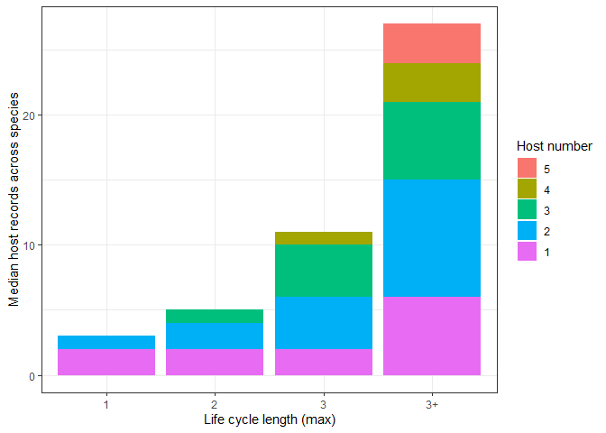<!-- -->

The next plot shows host records per stage, split by whether the stage
is a larva or adult. Interestingly, adult worms have fairly consistent
numbers of host records, regardless of whether they infected several or
no intermediate hosts prior to reaching the definitive host. That’s
consistent with Kevin’s observation in the Takvatn food web. I suppose I
would have expected a decrease, assuming that long life cycles take
parasites to the top of food webs where there are fewer predators. For
intermediate hosts, parasites tend to more generalist in the second or
third intermediate hosts, which are often paratenic hosts.

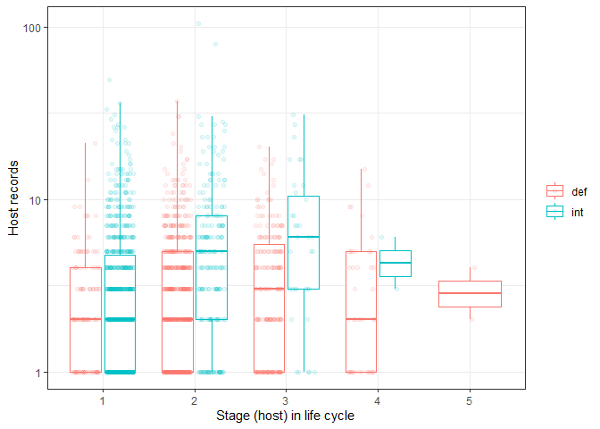<!-- -->

We can also split the plot by parasite life cycle length. This plot
demonstrates that parasites are especially generalist in their middle
intermediate hosts, but not necessarily the first intermediate hosts in
a life cycle.

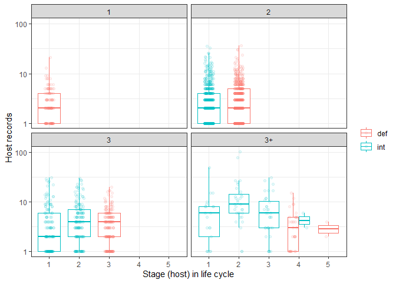<!-- -->

Host records increase with study effort. My study effort variable,
pubmed hits, is at the species level, not the stage level. I don’t think
I can adjust Pubmed queries to only return papers dealing with larvae or
adults, so we have to see if study effort is still an important
confounder at the stage level. Indeed, the number of host records still
increases with study effort, pretty much at any life stage and life
cycle length.

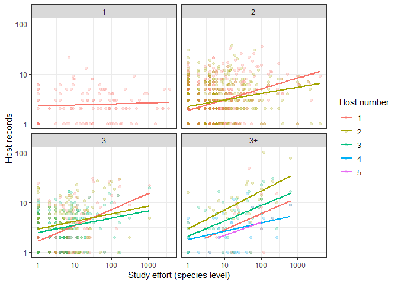<!-- -->

# Taxonomic regressions

This stage-level data is tricky to analyze because there are two source
of non-independence: (1) multiple stages from the same parasite species
and (2) covariation between parasite species due to phylogeny. One way
to address this is to include a species-level random effect in a mixed
model, as well as taxonomic groups as additional random effects. This
accounts for within-species variation as well as between-species
variation due to relatedness.

I add the following factors in order: (1) study effort, (2) whether the
stage is larval or adult, (3) whether the stage is the first, second,
third, etc in the life cycle (i.e. host number), and (4) the interaction
between host number and stage function (larval vs adult). There were
only a couple instances of host number = 5, so I combined these with
host number = 4.

## Host range

First, here are some stats reported in the tables of the manuscript. How
many species were in this analysis?

    ## [1] 971

How many stages?

    ## [1] 1964

How many host records?

    ## [1] 8322

#### Model type

But before fitting a series of models for hypothesis testing, let’s try
different model formulations. We’ll try four different models: (1)
standard linear mixed model with untransformed response variable
(identity link), Gaussian errors, (2) same as model 1 but with log
transformed response, (3) generalized linear mixed model with a log
link, Poisson errors, and (4) same as model 3 but with negative binomial
errors allowing for overdispersion. These can all be fit with `lme4`.
For comparison of model structures, we fit the ‘best’ model identified
below, specifically one including taxonomy, study effort, stage number
and stage function.

Given their different assumptions about data structure and expected
error distributions, these models cannot be compared with information
criteria or ratio tests. Rather, let’s visualize how well they
approximate the actual data.

Here is a plot with the predicted values on the y and the observed
values on the x. The dashed line is the 1:1 line (i.e. model predicts
data perfectly). It looks like the Poisson model comes closest to
matching the predictions. However, this relationship could be obscured
by a few high values, so we’ll log-transform the axes. Note that the
standard LMM model predicts negative values, which does not make sense.

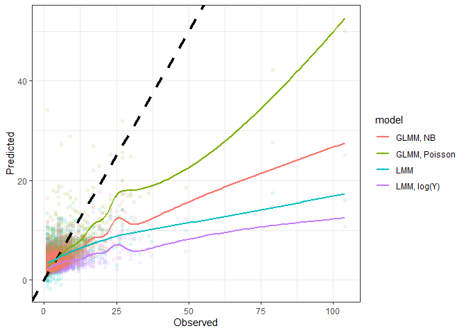<!-- -->

After log-transformation, we see that the Poisson model still seems to
perform best. All the models have trouble predicting low generalism
values, probably because there are an excess of ones or twos in the data
(just one or two known hosts in poorly studied species).

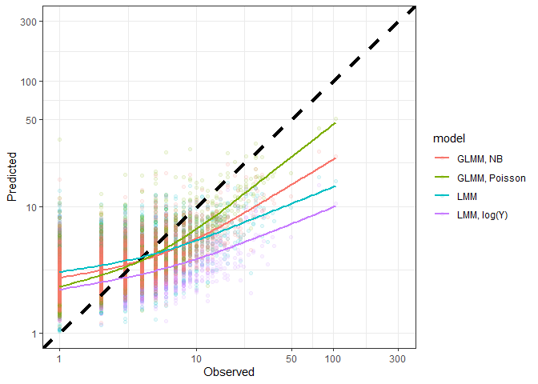<!-- -->

Next, let’s look at the unstandardized residual plots. Again the Poisson
model seems to do best, as it has the most homogenous scatter around
zero.

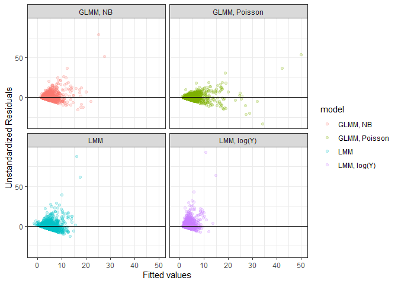<!-- -->

Another way to check model fit is to compare the distribution of
predictions with that of the observations. Here are density plots for
the predicted values. We can see that some models yield predictions more
closely matching the data than others, but it is a little hard to tell
with the substantial right-skew in the data.

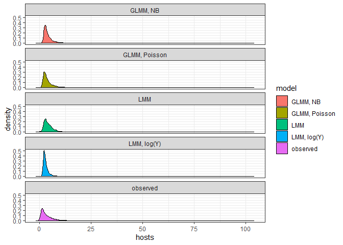<!-- -->

The differences may be easier to see on a log-scale. The LMM peaks at
values that are too high, while the neg binomial and log-transformed LMM
are both probably overconfident with too narrow a distribution. The
Poisson model appears best, though as stated before, seems to
overestimate low values.

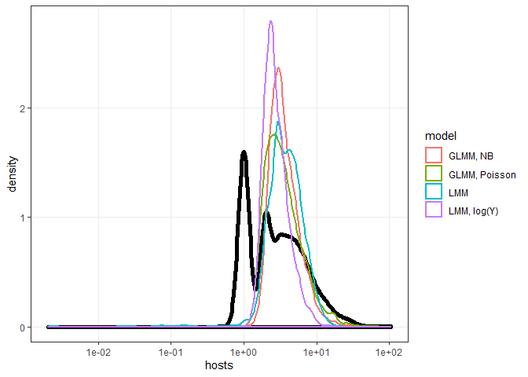<!-- -->

The main trend of interest is the change in host range across life
cycles. Let’s see what the models predict for this relationship,
compared to the observed pattern. The next plot shows boxplots of the
predicted and observed values at every level of life cycle length. We
see the closest match with the observed values for the Poisson model and
NB model. Other models underestimate the variance (LMM).

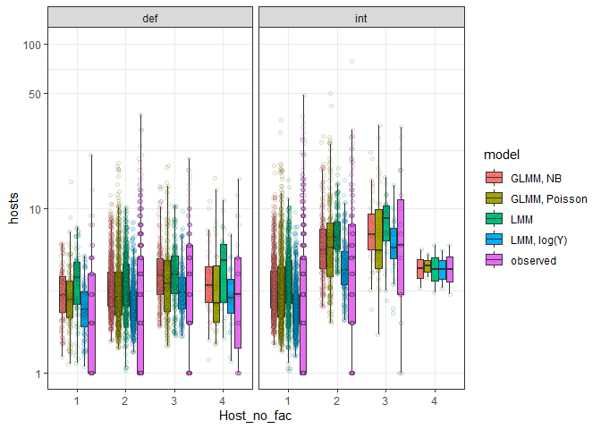<!-- -->

As a final model check, let’s look at the distribution of random
effects. Random effects are assumed to be normally distributed. We’ll
plot the estimated random effects for parasite family and genus, because
the model summarys suggested they had the largest effect on host range.

Here is a density plot for the distribution of random effects at the
family level. The family effects in all models seem to have a slight
positive skew. All these distributions appear ok, with the exception of
the standard LMM.

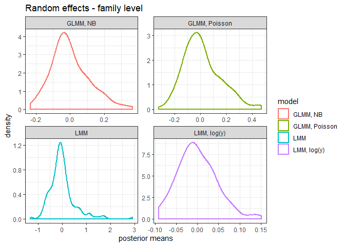<!-- -->

Here is the density plot for the random genus effects. Again, the LMM
seems to stand out as poor, while the largest effects are seen for the
Poisson and NB model.

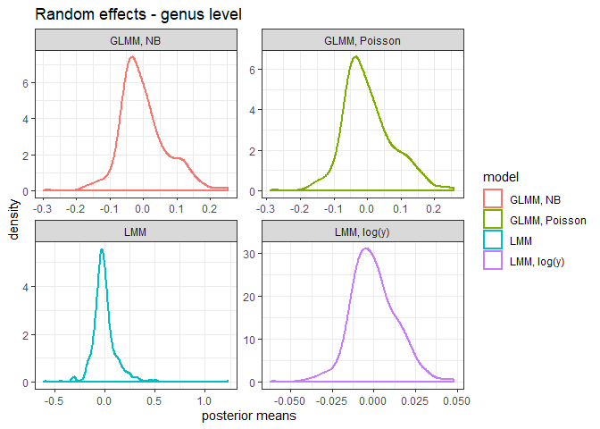<!-- -->

The Poisson model seems to be best, as its predictions best approximate
the observed data. A final consideration for Poisson models is
overdispersion, specifically that there is more variation in the data
than suggested by a Poisson distribution. This is common and probably
applies to these data, given that model predictions were generally less
variable than actual data. One way to address this is to fit an
observation-level random effect (see
[here](https://peerj.com/articles/616/)). If this observation-level
random effect is positive it indicates the residuals are more variable
than expected, i.e. overdispersion. When this model is fitted, we can
see if the observation-level random effect is positive. It is.

    ## Generalized linear mixed model fit by maximum likelihood (Laplace
    ##   Approximation) [glmerMod]
    ##  Family: poisson  ( log )
    ## Formula: 
    ## num_hosts_suspicious_removed ~ zstudy_effort + Def.int * Host_no_fac +  
    ##     (1 | Parasite.species) + (1 | parasite_genus) + (1 | parasite_family) +  
    ##     (1 | parasite_order) + (1 | parasite_class) + (1 | parasite_phylum) +  
    ##     (1 | obs)
    ##    Data: 
    ## filter(hosts_per_stage, Facultative != "postcyclic", !is.na(hsi_lcdb_suspcious_rem))
    ## 
    ##      AIC      BIC   logLik deviance df.resid 
    ##   9248.7   9338.0  -4608.3   9216.7     1948 
    ## 
    ## Scaled residuals: 
    ##     Min      1Q  Median      3Q     Max 
    ## -1.4664 -0.5429 -0.1457  0.2973  1.4627 
    ## 
    ## Random effects:
    ##  Groups           Name        Variance  Std.Dev.
    ##  obs              (Intercept) 3.596e-01 0.599684
    ##  Parasite.species (Intercept) 4.544e-03 0.067406
    ##  parasite_genus   (Intercept) 2.652e-02 0.162846
    ##  parasite_family  (Intercept) 4.792e-02 0.218903
    ##  parasite_order   (Intercept) 2.528e-04 0.015901
    ##  parasite_class   (Intercept) 5.578e-06 0.002362
    ##  parasite_phylum  (Intercept) 2.041e-05 0.004517
    ## Number of obs: 1964, groups:  
    ## obs, 1964; Parasite.species, 971; parasite_genus, 404; parasite_family, 122; parasite_order, 31; parasite_class, 6; parasite_phylum, 3
    ## 
    ## Fixed effects:
    ##                         Estimate Std. Error z value Pr(>|z|)    
    ## (Intercept)              0.65330    0.10283   6.353 2.11e-10 ***
    ## zstudy_effort            0.43689    0.03060  14.279  < 2e-16 ***
    ## Def.intint               0.39021    0.10942   3.566 0.000362 ***
    ## Host_no_fac2             0.43317    0.11101   3.902 9.54e-05 ***
    ## Host_no_fac3             0.57055    0.12196   4.678 2.90e-06 ***
    ## Host_no_fac4             0.03757    0.18688   0.201 0.840678    
    ## Def.intint:Host_no_fac2  0.02452    0.13236   0.185 0.853030    
    ## Def.intint:Host_no_fac3 -0.18899    0.19106  -0.989 0.322569    
    ## Def.intint:Host_no_fac4 -0.29008    0.59243  -0.490 0.624382    
    ## ---
    ## Signif. codes:  0 '***' 0.001 '**' 0.01 '*' 0.05 '.' 0.1 ' ' 1
    ## 
    ## Correlation of Fixed Effects:
    ##             (Intr) zstdy_ Df.ntn Hst__2 Hst__3 Hst__4 D.:H__2 D.:H__3
    ## zstudy_ffrt -0.212                                                   
    ## Def.intint  -0.901  0.199                                            
    ## Host_no_fc2 -0.891  0.214  0.915                                     
    ## Host_no_fc3 -0.812  0.165  0.816  0.800                              
    ## Host_no_fc4 -0.529  0.078  0.538  0.521  0.493                       
    ## Df.ntn:H__2  0.746 -0.209 -0.841 -0.859 -0.648 -0.389                
    ## Df.ntn:H__3  0.518 -0.153 -0.571 -0.529 -0.626 -0.183  0.517         
    ## Df.ntn:H__4  0.165 -0.044 -0.183 -0.167 -0.148 -0.260  0.156   0.119 
    ## convergence code: 0
    ## Model failed to converge with max|grad| = 0.981401 (tol = 0.001, component 1)

Accordingly, the model with overdispersion is considered better.

    ## Data: filter(hosts_per_stage, Facultative != "postcyclic", !is.na(hsi_lcdb_suspcious_rem))
    ## Models:
    ## reg3x: num_hosts_suspicious_removed ~ zstudy_effort + Def.int * Host_no_fac + 
    ## reg3x:     (1 | Parasite.species) + (1 | parasite_genus) + (1 | parasite_family) + 
    ## reg3x:     (1 | parasite_order) + (1 | parasite_class) + (1 | parasite_phylum)
    ## reg5x: num_hosts_suspicious_removed ~ zstudy_effort + Def.int * Host_no_fac + 
    ## reg5x:     (1 | Parasite.species) + (1 | parasite_genus) + (1 | parasite_family) + 
    ## reg5x:     (1 | parasite_order) + (1 | parasite_class) + (1 | parasite_phylum) + 
    ## reg5x:     (1 | obs)
    ##       Df     AIC   BIC  logLik deviance  Chisq Chi Df Pr(>Chisq)    
    ## reg3x 15 10149.9 10234 -5059.9  10119.9                             
    ## reg5x 16  9248.7  9338 -4608.3   9216.7 903.24      1  < 2.2e-16 ***
    ## ---
    ## Signif. codes:  0 '***' 0.001 '**' 0.01 '*' 0.05 '.' 0.1 ' ' 1

We can also calculate a dispersion factor, which is the ratio of the sum
squared pearson residuals to the residual df. When this ratio is \> 1,
it is an indication of overdispersion.

    ## Dispersion factor: 1.4

This is quite moderate overdispersion. A motivation to account for
overdispersion is that it can affect parameter estimates. Let’s look at
the estimated effect of life stage in the model with an
observation-level random effect, as compared to the other model
formulations. This ‘overdispersed’ model estimates mean host ranges that
tend to be closer to observed medians than the standard Poisson and
negative binomial models. It is worth keeping in mind, though, that
observation-level random effects might not work well with zero-inflation
(see [here](https://peerj.com/articles/616/)), which applies to this
case (i.e. many parasites with low host ranges).

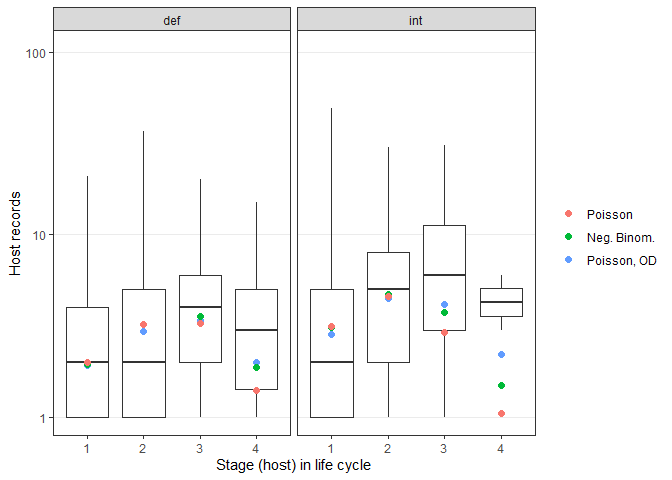<!-- -->

Moving on to hypothesis testing, let’s include the observation-level
random effect in our model, but keep in mind that we might want to look
at models without this effect as well.

### Model building

I add the following factors in order: (0) intercept-only, with
observation-level random effect for residuals, (1) within-species random
effect (i.e. same species, different stages), (2) taxonomic random
effect, (3) study effort, (4) whether the stage is larval or adult, (5)
whether the stage is the first, second, third, etc in the life cycle
(i.e. host number), and (6) the interaction between host number and
stage function (larval vs adult). There were only a couple instances of
host number = 5, so I combined these with host number = 4.

Here is a table of likelihood ratio tests for the host range measure.
Adding both random effects (0 vs 1 and 1 vs 2) are an improvement,
suggesting phylogenetic effects. Adding study effort (2 vs 3) improves
the model, but distinguishing larval and adult stages had only a
marginal effect (3 vs 4). Distinguishing between the order of life
stages is highly significant (4 vs 5). Finally, the interaction between
host number and larval vs adult was not significant.

    ## Data: filter(hosts_per_stage, Facultative != "postcyclic", !is.na(hsi_lcdb_suspcious_rem))
    ## Models:
    ## reg0f: num_hosts_suspicious_removed ~ 1 + (1 | obs)
    ## reg1f: num_hosts_suspicious_removed ~ (1 | obs) + (1 | Parasite.species)
    ## reg2f: num_hosts_suspicious_removed ~ (1 | obs) + (1 | Parasite.species) + 
    ## reg2f:     (1 | parasite_genus) + (1 | parasite_family) + (1 | parasite_order) + 
    ## reg2f:     (1 | parasite_class) + (1 | parasite_phylum)
    ## reg3f: num_hosts_suspicious_removed ~ (1 | obs) + (1 | Parasite.species) + 
    ## reg3f:     (1 | parasite_genus) + (1 | parasite_family) + (1 | parasite_order) + 
    ## reg3f:     (1 | parasite_class) + (1 | parasite_phylum) + zstudy_effort
    ## reg4f: num_hosts_suspicious_removed ~ (1 | obs) + (1 | Parasite.species) + 
    ## reg4f:     (1 | parasite_genus) + (1 | parasite_family) + (1 | parasite_order) + 
    ## reg4f:     (1 | parasite_class) + (1 | parasite_phylum) + zstudy_effort + 
    ## reg4f:     Def.int
    ## reg5f: num_hosts_suspicious_removed ~ (1 | obs) + (1 | Parasite.species) + 
    ## reg5f:     (1 | parasite_genus) + (1 | parasite_family) + (1 | parasite_order) + 
    ## reg5f:     (1 | parasite_class) + (1 | parasite_phylum) + zstudy_effort + 
    ## reg5f:     Def.int + Host_no_fac
    ## reg6f: num_hosts_suspicious_removed ~ (1 | obs) + (1 | Parasite.species) + 
    ## reg6f:     (1 | parasite_genus) + (1 | parasite_family) + (1 | parasite_order) + 
    ## reg6f:     (1 | parasite_class) + (1 | parasite_phylum) + zstudy_effort + 
    ## reg6f:     Def.int + Host_no_fac + Def.int:Host_no_fac
    ##       Df    AIC    BIC  logLik deviance    Chisq Chi Df Pr(>Chisq)    
    ## reg0f  2 9596.3 9607.4 -4796.1   9592.3                               
    ## reg1f  3 9522.9 9539.6 -4758.4   9516.9  75.4100      1  < 2.2e-16 ***
    ## reg2f  8 9479.7 9524.3 -4731.8   9463.7  53.1952      5  3.067e-10 ***
    ## reg3f  9 9314.4 9364.6 -4648.2   9296.4 167.2806      1  < 2.2e-16 ***
    ## reg4f 10 9313.1 9368.9 -4646.5   9293.1   3.3096      1    0.06888 .  
    ## reg5f 13 9246.4 9319.0 -4610.2   9220.4  72.6957      3  1.129e-15 ***
    ## reg6f 16 9248.7 9338.0 -4608.3   9216.7   3.7169      3    0.29370    
    ## ---
    ## Signif. codes:  0 '***' 0.001 '**' 0.01 '*' 0.05 '.' 0.1 ' ' 1

Here is the summary of the most complicated model. When we look at the
parameters, parasites tend to have higher host ranges in intermediate
than in definitive hosts. And they are more generalist in the second or
third host in the life cycle, but this does not differ much depending on
whether it is a definitive or intermediate host.

    ## Generalized linear mixed model fit by maximum likelihood (Laplace
    ##   Approximation) [glmerMod]
    ##  Family: poisson  ( log )
    ## Formula: num_hosts_suspicious_removed ~ (1 | obs) + (1 | Parasite.species) +  
    ##     (1 | parasite_genus) + (1 | parasite_family) + (1 | parasite_order) +  
    ##     (1 | parasite_class) + (1 | parasite_phylum) + zstudy_effort +  
    ##     Def.int + Host_no_fac + Def.int:Host_no_fac
    ##    Data: 
    ## filter(hosts_per_stage, Facultative != "postcyclic", !is.na(hsi_lcdb_suspcious_rem))
    ## 
    ##      AIC      BIC   logLik deviance df.resid 
    ##   9248.7   9338.0  -4608.3   9216.7     1948 
    ## 
    ## Scaled residuals: 
    ##     Min      1Q  Median      3Q     Max 
    ## -1.4664 -0.5429 -0.1457  0.2973  1.4627 
    ## 
    ## Random effects:
    ##  Groups           Name        Variance  Std.Dev.
    ##  obs              (Intercept) 3.596e-01 0.599684
    ##  Parasite.species (Intercept) 4.544e-03 0.067406
    ##  parasite_genus   (Intercept) 2.652e-02 0.162846
    ##  parasite_family  (Intercept) 4.792e-02 0.218903
    ##  parasite_order   (Intercept) 2.528e-04 0.015901
    ##  parasite_class   (Intercept) 5.578e-06 0.002362
    ##  parasite_phylum  (Intercept) 2.041e-05 0.004517
    ## Number of obs: 1964, groups:  
    ## obs, 1964; Parasite.species, 971; parasite_genus, 404; parasite_family, 122; parasite_order, 31; parasite_class, 6; parasite_phylum, 3
    ## 
    ## Fixed effects:
    ##                         Estimate Std. Error z value Pr(>|z|)    
    ## (Intercept)              0.65330    0.10283   6.353 2.11e-10 ***
    ## zstudy_effort            0.43689    0.03060  14.279  < 2e-16 ***
    ## Def.intint               0.39021    0.10942   3.566 0.000362 ***
    ## Host_no_fac2             0.43317    0.11101   3.902 9.54e-05 ***
    ## Host_no_fac3             0.57055    0.12196   4.678 2.90e-06 ***
    ## Host_no_fac4             0.03757    0.18688   0.201 0.840678    
    ## Def.intint:Host_no_fac2  0.02452    0.13236   0.185 0.853030    
    ## Def.intint:Host_no_fac3 -0.18899    0.19106  -0.989 0.322569    
    ## Def.intint:Host_no_fac4 -0.29008    0.59243  -0.490 0.624382    
    ## ---
    ## Signif. codes:  0 '***' 0.001 '**' 0.01 '*' 0.05 '.' 0.1 ' ' 1
    ## 
    ## Correlation of Fixed Effects:
    ##             (Intr) zstdy_ Df.ntn Hst__2 Hst__3 Hst__4 D.:H__2 D.:H__3
    ## zstudy_ffrt -0.212                                                   
    ## Def.intint  -0.901  0.199                                            
    ## Host_no_fc2 -0.891  0.214  0.915                                     
    ## Host_no_fc3 -0.812  0.165  0.816  0.800                              
    ## Host_no_fc4 -0.529  0.078  0.538  0.521  0.493                       
    ## Df.ntn:H__2  0.746 -0.209 -0.841 -0.859 -0.648 -0.389                
    ## Df.ntn:H__3  0.518 -0.153 -0.571 -0.529 -0.626 -0.183  0.517         
    ## Df.ntn:H__4  0.165 -0.044 -0.183 -0.167 -0.148 -0.260  0.156   0.119 
    ## convergence code: 0
    ## Model failed to converge with max|grad| = 0.981401 (tol = 0.001, component 1)

Now let’s look explicitly at effect sizes by making an R2
table for the model series.

    ## # A tibble: 6 x 6
    ##   step             df_used marg_r2 cond_r2 sp_var_explained tax_var_explained
    ##   <chr>              <dbl>   <dbl>   <dbl>            <dbl>             <dbl>
    ## 1 within-species        NA   0       0.219            0.219             0.219
    ## 2 taxonomy               0   0       0.231            0.125             0.231
    ## 3 study effort           1   0.111   0.237            0                 0.126
    ## 4 stage function         1   0.111   0.233            0.004             0.122
    ## 5 host number            3   0.149   0.242            0.007             0.093
    ## 6 stage x host num       3   0.146   0.238            0.005             0.092

The R2 table suggests that even after accounting for life
cycle length, there is still an effect of taxonomy, explaining about 10%
of the variation. Let’s examine this a little more closely. At what
level is the variation? We can look at the size of the variance
components for each taxonomic level, and we see that the parasite genus
or family tends to be most ‘explanatory’.

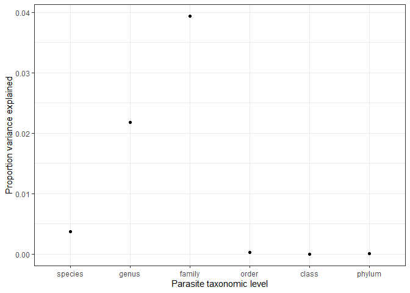<!-- -->

This suggests parasite genera and families exhibit different levels of
generalism, while at higher taxonomic levels this variance gets averaged
out, such that orders are not very different on average. Another way to
check this is by adding taxonomic levels sequentially, either forwards
or backwards and seeing how the variance explained changed. First, we go
from tips to root, starting with species and adding additional taxonomic
levels. Relatively little additional variation is explained beyond
family, actually it drops a little bit beyond family.

    ## # A tibble: 6 x 5
    ##   step    df_used marg_r2 cond_r2 tax_var_explained
    ##   <chr>     <dbl>   <dbl>   <dbl>             <dbl>
    ## 1 species      NA   0.142   0.218             0.076
    ## 2 genus         0   0.148   0.235             0.087
    ## 3 family        0   0.143   0.239             0.096
    ## 4 order         0   0.145   0.235             0.09 
    ## 5 class         0   0.146   0.235             0.089
    ## 6 phylum        0   0.146   0.238             0.092

Here’s the same table, but the terms are added in the opposite order, so
we’re going from root (phyla) to tips (species). The biggest jumps
happen towards the tips with families and genera.

    ## # A tibble: 6 x 5
    ##   step    df_used marg_r2 cond_r2 tax_var_explained
    ##   <chr>     <dbl>   <dbl>   <dbl>             <dbl>
    ## 1 phylum       NA   0.148   0.148             0    
    ## 2 class         0   0.149   0.149             0    
    ## 3 order         0   0.141   0.18              0.039
    ## 4 family        0   0.145   0.216             0.071
    ## 5 genus         0   0.145   0.23              0.085
    ## 6 species       0   0.146   0.238             0.092

Here is the same information as in the last two tables, but plotted. We
can see that higher taxonomic levels like class and phyla have little
explanatory power.

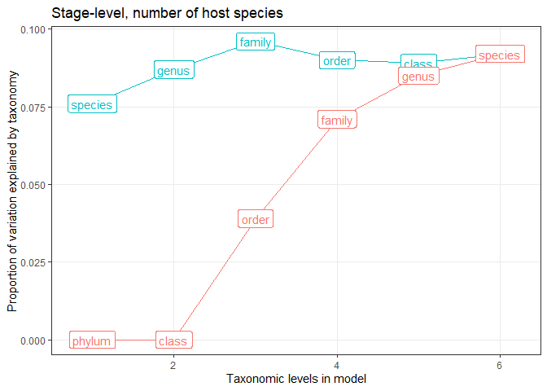<!-- -->

So to understand what causes the taxonomic effect in the model, let’s
look at families. We’ll take the random effect estimates for parasite
family from the model accounting for study effort, stage number, and
stage function. Then, we’ll sort them to see which families rank high
(generalists) or low (specialists).

Here are the families above the 90th percentile for generalism. Some of
these have generalist paratenic stages (Anisakidae, Ophidascaridae).

    ##           re            family re_quantile parasite_phylum
    ## 1  0.4775039    Ophidascaridae     top 10%        Nematoda
    ## 2  0.3766333     Spirocercidae     top 10%        Nematoda
    ## 3  0.3360323     Paruterinidae     top 10% Platyhelminthes
    ## 4  0.3185731        Anisakidae     top 10%        Nematoda
    ## 5  0.2608551 Raphidascarididae     top 10%        Nematoda
    ## 6  0.2595091        Spiruridae     top 10%        Nematoda
    ## 7  0.2517079        Syngamidae     top 10%        Nematoda
    ## 8  0.2438842        Acuariidae     top 10%        Nematoda
    ## 9  0.2397930   Mesocestoididae     top 10% Platyhelminthes
    ## 10 0.2358384 Protostrongylidae     top 10%        Nematoda
    ## 11 0.2036228     Capillariidae     top 10%        Nematoda
    ## 12 0.2033737   Hymenolepididae     top 10% Platyhelminthes
    ## 13 0.1980090    Acrobothriidae     top 10% Platyhelminthes

Here are the families below the 10th percentile for generalism
(specialists). Some well-studied groups (Haemonchidae, Oxyuridae) pop
up, suggesting they probably have more restricted host ranges than
expected.

    ##            re              family re_quantile parasite_phylum
    ## 1  -0.2706957 Neoechinorhynchidae  bottom 10%  Acanthocephala
    ## 2  -0.1698196     Onchobothriidae  bottom 10% Platyhelminthes
    ## 3  -0.1626080        Lytocestidae  bottom 10% Platyhelminthes
    ## 4  -0.1610402        Haemonchidae  bottom 10%        Nematoda
    ## 5  -0.1589865    Phyllobothriidae  bottom 10% Platyhelminthes
    ## 6  -0.1458355         Cloacinidae  bottom 10%        Nematoda
    ## 7  -0.1416232           Oxyuridae  bottom 10%        Nematoda
    ## 8  -0.1409155          Seuratidae  bottom 10%        Nematoda
    ## 9  -0.1393280         Ascarididae  bottom 10%        Nematoda
    ## 10 -0.1379669     Rhinebothriidae  bottom 10% Platyhelminthes
    ## 11 -0.1139719     Diplotriaenidae  bottom 10%        Nematoda
    ## 12 -0.1132332        Camallanidae  bottom 10%        Nematoda
    ## 13 -0.1132038    Proteocephalidae  bottom 10% Platyhelminthes

In both lists, there are nematodes and cestodes, which shouldn’t be
surprising, since phyla had little explanatory value. Let’s plot the
individual species in these family groups.

We can see that stages from generalist or specialist families can still
be quite variable. That is, they do not consistently score higher or
lower than expected for a given life stage. Partly, this is due to
differences in study effort - families will be considered generalists if
they have many hosts and low study effort, and specialists with few
hosts and high study effort. Also, the variability is a reminder that
taxonomy only explained 10% of the variation in generalism in the final
model.

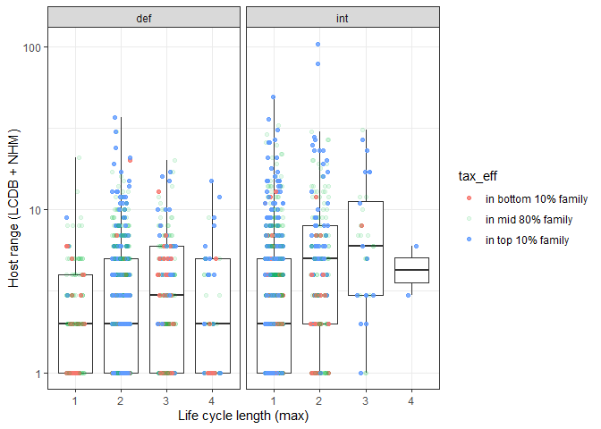<!-- -->

The patterns are clearer when we have boxplots for each family.
Specialist families (bottom 10%) usually have more restricted host
ranges than generalist families (top 10%), though the differences are
not extremely pronounced.

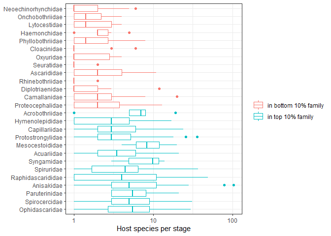<!-- -->

A family could be considered generalist if it has a wide host range at
all life stages or just at one particular stage. To understand which
families are identified by the model as generalist, let’s look at the
observed generalism relative to predictions for each family. The next
plot shows generalism across the life cycle for the 12 most ‘generalist’
families according to the model. The red points are model predictions
accounting for study effort, stage number, and stage function. We can
see that in these families life stages often have more recorded hosts
than predicted, but not always.

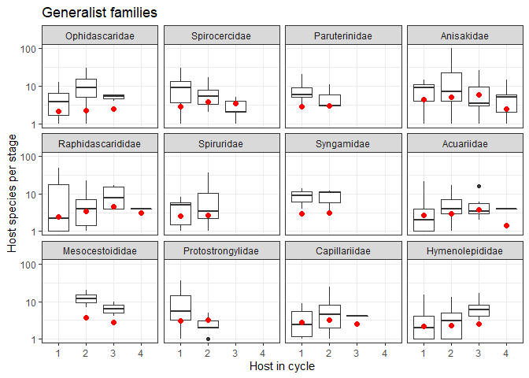<!-- -->

Similarly, when we make the same plot for the 12 most specialized
families according to the model, we see that some stages infect far
fewer hosts than expected. Some stages, though, are as generalist as
expected, which suggests that taxa differ because particular stages are
more or less generalist than expected, not necessarily because the taxon
is consistently generalist (or specialists) across the full life cycle.

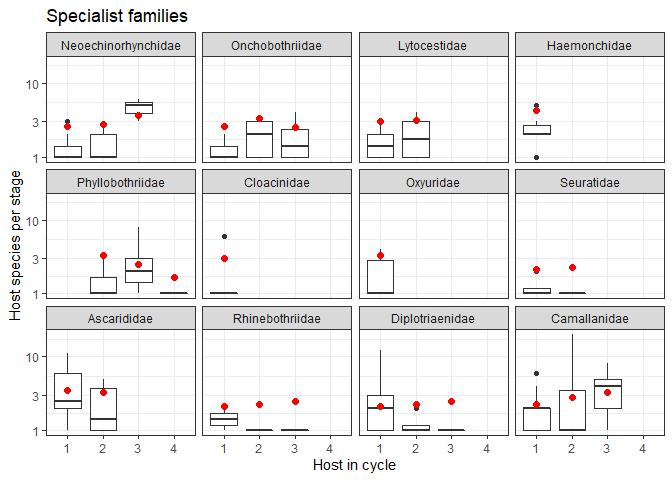<!-- -->

This suggests that we might improve our model by allowing taxonomic
effects to vary across the life cycle, e.g. is parasite taxon *A* more
generalist at stage *B* than expected based on taxonomy and stage alone?
Let’s add this interaction. We allow parasite families to have different
generalism levels for each stage in their life cycle, with stage being a
combination of host number and type (int vs def). We used parasite
family, because our analyses above suggested that parasite family
explains considerable variation in host range, both when added backwards
or forwards into the model.

Allowing the parasite family effect to vary by stage is a clear and
significant improvement to the model.

    ## Data: filter(hosts_per_stage, Facultative != "postcyclic", !is.na(hsi_lcdb_suspcious_rem))
    ## Models:
    ## reg6f: num_hosts_suspicious_removed ~ (1 | obs) + (1 | Parasite.species) + 
    ## reg6f:     (1 | parasite_genus) + (1 | parasite_family) + (1 | parasite_order) + 
    ## reg6f:     (1 | parasite_class) + (1 | parasite_phylum) + zstudy_effort + 
    ## reg6f:     Def.int + Host_no_fac + Def.int:Host_no_fac
    ## reg7f: num_hosts_suspicious_removed ~ (1 | obs) + (1 | Parasite.species) + 
    ## reg7f:     (1 | parasite_genus) + (1 | parasite_order) + (1 | parasite_class) + 
    ## reg7f:     (1 | parasite_phylum) + zstudy_effort + Def.int + Host_no_fac + 
    ## reg7f:     (1 | stagex_fam2) + Def.int:Host_no_fac
    ##       Df    AIC    BIC  logLik deviance  Chisq Chi Df Pr(>Chisq)    
    ## reg6f 16 9248.7 9338.0 -4608.3   9216.7                             
    ## reg7f 16 9171.2 9260.5 -4569.6   9139.2 77.464      0  < 2.2e-16 ***
    ## ---
    ## Signif. codes:  0 '***' 0.001 '**' 0.01 '*' 0.05 '.' 0.1 ' ' 1

This explains an additional 13% variation in the model.

    ## # A tibble: 7 x 5
    ##   step                    df_used marg_r2 cond_r2 tax_var_explained
    ##   <chr>                     <dbl>   <dbl>   <dbl>             <dbl>
    ## 1 within-species               NA   0       0.219             0.219
    ## 2 taxonomy                      0   0       0.231             0.231
    ## 3 study effort                  1   0.111   0.237             0.126
    ## 4 stage function                1   0.111   0.233             0.122
    ## 5 host number                   3   0.149   0.242             0.093
    ## 6 stage x host num              3   0.146   0.238             0.092
    ## 7 stage x parasite family       0   0.146   0.363             0.217

Now, the taxonomic effect is mainly attributed to parasite family, which
is not surprising, given that we allowed it to be stage dependent,
i.e. the family effect can differ for 1st hosts, 2nd hosts, etc.

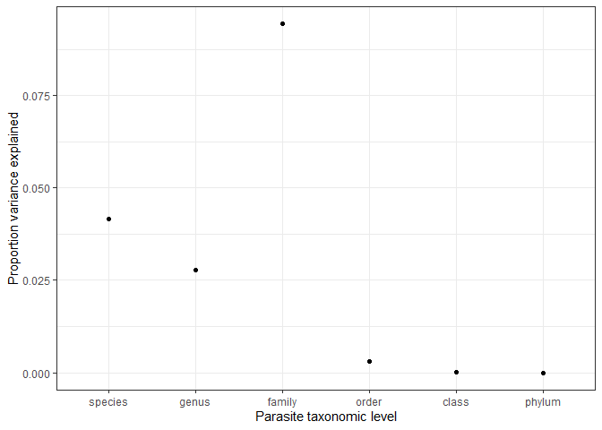<!-- -->

Notably, the same fixed parameters are significant, such as parasites
infecting more diverse hosts as larvae than adults (int \> def) and
generalism being higher in 2nd and 3rd hosts compared to first hosts.

    ## Generalized linear mixed model fit by maximum likelihood (Laplace
    ##   Approximation) [glmerMod]
    ##  Family: poisson  ( log )
    ## Formula: num_hosts_suspicious_removed ~ (1 | obs) + (1 | Parasite.species) +  
    ##     (1 | parasite_genus) + (1 | parasite_order) + (1 | parasite_class) +  
    ##     (1 | parasite_phylum) + zstudy_effort + Def.int + Host_no_fac +  
    ##     (1 | stagex_fam2) + Def.int:Host_no_fac
    ##    Data: 
    ## filter(hosts_per_stage, Facultative != "postcyclic", !is.na(hsi_lcdb_suspcious_rem))
    ## 
    ##      AIC      BIC   logLik deviance df.resid 
    ##   9171.2   9260.5  -4569.6   9139.2     1948 
    ## 
    ## Scaled residuals: 
    ##     Min      1Q  Median      3Q     Max 
    ## -1.5771 -0.5540 -0.1496  0.2966  1.6421 
    ## 
    ## Random effects:
    ##  Groups           Name        Variance  Std.Dev.
    ##  obs              (Intercept) 2.565e-01 0.506413
    ##  Parasite.species (Intercept) 4.651e-02 0.215659
    ##  parasite_genus   (Intercept) 3.102e-02 0.176124
    ##  stagex_fam2      (Intercept) 1.056e-01 0.325036
    ##  parasite_order   (Intercept) 3.490e-03 0.059077
    ##  parasite_class   (Intercept) 1.848e-04 0.013595
    ##  parasite_phylum  (Intercept) 2.362e-05 0.004861
    ## Number of obs: 1964, groups:  
    ## obs, 1964; Parasite.species, 971; parasite_genus, 404; stagex_fam2, 330; parasite_order, 31; parasite_class, 6; parasite_phylum, 3
    ## 
    ## Fixed effects:
    ##                         Estimate Std. Error z value Pr(>|z|)    
    ## (Intercept)              0.58355    0.11677   4.997 5.81e-07 ***
    ## zstudy_effort            0.44505    0.02994  14.863  < 2e-16 ***
    ## Def.intint               0.43393    0.12678   3.423  0.00062 ***
    ## Host_no_fac2             0.50936    0.12908   3.946 7.94e-05 ***
    ## Host_no_fac3             0.59831    0.14058   4.256 2.08e-05 ***
    ## Host_no_fac4             0.20468    0.23447   0.873  0.38269    
    ## Def.intint:Host_no_fac2 -0.08618    0.16018  -0.538  0.59057    
    ## Def.intint:Host_no_fac3 -0.12384    0.24379  -0.508  0.61146    
    ## Def.intint:Host_no_fac4 -0.39660    0.65984  -0.601  0.54780    
    ## ---
    ## Signif. codes:  0 '***' 0.001 '**' 0.01 '*' 0.05 '.' 0.1 ' ' 1
    ## 
    ## Correlation of Fixed Effects:
    ##             (Intr) zstdy_ Df.ntn Hst__2 Hst__3 Hst__4 D.:H__2 D.:H__3
    ## zstudy_ffrt -0.189                                                   
    ## Def.intint  -0.894  0.167                                            
    ## Host_no_fc2 -0.882  0.185  0.831                                     
    ## Host_no_fc3 -0.808  0.145  0.756  0.741                              
    ## Host_no_fc4 -0.476  0.039  0.446  0.433  0.404                       
    ## Df.ntn:H__2  0.711 -0.169 -0.799 -0.816 -0.582 -0.337                
    ## Df.ntn:H__3  0.473 -0.134 -0.527 -0.443 -0.582 -0.169  0.426         
    ## Df.ntn:H__4  0.177 -0.039 -0.197 -0.164 -0.150 -0.340  0.155   0.099 
    ## convergence code: 0
    ## unable to evaluate scaled gradient
    ## Model failed to converge: degenerate  Hessian with 1 negative eigenvalues

Here is the correlation between the parameter estimates from the model
without and with the stage x taxonomy interaction. The are quite
comparable.

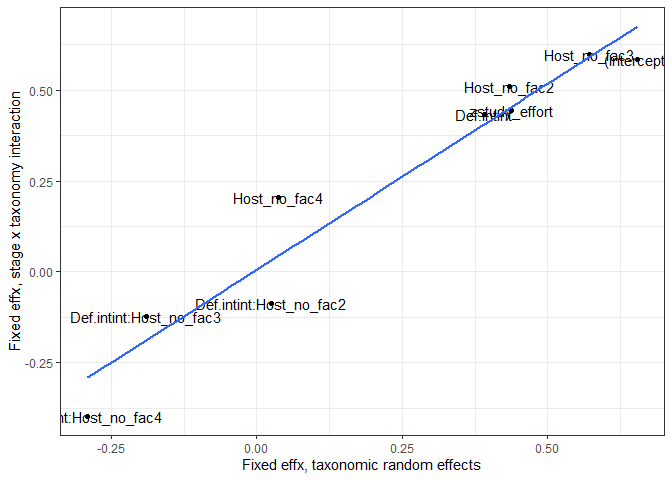<!-- -->

This suggests that certain stages are more generalist than others, but
particular parasite taxa may not conform to the trend. Therefore,
instead of looking at which parasite families are more or less
generalist than expected, we should look at what combinations of taxa
and stage are more or less generalist than expected.

Here are the stage x family combinations characterized by high
generalism (90th percentile). Some make sense, like Anisakids in fish
paratenic hosts and Protostrongylids in their snail first hosts.

    ##           re                      family re_quantile
    ## 1  0.7409223         Spirocercidae_1_int     top 10%
    ## 2  0.7167375     Protostrongylidae_1_int     top 10%
    ## 3  0.6585602        Ophidascaridae_2_def     top 10%
    ## 4  0.6240465            Anisakidae_2_int     top 10%
    ## 5  0.5285933          Dipylidiidae_2_int     top 10%
    ## 6  0.5071758         Paruterinidae_1_int     top 10%
    ## 7  0.4727657       Hymenolepididae_3_def     top 10%
    ## 8  0.4673835         Capillariidae_1_def     top 10%
    ## 9  0.4505841     Raphidascarididae_1_int     top 10%
    ## 10 0.4247686          Linstowiidae_2_def     top 10%
    ## 11 0.4237189     Rhadinorhynchidae_2_def     top 10%
    ## 12 0.4181813         Cosmocercidae_1_def     top 10%
    ## 13 0.4146328        Crenosomatidae_1_int     top 10%
    ## 14 0.4116706            Spiruridae_2_def     top 10%
    ## 15 0.4046143     Angiostrongylidae_1_int     top 10%
    ## 16 0.3953168            Acuariidae_2_def     top 10%
    ## 17 0.3870969        Cystidicolidae_2_def     top 10%
    ## 18 0.3852963 Oligacanthorhynchidae_2_int     top 10%
    ## 19 0.3495210        Dioctophymidae_2_int     top 10%
    ## 20 0.3468276         Capillariidae_2_def     top 10%
    ## 21 0.3462469       Mesocestoididae_2_int     top 10%
    ## 22 0.3355561        Ophidascaridae_2_int     top 10%
    ## 23 0.3303070       Amidostomatidae_1_def     top 10%
    ## 24 0.3274508        Acrobothriidae_2_def     top 10%
    ## 25 0.3240421          Strongylidae_1_def     top 10%
    ## 26 0.3092132      Echinorhynchidae_2_def     top 10%
    ## 27 0.3082539            Syngamidae_1_int     top 10%
    ## 28 0.2821516         Spirocercidae_2_int     top 10%
    ## 29 0.2739318           Dilepididae_2_def     top 10%
    ## 30 0.2714074          Cucullanidae_3_def     top 10%
    ## 31 0.2709538            Hedruridae_2_def     top 10%
    ## 32 0.2677669         Polymorphidae_3_def     top 10%
    ## 33 0.2666183            Anisakidae_1_int     top 10%

Here are the stage x family combinations characterized by low generalism
(10th percentile). Some relatively well studied groups
(Protostrongylidae, Gnathostomatidae, Taeniidae) pop up. These groups
are expected to have many hosts due to high study effort, and when they
do not, the model considers them specialists.

    ##            re                    family re_quantile
    ## 1  -0.3758457   Angiostrongylidae_2_int  bottom 10%
    ## 2  -0.3581501         Ascarididae_2_def  bottom 10%
    ## 3  -0.3580817   Protostrongylidae_2_def  bottom 10%
    ## 4  -0.3557183       Polymorphidae_1_int  bottom 10%
    ## 5  -0.3427159    Echinorhynchidae_1_int  bottom 10%
    ## 6  -0.3356769    Gnathostomatidae_4_def  bottom 10%
    ## 7  -0.3280120   Rhadinorhynchidae_1_int  bottom 10%
    ## 8  -0.3264196     Physalopteridae_2_int  bottom 10%
    ## 9  -0.3232010           Taeniidae_2_def  bottom 10%
    ## 10 -0.3119875    Phyllobothriidae_2_int  bottom 10%
    ## 11 -0.3089825         Dilepididae_2_int  bottom 10%
    ## 12 -0.3036612    Proteocephalidae_2_int  bottom 10%
    ## 13 -0.2967108     Diplotriaenidae_2_def  bottom 10%
    ## 14 -0.2949360 Neoechinorhynchidae_1_int  bottom 10%
    ## 15 -0.2933557       Philometridae_3_def  bottom 10%
    ## 16 -0.2927389         Davaineidae_2_def  bottom 10%
    ## 17 -0.2894230 Neoechinorhynchidae_2_int  bottom 10%
    ## 18 -0.2878369     Tetrabothriidae_2_int  bottom 10%
    ## 19 -0.2782676    Proteocephalidae_2_def  bottom 10%
    ## 20 -0.2780005        Haemonchidae_1_def  bottom 10%
    ## 21 -0.2627715     Anguillicolidae_3_def  bottom 10%
    ## 22 -0.2524703          Hedruridae_1_int  bottom 10%
    ## 23 -0.2387222      Dioctophymidae_1_int  bottom 10%
    ## 24 -0.2379228         Cloacinidae_1_def  bottom 10%
    ## 25 -0.2373140       Spirocercidae_3_def  bottom 10%
    ## 26 -0.2329383        Camallanidae_2_int  bottom 10%
    ## 27 -0.2282571  Diphyllobothriidae_3_int  bottom 10%
    ## 28 -0.2276333        Camallanidae_1_int  bottom 10%
    ## 29 -0.2275636           Oxyuridae_1_def  bottom 10%
    ## 30 -0.2246729        Filaroididae_2_int  bottom 10%
    ## 31 -0.2227280         Dilepididae_1_int  bottom 10%
    ## 32 -0.2060438        Lytocestidae_1_int  bottom 10%
    ## 33 -0.2054245      Crenosomatidae_2_int  bottom 10%

# Cross-stage tradeoffs

The taxonomic analyses suggest that species or taxa are not consistent
generalists across the full life cycle, which is not consistent with the
idea of generalism begetting generalism. Rather certain stages may
generalist while others specialist - there may be a tradeoff. This would
not be detectable from the variance components, as taxonomic groups
would not have consistent (high or low) generalism.

Let’s update the models to test for tradeoffs. Specifically, we ask if
generalism at the current stage is determined by generalism at the
previous stage, either positively or negatively. To examine this, we
need to restrict our data to just species with multi-stage life cycles.
This reduces the data by about half.

Number of stages:

    ## [1] 967

We fit the same series of models to account for taxonomy, study effort,
stage function (def vs int host), and host number. The results from
likelihood ratio tests are comparable to those with the full dataset.
Essentially all the terms have an effect on generalism.

    ## Data: filter(hosts_per_stage, Facultative != "postcyclic", !is.na(hsi_lcdb_suspcious_rem),  ...
    ## Models:
    ## reg0f: num_hosts_suspicious_removed ~ 1 + (1 | obs)
    ## reg1f: num_hosts_suspicious_removed ~ (1 | obs) + (1 | Parasite.species)
    ## reg2f: num_hosts_suspicious_removed ~ (1 | obs) + (1 | Parasite.species) + 
    ## reg2f:     (1 | parasite_genus) + (1 | parasite_family) + (1 | parasite_order) + 
    ## reg2f:     (1 | parasite_class) + (1 | parasite_phylum)
    ## reg3f: num_hosts_suspicious_removed ~ (1 | obs) + (1 | Parasite.species) + 
    ## reg3f:     (1 | parasite_genus) + (1 | parasite_family) + (1 | parasite_order) + 
    ## reg3f:     (1 | parasite_class) + (1 | parasite_phylum) + zstudy_effort
    ## reg4f: num_hosts_suspicious_removed ~ (1 | obs) + (1 | Parasite.species) + 
    ## reg4f:     (1 | parasite_genus) + (1 | parasite_family) + (1 | parasite_order) + 
    ## reg4f:     (1 | parasite_class) + (1 | parasite_phylum) + zstudy_effort + 
    ## reg4f:     Def.int
    ## reg5f: num_hosts_suspicious_removed ~ (1 | obs) + (1 | Parasite.species) + 
    ## reg5f:     (1 | parasite_genus) + (1 | parasite_family) + (1 | parasite_order) + 
    ## reg5f:     (1 | parasite_class) + (1 | parasite_phylum) + zstudy_effort + 
    ## reg5f:     Def.int + Host_no_fac
    ## reg6f: num_hosts_suspicious_removed ~ (1 | obs) + (1 | Parasite.species) + 
    ## reg6f:     (1 | parasite_genus) + (1 | parasite_family) + (1 | parasite_order) + 
    ## reg6f:     (1 | parasite_class) + (1 | parasite_phylum) + zstudy_effort + 
    ## reg6f:     Def.int + Host_no_fac + Def.int:Host_no_fac
    ##       Df    AIC    BIC  logLik deviance    Chisq Chi Df Pr(>Chisq)    
    ## reg0f  2 4849.1 4858.8 -2422.5   4845.1                               
    ## reg1f  3 4833.7 4848.3 -2413.8   4827.7  17.3888      1  3.046e-05 ***
    ## reg2f  8 4806.8 4845.8 -2395.4   4790.8  36.8987      5  6.276e-07 ***
    ## reg3f  9 4693.0 4736.9 -2337.5   4675.0 115.7149      1  < 2.2e-16 ***
    ## reg4f 10 4671.0 4719.8 -2325.5   4651.0  24.0276      1  9.496e-07 ***
    ## reg5f 12 4663.9 4722.4 -2320.0   4639.9  11.0844      2   0.003918 ** 
    ## reg6f 14 4662.3 4730.5 -2317.1   4634.3   5.6726      2   0.058642 .  
    ## ---
    ## Signif. codes:  0 '***' 0.001 '**' 0.01 '*' 0.05 '.' 0.1 ' ' 1

Next, we add the number of hosts in the previous stage to the model. The
relationship could be either positive (generalism begets generalism),
negative (tradeoffs), or absent (stage to stage differences cancel out
the overall effect). The term is weakly positive.

    ## Generalized linear mixed model fit by maximum likelihood (Laplace
    ##   Approximation) [glmerMod]
    ##  Family: poisson  ( log )
    ## Formula: num_hosts_suspicious_removed ~ (1 | obs) + (1 | Parasite.species) +  
    ##     (1 | parasite_genus) + (1 | parasite_family) + (1 | parasite_order) +  
    ##     (1 | parasite_class) + (1 | parasite_phylum) + zstudy_effort +  
    ##     Def.int + Host_no_fac + log(prev_hosts) + Def.int:Host_no_fac
    ##    Data: 
    ## filter(hosts_per_stage, Facultative != "postcyclic", !is.na(hsi_lcdb_suspcious_rem),  
    ##     !is.na(prev_hosts))
    ## 
    ##      AIC      BIC   logLik deviance df.resid 
    ##   4659.3   4732.4  -2314.6   4629.3      952 
    ## 
    ## Scaled residuals: 
    ##     Min      1Q  Median      3Q     Max 
    ## -1.4797 -0.5478 -0.1202  0.3311  1.2050 
    ## 
    ## Random effects:
    ##  Groups           Name        Variance  Std.Dev.
    ##  obs              (Intercept) 3.181e-01 0.564001
    ##  Parasite.species (Intercept) 2.241e-03 0.047343
    ##  parasite_genus   (Intercept) 1.025e-02 0.101231
    ##  parasite_family  (Intercept) 8.337e-02 0.288736
    ##  parasite_order   (Intercept) 2.524e-04 0.015887
    ##  parasite_class   (Intercept) 9.338e-06 0.003056
    ##  parasite_phylum  (Intercept) 2.100e-05 0.004582
    ## Number of obs: 967, groups:  
    ## obs, 967; Parasite.species, 803; parasite_genus, 336; parasite_family, 99; parasite_order, 30; parasite_class, 6; parasite_phylum, 3
    ## 
    ## Fixed effects:
    ##                         Estimate Std. Error z value Pr(>|z|)    
    ## (Intercept)              1.05944    0.06304  16.804  < 2e-16 ***
    ## zstudy_effort            0.40975    0.04597   8.914  < 2e-16 ***
    ## Def.intint               0.35944    0.08143   4.414 1.02e-05 ***
    ## Host_no_fac3             0.09585    0.07908   1.212  0.22553    
    ## Host_no_fac4            -0.52932    0.17281  -3.063  0.00219 ** 
    ## log(prev_hosts)          0.07767    0.03359   2.312  0.02077 *  
    ## Def.intint:Host_no_fac3 -0.42878    0.17841  -2.403  0.01625 *  
    ## Def.intint:Host_no_fac4 -0.53268    0.57226  -0.931  0.35194    
    ## ---
    ## Signif. codes:  0 '***' 0.001 '**' 0.01 '*' 0.05 '.' 0.1 ' ' 1
    ## 
    ## Correlation of Fixed Effects:
    ##             (Intr) zstdy_ Df.ntn Hst__3 Hst__4 lg(p_) D.:H__3
    ## zstudy_ffrt  0.217                                           
    ## Def.intint  -0.276 -0.144                                    
    ## Host_no_fc3 -0.232 -0.018  0.373                             
    ## Host_no_fc4 -0.159 -0.112  0.286  0.195                      
    ## lg(prv_hst) -0.498 -0.398 -0.075 -0.185 -0.026               
    ## Df.ntn:H__3  0.137 -0.005 -0.326 -0.402  0.137 -0.028        
    ## Df.ntn:H__4  0.074  0.046 -0.135 -0.038 -0.216 -0.057  0.058 
    ## convergence code: 0
    ## Model failed to converge with max|grad| = 0.519607 (tol = 0.001, component 1)

Let’s allow this effect to differ by life stage. That is, perhaps the
relationship for the 1st to 2nd host differs from that for the 2nd to
3rd hosts. And then we’ll expand it once more by acknowledging that a
transition to a definitive host might differ from a transition to an
intermediate host. Next are the likelihood ratio tests showing (i) the
mildly significant effect of generality at previous stage, (ii) the
weakly insignificant effect of allowing this effect to vary across the
life cycle, and (iii) the insignificant effect of allowing the effect to
depend on stage and on whether the next host is an intermediate or
definitive host.

    ## Data: filter(hosts_per_stage, Facultative != "postcyclic", !is.na(hsi_lcdb_suspcious_rem),  ...
    ## Models:
    ## reg6f: num_hosts_suspicious_removed ~ (1 | obs) + (1 | Parasite.species) + 
    ## reg6f:     (1 | parasite_genus) + (1 | parasite_family) + (1 | parasite_order) + 
    ## reg6f:     (1 | parasite_class) + (1 | parasite_phylum) + zstudy_effort + 
    ## reg6f:     Def.int + Host_no_fac + Def.int:Host_no_fac
    ## reg7f: num_hosts_suspicious_removed ~ (1 | obs) + (1 | Parasite.species) + 
    ## reg7f:     (1 | parasite_genus) + (1 | parasite_family) + (1 | parasite_order) + 
    ## reg7f:     (1 | parasite_class) + (1 | parasite_phylum) + zstudy_effort + 
    ## reg7f:     Def.int + Host_no_fac + log(prev_hosts) + Def.int:Host_no_fac
    ## reg8f: num_hosts_suspicious_removed ~ (1 | obs) + (1 | Parasite.species) + 
    ## reg8f:     (1 | parasite_genus) + (1 | parasite_family) + (1 | parasite_order) + 
    ## reg8f:     (1 | parasite_class) + (1 | parasite_phylum) + zstudy_effort + 
    ## reg8f:     Def.int + Host_no_fac + log(prev_hosts) + Def.int:Host_no_fac + 
    ## reg8f:     Host_no_fac:log(prev_hosts)
    ## reg9f: num_hosts_suspicious_removed ~ (1 | obs) + (1 | Parasite.species) + 
    ## reg9f:     (1 | parasite_genus) + (1 | parasite_family) + (1 | parasite_order) + 
    ## reg9f:     (1 | parasite_class) + (1 | parasite_phylum) + zstudy_effort + 
    ## reg9f:     Def.int + Host_no_fac + log(prev_hosts) + Def.int:Host_no_fac + 
    ## reg9f:     Host_no_fac:log(prev_hosts) + Def.int:log(prev_hosts) + Def.int:Host_no_fac:log(prev_hosts)
    ##       Df    AIC    BIC  logLik deviance  Chisq Chi Df Pr(>Chisq)  
    ## reg6f 14 4662.3 4730.5 -2317.1   4634.3                           
    ## reg7f 15 4659.3 4732.4 -2314.6   4629.3 4.9807      1    0.02563 *
    ## reg8f 17 4659.3 4742.2 -2312.7   4625.3 3.9496      2    0.13879  
    ## reg9f 20 4660.1 4757.6 -2310.1   4620.1 5.1946      3    0.15809  
    ## ---
    ## Signif. codes:  0 '***' 0.001 '**' 0.01 '*' 0.05 '.' 0.1 ' ' 1

Here is a simpler likelihood ratio test. It compares the model without
previous stage generalism with the model including previous stage and
all its interactions.

    ## Data: filter(hosts_per_stage, Facultative != "postcyclic", !is.na(hsi_lcdb_suspcious_rem),  ...
    ## Models:
    ## reg6f: num_hosts_suspicious_removed ~ (1 | obs) + (1 | Parasite.species) + 
    ## reg6f:     (1 | parasite_genus) + (1 | parasite_family) + (1 | parasite_order) + 
    ## reg6f:     (1 | parasite_class) + (1 | parasite_phylum) + zstudy_effort + 
    ## reg6f:     Def.int + Host_no_fac + Def.int:Host_no_fac
    ## reg9f: num_hosts_suspicious_removed ~ (1 | obs) + (1 | Parasite.species) + 
    ## reg9f:     (1 | parasite_genus) + (1 | parasite_family) + (1 | parasite_order) + 
    ## reg9f:     (1 | parasite_class) + (1 | parasite_phylum) + zstudy_effort + 
    ## reg9f:     Def.int + Host_no_fac + log(prev_hosts) + Def.int:Host_no_fac + 
    ## reg9f:     Host_no_fac:log(prev_hosts) + Def.int:log(prev_hosts) + Def.int:Host_no_fac:log(prev_hosts)
    ##       Df    AIC    BIC  logLik deviance  Chisq Chi Df Pr(>Chisq)  
    ## reg6f 14 4662.3 4730.5 -2317.1   4634.3                           
    ## reg9f 20 4660.1 4757.6 -2310.1   4620.1 14.125      6    0.02827 *
    ## ---
    ## Signif. codes:  0 '***' 0.001 '**' 0.01 '*' 0.05 '.' 0.1 ' ' 1

The R2 table shows that taxonomy and study effort have clear
affects. Life cycle characteristics are also important, explaining about
3% of the variation. Adding generality at the previous stage explains an
additional 1% of the variation.

    ## # A tibble: 9 x 6
    ##   step                 df_used marg_r2 cond_r2 sp_var_explained tax_var_explain~
    ##   <chr>                  <dbl>   <dbl>   <dbl>            <dbl>            <dbl>
    ## 1 within-species            NA   0       0.191            0.191            0.191
    ## 2 taxonomy                   0   0       0.202            0.081            0.202
    ## 3 study effort               1   0.131   0.242            0                0.111
    ## 4 stage function             1   0.156   0.26             0                0.104
    ## 5 host number                2   0.156   0.271            0                0.115
    ## 6 stage x host num           2   0.155   0.28             0                0.125
    ## 7 previous stage gene~       1   0.162   0.276            0.003            0.114
    ## 8 previous stage x ho~       2   0.164   0.301            0.006            0.137
    ## 9 previous stage x ho~       3   0.166   0.3              0                0.134

To get a feel for the patterns, we can plot the model predictions. We
get the expected relationship between previous stage generalism and
current stage generalism controlling for study effort (average) and
taxonomy (unconditional predictions).

The dotted lines represent the predicted relationships at a typical
study effort. They vary in a way expected from the simulations in that
the relationship is positive at the beginning of the life cycle and then
negative at the end. But the pattern is quite weak overall.

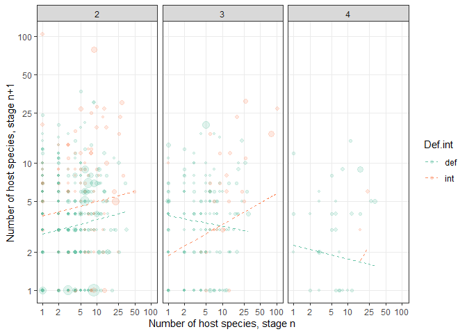<!-- -->

# Conclusions

We determined that a generalized linear mixed model with Poisson errors
performs better on host species counts than other models. Moreover, a
model accounting for overdispersion was an improvement. Using this as
the model structure, we fit a series of models to test hypotheses. We
found that, after accounting for study effort, generalism was higher in
intermediate than definitive hosts and it was higher in 2nd and 3rd
hosts compared to 1st hosts. In other words, the middle intermediate
hosts in long life cycles are characterized by wide host ranges. After
accounting for life cycle characteristics, parasite taxonomy still
explained some of the variation in host range. This was mainly due to
differences among parasite genera and families; higher taxonomic levels
explained less variation. Yet, parasite families (or genera) are not
consistently generalist. Rather, differences among taxa tend to be
driven by certain generalist stages. We confirmed this by adding a stage
by taxa (family) interaction to the model, which explained and
additional \~13% of the variation. This suggests that particular taxa
may diverge from the observed trends across stages. Finally, we assessed
cross-stage tradeoffs. We compared whether generalism at the previous
stage was related to generalism at the current stage, which reduced the
dataset by about half. The trends followed the pattern expected from
life cycle simulations, but only weakly, suggesting that there are not
obvious tradeoffs between stages.
