Host specificity at stage level
================
Dan Benesh
21/01/2020

Instead of looking at patterns of host use/specificity at the parasite
species-level, now I focus on specificty at the stage level. For
example, if a parasite has a 2-host life cycle, there are two stages,
the larval stage (in intermediate hosts) and the adult stage (in
definitive hosts). For this analysis, I am restricted to host records
from my life cycle database, because the NHM records were not broken
down by stage. I imagine I could predict/impute stage information onto
those host records (e.g. if the host is an invertebrate, it is almost
certainly an intermediate host), but that is a project unto itself.
Thus, this notebook presents patterns using host records from just life
cycle database.

# Taxonomic dissimilarity index

In this notebook we examine our second measure of generalism, the index
proposed by [Poulin and
Mouillot 2003](https://doi.org/10.1017/S0031182003002993). Higher values
of their index indicate that parasites have been found in more distantly
related hosts, while low values indicate they have been recorded in more
taxonomically similar hosts. I calculated the index for each stage for
every parasite species, again with only the host records from the life
cycle database.

First a few exploratory plots before statistical modelling. The
taxonomic dissimilarity of definitive hosts is rather constant with
parasite life cycle length. However, parasites in their second and third
intermediate hosts tend to infect a more taxonomically diverse group of
hosts.

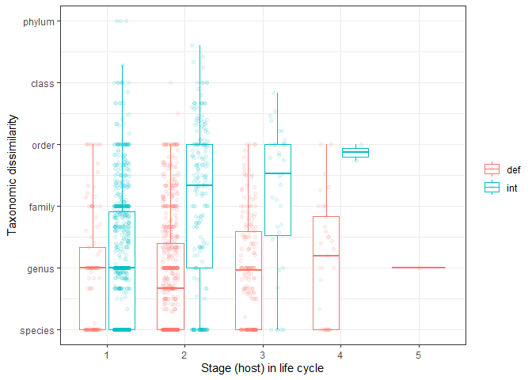<!-- -->

The generalism of worms in second or third intermediate hosts is also
clear when we split them by life cycle length.

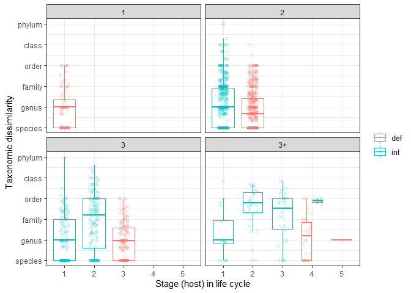<!-- -->

Finally, we can check if our index is related to study effort. It is;
most stages have higher generalism when the parasite species has been
more intensely studied. This pattern was not observed at the species
level, suggesting more study effort can add taxonomically dissimilar
hosts to the host list for a given *stage* but not for the *species
overall*.

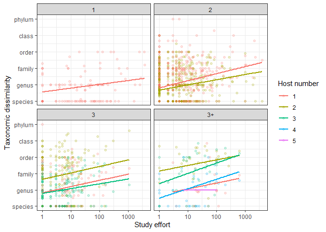<!-- -->

# Taxonomic regressions

This stage-level data is tricky to analyze because there are two source
of non-independence: (1) multiple stages from the same parasite species
and (2) covariation between parasite species due to phylogeny. One way
to address this is to include a species level random effect in a mixed
model, as well as taxonomic groups as additional random effects. This
accounts for within-species and between-species variation.

I add the following factors in order: (1) study effort, (2) whether the
stage is larval or adult, (3) whether the stage is the first, second,
third, etc in the life cycle (i.e. host number), and (4) the interaction
between host number and stage function (larval vs adult). There were
only a couple instances of host number = 5, so I combined these with
host number = 4.

Here are a few stats reported in the tables of the manuscript. How many
species were in this analysis?

    ## [1] 971

How many stages?

    ## [1] 1964

How many host records?

    ## [1] 8322

#### Model type

Before fitting a series of models for hypothesis testing, let’s try
different model formulations to see how well they capture patterns in
taxonomic dissimilarity. This metric is continuous between 1 (parasite
typically infects different species within genera) and 6 (parasite
infects different host phyla). However, there is a large peak at 1,
indicating stages known from a single host.

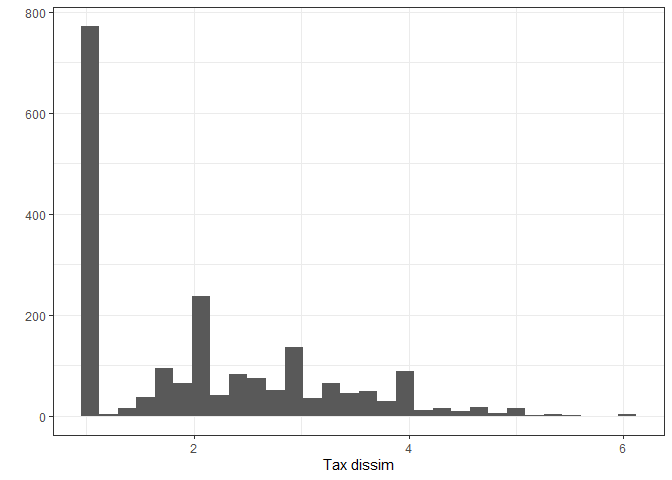<!-- -->
This peak is mainly due to sampling biases. For example, a parasite
species is given a value of 1 if it has been recorded from just 1 host
species.

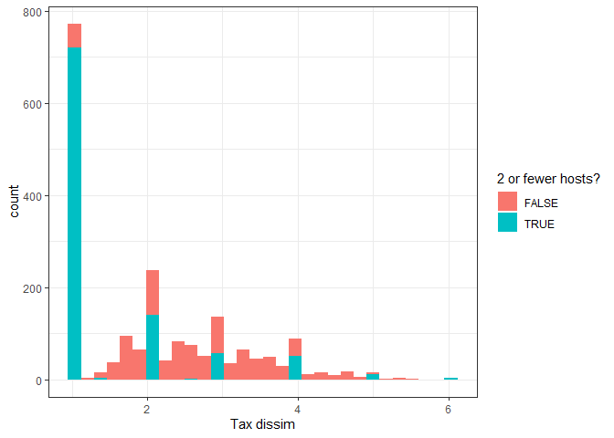<!-- -->

To some degree, study effort should capture this variation. However,
these peaks are offset from the overall mean, so they may be difficult
for a standard linear mixed model to capture. One way to address such
zero-inflation is a compound Poisson mixture model. Another possible
solution is to exclude species with few recorded hosts, which is
probably due to sampling effort more than actual host specificity.
However, this excludes quite a large fraction of the data, just under
half.

    ## 
    ## FALSE  TRUE 
    ##   983  1005

Thus, let’s compare four mixed models: (1) standard linear mixed model
(LMM) with the full data, (2) LMM excluding parasite stages with 2 or
fewer host species, (3) LMM excluding stages with few host species and
square-root transformed response, and (4) a compound Poisson-Gamma mixed
model fit with the package `cplm`.

Given their different assumptions about data structure and expected
error distributions, these models cannot be compared with information
criteria or ratio tests. Rather, let’s visualize how well they
approximate the actual data.

Here is a plot with the predicted values on the y and the observed
values on the x. The dashed line is the 1:1 line (i.e. model predicts
data perfectly). We can see that all models over- and under-estimate
extreme values. The two models with full data, Gamma and LMM, were quite
similar.

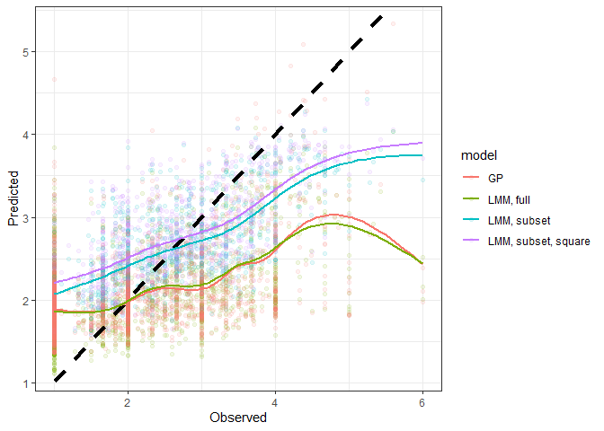<!-- -->

Next, let’s look at the unstandardized residual plots. They all look
quite similar, though the ones excluding data might be a bit better,
given they are less funnel shaped.

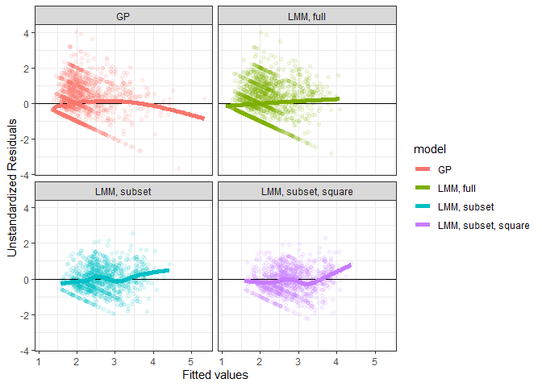<!-- -->

Another way to check model fit is to compare the distribution of
predictions with that of the observations. Here are density plots for
the predicted values. We can see that the models with all the data do
not have enough low values nor enough high values. The two models that
excluded stages with few host records are shifted up, as expected.

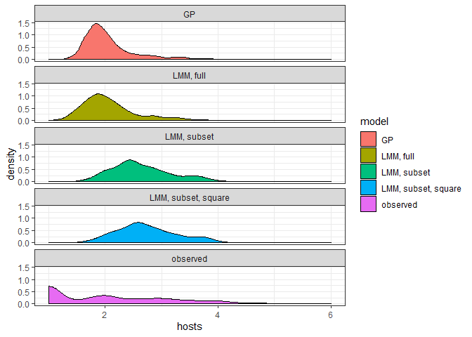<!-- -->

The pattern is perhaps better visualized without panelling. Excluding
stages with few host records clearly shifts the distribution towards
higher values. The Gamma model also has a bit narrower distribution of
predicted values than the LMM conducted with the full data.

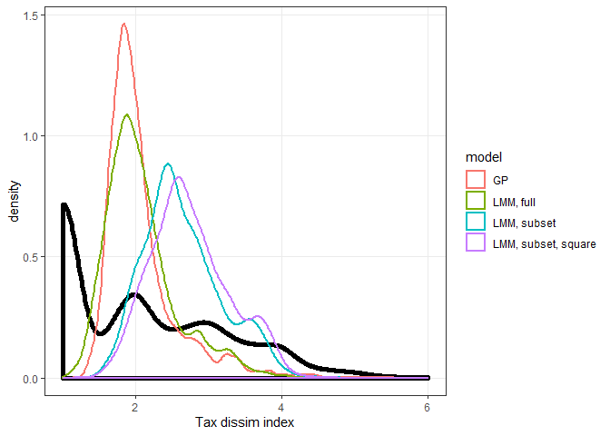<!-- -->

The main trend of interest is the change in host range across life
cycles. Let’s see what the models predict for this relationship,
compared to the observed pattern. The next plot shows boxplots of the
predicted and observed values at every level of life cycle length. We
see the closest match for the models based on the full dataset, as would
be expected, though the range of predictions tends to be narrower than
the observed values.

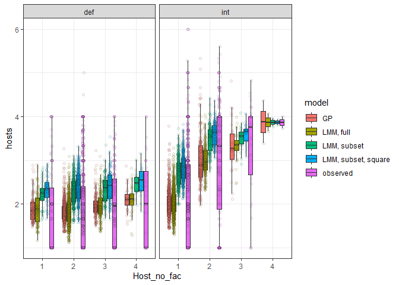<!-- -->

As a final model check, let’s look at the distribution of random
effects. Random effects are assumed to be normally distributed. We’ll
plot the estimated random effects for parasite family and genus.

Here is a density plot for the distribution of random effects at the
family level. The family effects in all models are fairly normal, though
they appear a bit lower in the gamma model.

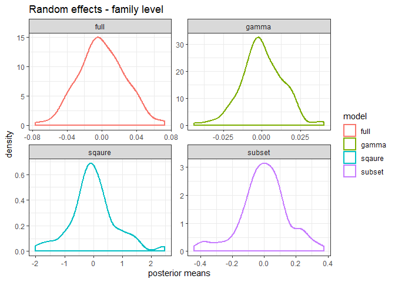<!-- -->

Here is the density plot for the random genus effects. They seem similar
to the family effects.

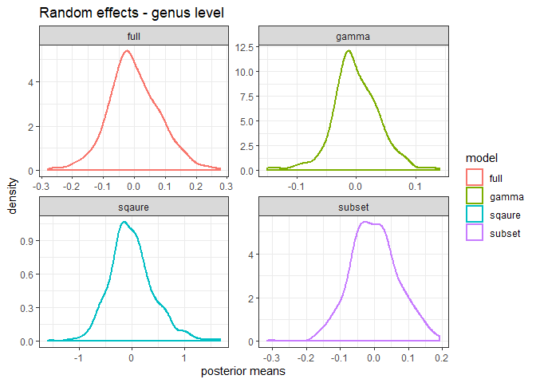<!-- -->

By excluding stages with few host records, we upwardly bias the mean
value of the dissimilarity index, because stages with few host records
usually have low index values (considered more specific). However,
subsetting excludes about half the data, so I am reluctant to prefer
this approach, even if it does have advantages like better residual
distributions and larger random effect sizes. Let’s compare the
parameter estimates for the LMM model with and without data exclusion.
They tend to be similar. Some of the largest parameters in both models
are for the contrasts of def vs int host, 1st vs 2nd host, and 1st vs
3rd host.

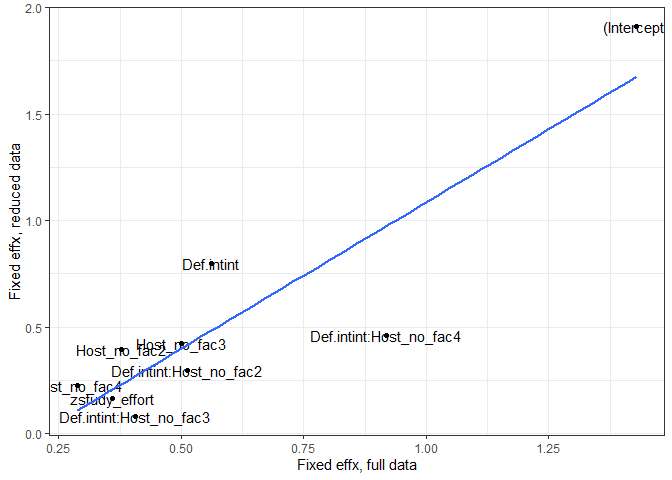<!-- -->

As the results appear consistent with and without data exclusion, let’s
proceed with the full dataset. I also do not see a reason to prefer the
more complicated Gamma model over the standard LMM: the predictions,
residuals, and random effects were quite similar.

### Model building

I add the following factors in order: (1) within-species random effect
(i.e. same species, different stages), (2) taxonomic random effects, (3)
study effort, (4) whether the stage is larval or adult, (5) whether the
stage is the first, second, third, etc in the life cycle (i.e. host
number), and (6) the interaction between host number and stage function
(larval vs adult). There were only a couple instances of host number =
5, so I combined these with host number = 4.

Here is a table of likelihood ratio tests for the model series. Every
addition is an improvement - adding the taxonomic random effect (1 vs
2), adding study effort (2 vs 3), distinguishing larval and adult stages
(3 vs 4), and distinguishing between the order of life stages (4 vs 5)
all improves the model. Even the interaction between stage number and
stage function was moderately significant.

    ## Data: filter(hosts_per_stage, Facultative != "postcyclic", !is.na(hsi_lcdb_suspcious_rem))
    ## Models:
    ## reg1f: hsi_lcdb_suspcious_rem ~ 1 + (1 | Parasite.species)
    ## reg2f: hsi_lcdb_suspcious_rem ~ (1 | Parasite.species) + (1 | parasite_genus) + 
    ## reg2f:     (1 | parasite_family) + (1 | parasite_order) + (1 | parasite_class) + 
    ## reg2f:     (1 | parasite_phylum)
    ## reg3f: hsi_lcdb_suspcious_rem ~ (1 | Parasite.species) + (1 | parasite_genus) + 
    ## reg3f:     (1 | parasite_family) + (1 | parasite_order) + (1 | parasite_class) + 
    ## reg3f:     (1 | parasite_phylum) + zstudy_effort
    ## reg4f: hsi_lcdb_suspcious_rem ~ (1 | Parasite.species) + (1 | parasite_genus) + 
    ## reg4f:     (1 | parasite_family) + (1 | parasite_order) + (1 | parasite_class) + 
    ## reg4f:     (1 | parasite_phylum) + zstudy_effort + Def.int
    ## reg5f: hsi_lcdb_suspcious_rem ~ (1 | Parasite.species) + (1 | parasite_genus) + 
    ## reg5f:     (1 | parasite_family) + (1 | parasite_order) + (1 | parasite_class) + 
    ## reg5f:     (1 | parasite_phylum) + zstudy_effort + Def.int + Host_no_fac
    ## reg6f: hsi_lcdb_suspcious_rem ~ (1 | Parasite.species) + (1 | parasite_genus) + 
    ## reg6f:     (1 | parasite_family) + (1 | parasite_order) + (1 | parasite_class) + 
    ## reg6f:     (1 | parasite_phylum) + zstudy_effort + Def.int + Host_no_fac + 
    ## reg6f:     Def.int:Host_no_fac
    ##       Df    AIC    BIC  logLik deviance   Chisq Chi Df Pr(>Chisq)    
    ## reg1f  3 5894.4 5911.2 -2944.2   5888.4                              
    ## reg2f  8 5826.9 5871.6 -2905.4   5810.9  77.528      5  2.759e-15 ***
    ## reg3f  9 5729.4 5779.7 -2855.7   5711.4  99.472      1  < 2.2e-16 ***
    ## reg4f 10 5667.7 5723.5 -2823.8   5647.7  63.723      1  1.432e-15 ***
    ## reg5f 13 5549.6 5622.2 -2761.8   5523.6 124.098      3  < 2.2e-16 ***
    ## reg6f 16 5543.7 5633.1 -2755.9   5511.7  11.851      3   0.007913 ** 
    ## ---
    ## Signif. codes:  0 '***' 0.001 '**' 0.01 '*' 0.05 '.' 0.1 ' ' 1

Here is the summary of the most complicated model. When we look at the
parameters, parasites tend to have higher host ranges in intermediate
host than in definitive hosts. And they are more generalist in the
second or third host in the life cycle, especially if the second host is
an intermediate host.

    ## Linear mixed model fit by REML ['lmerMod']
    ## Formula: 
    ## hsi_lcdb_suspcious_rem ~ (1 | Parasite.species) + (1 | parasite_genus) +  
    ##     (1 | parasite_family) + (1 | parasite_order) + (1 | parasite_class) +  
    ##     (1 | parasite_phylum) + zstudy_effort + Def.int + Host_no_fac +  
    ##     Def.int:Host_no_fac
    ##    Data: 
    ## filter(hosts_per_stage, Facultative != "postcyclic", !is.na(hsi_lcdb_suspcious_rem))
    ## 
    ## REML criterion at convergence: 5534.4
    ## 
    ## Scaled residuals: 
    ##     Min      1Q  Median      3Q     Max 
    ## -2.9563 -0.7722 -0.1195  0.6565  4.1586 
    ## 
    ## Random effects:
    ##  Groups           Name        Variance  Std.Dev.
    ##  Parasite.species (Intercept) 7.057e-09 0.000084
    ##  parasite_genus   (Intercept) 4.545e-02 0.213198
    ##  parasite_family  (Intercept) 9.387e-03 0.096887
    ##  parasite_order   (Intercept) 2.400e-02 0.154930
    ##  parasite_class   (Intercept) 3.922e-02 0.198043
    ##  parasite_phylum  (Intercept) 0.000e+00 0.000000
    ##  Residual                     9.194e-01 0.958850
    ## Number of obs: 1964, groups:  
    ## Parasite.species, 971; parasite_genus, 404; parasite_family, 122; parasite_order, 31; parasite_class, 6; parasite_phylum, 3
    ## 
    ## Fixed effects:
    ##                         Estimate Std. Error t value
    ## (Intercept)               1.4293     0.1527   9.360
    ## zstudy_effort             0.3591     0.0353  10.173
    ## Def.intint                0.5607     0.1241   4.520
    ## Host_no_fac2              0.3777     0.1258   3.003
    ## Host_no_fac3              0.4992     0.1403   3.558
    ## Host_no_fac4              0.2879     0.2130   1.352
    ## Def.intint:Host_no_fac2   0.5127     0.1520   3.373
    ## Def.intint:Host_no_fac3   0.4062     0.2359   1.722
    ## Def.intint:Host_no_fac4   0.9180     0.7355   1.248
    ## 
    ## Correlation of Fixed Effects:
    ##             (Intr) zstdy_ Df.ntn Hst__2 Hst__3 Hst__4 D.:H__2 D.:H__3
    ## zstudy_ffrt -0.122                                                   
    ## Def.intint  -0.717  0.158                                            
    ## Host_no_fc2 -0.708  0.171  0.914                                     
    ## Host_no_fc3 -0.639  0.121  0.811  0.796                              
    ## Host_no_fc4 -0.412  0.032  0.522  0.507  0.473                       
    ## Df.ntn:H__2  0.582 -0.183 -0.828 -0.843 -0.639 -0.382                
    ## Df.ntn:H__3  0.386 -0.136 -0.539 -0.498 -0.596 -0.175  0.472         
    ## Df.ntn:H__4  0.129 -0.034 -0.178 -0.162 -0.147 -0.262  0.143   0.096 
    ## convergence code: 0
    ## boundary (singular) fit: see ?isSingular

Now let’s look explicitly at effect sizes by making an R2
table for the model series.

    ## # A tibble: 6 x 6
    ##   step             df_used marg_r2 cond_r2 sp_var_explained tax_var_explained
    ##   <chr>              <dbl>   <dbl>   <dbl>            <dbl>             <dbl>
    ## 1 within-species        NA   0       0.144            0.144             0.144
    ## 2 taxonomy               0   0       0.156            0.027             0.156
    ## 3 study effort           1   0.062   0.178            0                 0.116
    ## 4 stage function         1   0.088   0.191            0                 0.103
    ## 5 host number            3   0.153   0.257            0                 0.104
    ## 6 stage x host num       3   0.158   0.254            0                 0.096

The fixed effects explain about 16% of the variation in taxonomic
dissimilarity. The R2 table suggests that even after
accounting for life cycle characteristics, there is still an effect of
taxonomy, explaining about 10% of the variation. Let’s examine this a
little more closely. At what level is the variation? We can look at the
size of the variance components for each taxonomic level. The pattern
seems bimodal - both genus and class explain some variation, while the
highest and lowest taxonomic units (species and phyla) do not seem
important.

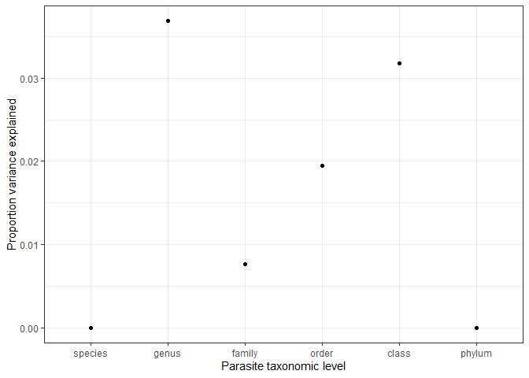<!-- -->

Another way to check this is by adding taxonomic levels sequentially,
either forwards or backwards and seeing how the variance explained
changed. First, we go from tips to root, starting with species and
adding additional taxonomic levels. Relatively little additional
variation is explained beyond order.

    ## # A tibble: 6 x 5
    ##   step    df_used marg_r2 cond_r2 tax_var_explained
    ##   <chr>     <dbl>   <dbl>   <dbl>             <dbl>
    ## 1 species      NA   0.162   0.223            0.061 
    ## 2 genus         0   0.165   0.235            0.0700
    ## 3 family        0   0.156   0.236            0.0800
    ## 4 order         0   0.158   0.251            0.093 
    ## 5 class         0   0.158   0.254            0.096 
    ## 6 phylum        0   0.158   0.254            0.096

Here’s the same table, but the terms are added in the opposite order, so
we’re going from root (phyla) to tips (species). There is a relatively
consistent increase in explanatory power with each taxonomic level
added, besides species at the end.

    ## # A tibble: 6 x 5
    ##   step    df_used marg_r2 cond_r2 tax_var_explained
    ##   <chr>     <dbl>   <dbl>   <dbl>             <dbl>
    ## 1 phylum       NA   0.16    0.18             0.0200
    ## 2 class         0   0.154   0.209            0.0550
    ## 3 order         0   0.153   0.214            0.061 
    ## 4 family        0   0.154   0.229            0.075 
    ## 5 genus         0   0.158   0.254            0.096 
    ## 6 species       0   0.158   0.254            0.096

Here is the same information as in the last two tables, but plotted. In
both cases, each additional taxonomic level has some explanatory power,
though not at the edges (e.g. adding phylum after class is not useful,
nor is adding species after genus). Thus, there are groupings throughout
the taxonomic hierarchy with some impact on host specificity.

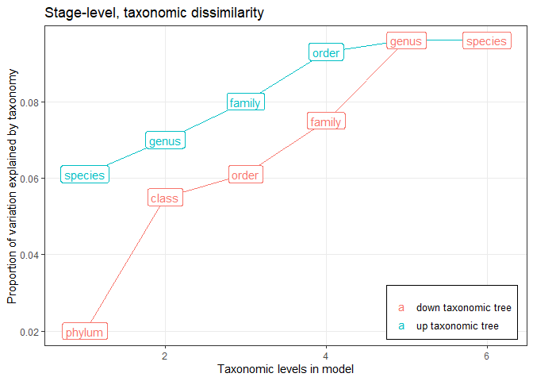<!-- -->

We’ll look at worm families to try and understand the taxonomic effects
in the model, not because it appears especially important, but rather
because it is the intermediate taxonomic level and thus balances the
number of groups with the sample size within groups. We’ll take the
random effect estimates for parasite family from the model accounting
for study effort, stage number, and stage function. Then, we’ll sort
them to see which families rank high (generalists) or low (specialists).

Here are the families above the 90th percentile for generalism. Some of
these have generalist paratenic stages (Raphidascarids,
Gnathostomatids), others have a wide host range at specific stages
(Anoplocephalids in taxonomically diverse mite intermediate hosts).

    ##            re            family re_quantile parasite_phylum
    ## 1  0.07275823     Paruterinidae     top 10% Platyhelminthes
    ## 2  0.06580279  Anoplocephalidae     top 10% Platyhelminthes
    ## 3  0.05281434     Spirocercidae     top 10%        Nematoda
    ## 4  0.04983022 Raphidascarididae     top 10%        Nematoda
    ## 5  0.04553038        Molineidae     top 10%        Nematoda
    ## 6  0.04248232      Tetrameridae     top 10%        Nematoda
    ## 7  0.04216744  Gnathostomatidae     top 10%        Nematoda
    ## 8  0.04121012        Syngamidae     top 10%        Nematoda
    ## 9  0.03976954        Spiruridae     top 10%        Nematoda
    ## 10 0.03968150     Fessisentidae     top 10%  Acanthocephala
    ## 11 0.03895406    Ophidascaridae     top 10%        Nematoda
    ## 12 0.03700318     Rictulariidae     top 10%        Nematoda
    ## 13 0.03644768        Acuariidae     top 10%        Nematoda

Here are the families below the 10th percentile for generalism
(specialists). Some of these are quite specific for their definitive
host (Triaenophorids and Anguillicolids).

    ##             re              family re_quantile parasite_phylum
    ## 1  -0.07646832       Philometridae  bottom 10%        Nematoda
    ## 2  -0.06207820   Rhadinorhynchidae  bottom 10%  Acanthocephala
    ## 3  -0.05096608          Seuratidae  bottom 10%        Nematoda
    ## 4  -0.04856992     Diplotriaenidae  bottom 10%        Nematoda
    ## 5  -0.04497042     Triaenophoridae  bottom 10% Platyhelminthes
    ## 6  -0.04295114        Camallanidae  bottom 10%        Nematoda
    ## 7  -0.04113498         Cloacinidae  bottom 10%        Nematoda
    ## 8  -0.03992000     Anguillicolidae  bottom 10%        Nematoda
    ## 9  -0.03886995   Protostrongylidae  bottom 10%        Nematoda
    ## 10 -0.03775745        Strongylidae  bottom 10%        Nematoda
    ## 11 -0.03670030           Taeniidae  bottom 10% Platyhelminthes
    ## 12 -0.03570496           Oxyuridae  bottom 10%        Nematoda
    ## 13 -0.03466315 Neoechinorhynchidae  bottom 10%  Acanthocephala

In both lists, there are nematodes and cestodes, which shouldn’t be
surprising, since phyla had little explanatory value. Let’s plot the
individual species in these family groups.

We can see that stages from generalist or specialist families can still
be quite variable. That is, they do not consistently score higher or
lower than expected for a given life stage. Partly, this is due to
differences in study effort - families will be considered generalists if
they have many hosts and low study effort, and specialists with few
hosts and high study effort. Also, the variability is a reminder that
taxonomy only explained 10% of the variation in generalism in the final
model.

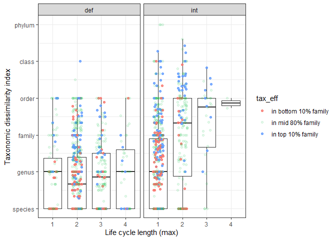<!-- -->

The patterns are clearer when we have boxplots for each family.
Specialist families (bottom 10%) usually have more restricted host
ranges than generalist families (top 10%), though the differences are
not extremely pronounced.

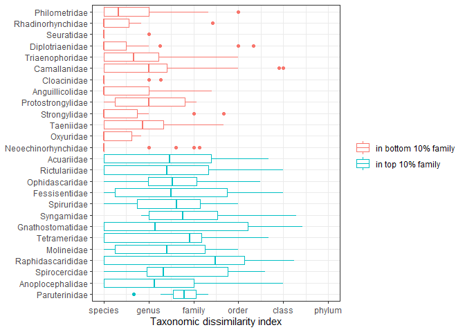<!-- -->

A family could be considered generalist if it has a wide host range at
all life stages or just at one particular stage. To understand which
families are identified by the model as generalist, let’s look at the
observed generalism relative to predictions for each family. The next
plot shows generalism across the life cycle for the 12 most ‘generalist’
families according to the model. The red points are model predictions
accounting for study effort, stage number, and stage function. We can
see that in these families life stages often have more recorded hosts
than predicted, but not always.

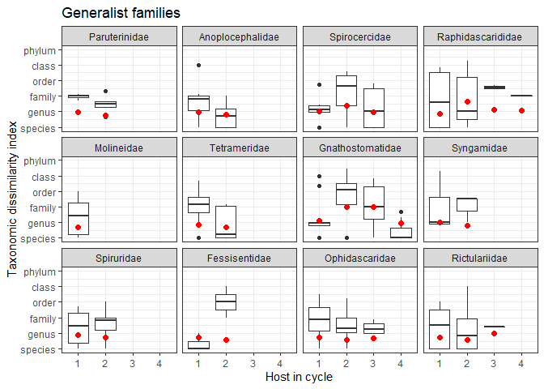<!-- -->

Similarly, when we make the same plot for the 12 most specialized
families according to the model, we see that some stages infect a more
taxonomically homogenous host set than expected. Some stages, though,
are as generalist as expected, which suggests that taxa differ because
particular stages are more or less generalist than expected, not
necessarily because the taxon is consistently generalist (or
specialists) across the full life cycle.

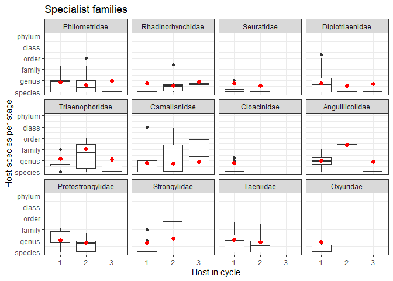<!-- -->

We can make the same plots, but for parasite orders instead of families,
because unlike for host range, parasite order also seemed relevant in
the mixed models for taxonomic dissimilarity.

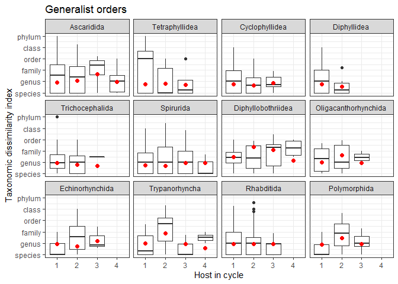<!-- -->

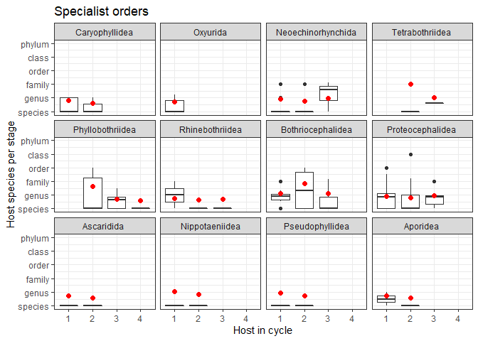<!-- -->

The same pattern emerges. Generalist taxa have some, but not all, stages
that are more generalist than expected, while specialist taxa tend to
have some, but not all, stage that are less generalist than expected.

This suggests that we might improve our model by allowing taxonomic
effects to vary across the life cycle, e.g. is parasite taxon *A* more
generalist at stage *B* than expected based on taxonomy and stage alone?
Let’s add this interaction. We allow parasite families to have different
generalism levels for each stage in their life cycle, with stage being a
combination of host number and type (int vs def). We used parasite
family, because of its position in the middle of the taxonomic hierarchy
(i.e. not adding too many or too few parameters).

Allowing the parasite family effect to vary by stage is a clear and
significant improvement to the model.

    ## Data: filter(hosts_per_stage, Facultative != "postcyclic", !is.na(hsi_lcdb_suspcious_rem))
    ## Models:
    ## reg6f: hsi_lcdb_suspcious_rem ~ (1 | Parasite.species) + (1 | parasite_genus) + 
    ## reg6f:     (1 | parasite_family) + (1 | parasite_order) + (1 | parasite_class) + 
    ## reg6f:     (1 | parasite_phylum) + zstudy_effort + Def.int + Host_no_fac + 
    ## reg6f:     Def.int:Host_no_fac
    ## reg7f: hsi_lcdb_suspcious_rem ~ (1 | Parasite.species) + (1 | parasite_genus) + 
    ## reg7f:     (1 | parasite_order) + (1 | parasite_class) + (1 | parasite_phylum) + 
    ## reg7f:     zstudy_effort + Def.int + Host_no_fac + (1 | stagex_fam2) + 
    ## reg7f:     Def.int:Host_no_fac
    ##       Df    AIC    BIC  logLik deviance  Chisq Chi Df Pr(>Chisq)    
    ## reg6f 16 5543.7 5633.1 -2755.9   5511.7                             
    ## reg7f 16 5492.7 5582.0 -2730.3   5460.7 51.081      0  < 2.2e-16 ***
    ## ---
    ## Signif. codes:  0 '***' 0.001 '**' 0.01 '*' 0.05 '.' 0.1 ' ' 1

This explains an additional 10% variation in the model.

    ## # A tibble: 7 x 5
    ##   step                    df_used marg_r2 cond_r2 tax_var_explained
    ##   <chr>                     <dbl>   <dbl>   <dbl>             <dbl>
    ## 1 within-species               NA   0       0.144             0.144
    ## 2 taxonomy                      0   0       0.156             0.156
    ## 3 study effort                  1   0.062   0.178             0.116
    ## 4 stage function                1   0.088   0.191             0.103
    ## 5 host number                   3   0.153   0.257             0.104
    ## 6 stage x host num              3   0.158   0.254             0.096
    ## 7 stage x parasite family       0   0.153   0.357             0.204

Now, the taxonomic effect is mainly attributed to parasite family, which
is not surprising, given that we allowed it to be stage dependent,
i.e. the family effect can differ for 1st hosts, 2nd hosts, etc.

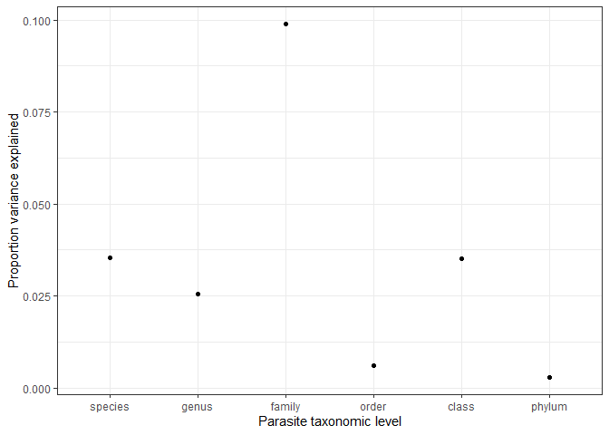<!-- -->

Notably, the same fixed parameters are significant, such as parasites
infecting more diverse hosts as larvae than adults (int \> def) and
generalism being higher in 2nd and 3rd hosts compared to first hosts.

    ## Linear mixed model fit by REML ['lmerMod']
    ## Formula: 
    ## hsi_lcdb_suspcious_rem ~ (1 | Parasite.species) + (1 | parasite_genus) +  
    ##     (1 | parasite_order) + (1 | parasite_class) + (1 | parasite_phylum) +  
    ##     zstudy_effort + Def.int + Host_no_fac + (1 | stagex_fam2) +  
    ##     Def.int:Host_no_fac
    ##    Data: 
    ## filter(hosts_per_stage, Facultative != "postcyclic", !is.na(hsi_lcdb_suspcious_rem))
    ## 
    ## REML criterion at convergence: 5480.1
    ## 
    ## Scaled residuals: 
    ##     Min      1Q  Median      3Q     Max 
    ## -3.0989 -0.6922 -0.1168  0.6110  4.3954 
    ## 
    ## Random effects:
    ##  Groups           Name        Variance Std.Dev.
    ##  Parasite.species (Intercept) 0.044016 0.20980 
    ##  parasite_genus   (Intercept) 0.031638 0.17787 
    ##  stagex_fam2      (Intercept) 0.123158 0.35094 
    ##  parasite_order   (Intercept) 0.007378 0.08590 
    ##  parasite_class   (Intercept) 0.043634 0.20889 
    ##  parasite_phylum  (Intercept) 0.003693 0.06077 
    ##  Residual                     0.801605 0.89532 
    ## Number of obs: 1964, groups:  
    ## Parasite.species, 971; parasite_genus, 404; stagex_fam2, 330; parasite_order, 31; parasite_class, 6; parasite_phylum, 3
    ## 
    ## Fixed effects:
    ##                         Estimate Std. Error t value
    ## (Intercept)              1.43413    0.16994   8.439
    ## zstudy_effort            0.35522    0.03563   9.969
    ## Def.intint               0.56853    0.14474   3.928
    ## Host_no_fac2             0.41491    0.14715   2.820
    ## Host_no_fac3             0.50615    0.16207   3.123
    ## Host_no_fac4             0.51157    0.26280   1.947
    ## Def.intint:Host_no_fac2  0.48536    0.18295   2.653
    ## Def.intint:Host_no_fac3  0.37402    0.28986   1.290
    ## Def.intint:Host_no_fac4  0.73931    0.79831   0.926
    ## 
    ## Correlation of Fixed Effects:
    ##             (Intr) zstdy_ Df.ntn Hst__2 Hst__3 Hst__4 D.:H__2 D.:H__3
    ## zstudy_ffrt -0.123                                                   
    ## Def.intint  -0.718  0.152                                            
    ## Host_no_fc2 -0.708  0.169  0.840                                     
    ## Host_no_fc3 -0.645  0.124  0.762  0.747                              
    ## Host_no_fc4 -0.383  0.025  0.455  0.443  0.412                       
    ## Df.ntn:H__2  0.566 -0.165 -0.794 -0.810 -0.585 -0.343                
    ## Df.ntn:H__3  0.373 -0.127 -0.513 -0.436 -0.567 -0.174  0.413         
    ## Df.ntn:H__4  0.142 -0.035 -0.194 -0.164 -0.151 -0.322  0.150   0.095

Here is the correlation between the parameter estimates from the model
without and with the stage x taxonomy interaction. The are quite
comparable.

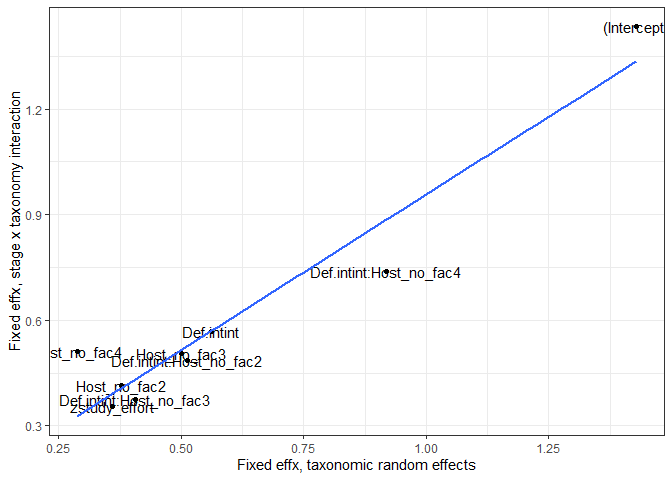<!-- -->

This suggests that certain stages are more generalist than others, but
particular parasite taxa may not conform to the trend. Therefore,
instead of looking at which parasite families are more or less
generalist than expected, we should look at what combinations of taxa
and stage are more or less generalist than expected.

Here are the stage x family combinations characterized by high
generalism (90th percentile).

    ##           re                   family re_quantile
    ## 1  0.6699900      Fessisentidae_2_def     top 10%
    ## 2  0.5941758   Echinorhynchidae_2_def     top 10%
    ## 3  0.5129293      Spirocercidae_2_int     top 10%
    ## 4  0.4849199       Tetrameridae_1_int     top 10%
    ## 5  0.4772604  Angiostrongylidae_1_int     top 10%
    ## 6  0.4714655      Polymorphidae_2_def     top 10%
    ## 7  0.4705682 Diphyllobothriidae_4_def     top 10%
    ## 8  0.4629533       Kathlaniidae_1_int     top 10%
    ## 9  0.4607963   Anoplocephalidae_1_int     top 10%
    ## 10 0.4397177      Paruterinidae_1_int     top 10%
    ## 11 0.4046429      Illiosentidae_2_def     top 10%
    ## 12 0.3894344  Raphidascarididae_3_def     top 10%
    ## 13 0.3849927      Capillariidae_1_def     top 10%
    ## 14 0.3756287    Dioecotaeniidae_1_int     top 10%
    ## 15 0.3752226   Gnathostomatidae_2_int     top 10%
    ## 16 0.3561978        Toxocaridae_1_int     top 10%
    ## 17 0.3488667         Acuariidae_2_int     top 10%
    ## 18 0.3251003     Ophidascaridae_1_int     top 10%
    ## 19 0.3237159     Habronematidae_2_def     top 10%
    ## 20 0.3119102         Molineidae_1_def     top 10%
    ## 21 0.3068953   Gnathostomatidae_3_int     top 10%
    ## 22 0.3017452      Paruterinidae_2_def     top 10%
    ## 23 0.2930854       Serendipidae_1_int     top 10%
    ## 24 0.2840090   Gnathostomatidae_2_def     top 10%
    ## 25 0.2772479         Spiruridae_2_def     top 10%
    ## 26 0.2771498   Echinobothriidae_1_int     top 10%
    ## 27 0.2771482       Camallanidae_3_def     top 10%
    ## 28 0.2711345         Hedruridae_2_def     top 10%
    ## 29 0.2700450 Diphyllobothriidae_3_def     top 10%
    ## 30 0.2668870        Dilepididae_2_def     top 10%
    ## 31 0.2633002    Onchobothriidae_2_int     top 10%
    ## 32 0.2588882  Lacistorhynchidae_2_int     top 10%
    ## 33 0.2537864   Metastrongylidae_2_int     top 10%

Here are the stage x family combinations characterized by low generalism
(10th percentile). Some of these are probably sampling issues. For
example, Dilepids appear specific for 2nd intermediate hosts because
they have only been sporadically reported from snails, which may be more
of a dead end than a typical part of the life cycle. It is nice to see
that Diphyllobothrids in second intermediate hosts, like
*Schistocephalus* in sticklebacks, are among the most specific parasite
families.

    ##            re                    family re_quantile
    ## 1  -0.5550124         Dilepididae_2_int  bottom 10%
    ## 2  -0.4845242 Neoechinorhynchidae_2_int  bottom 10%
    ## 3  -0.4787963    Echinorhynchidae_1_int  bottom 10%
    ## 4  -0.4476455       Polymorphidae_1_int  bottom 10%
    ## 5  -0.4426452  Diphyllobothriidae_2_int  bottom 10%
    ## 6  -0.4345626     Diplotriaenidae_2_def  bottom 10%
    ## 7  -0.4177306    Gnathostomatidae_4_def  bottom 10%
    ## 8  -0.4119209          Anisakidae_4_def  bottom 10%
    ## 9  -0.4020836        Strongylidae_1_def  bottom 10%
    ## 10 -0.3961873     Anguillicolidae_3_def  bottom 10%
    ## 11 -0.3938986   Rhadinorhynchidae_1_int  bottom 10%
    ## 12 -0.3931629     Tetrabothriidae_2_int  bottom 10%
    ## 13 -0.3709801          Hedruridae_1_int  bottom 10%
    ## 14 -0.3599451         Ascarididae_2_def  bottom 10%
    ## 15 -0.3559466        Camallanidae_2_int  bottom 10%
    ## 16 -0.3547592           Oxyuridae_1_def  bottom 10%
    ## 17 -0.3481024   Rhadinorhynchidae_2_int  bottom 10%
    ## 18 -0.3340743    Metastrongylidae_3_def  bottom 10%
    ## 19 -0.3338027   Protostrongylidae_2_def  bottom 10%
    ## 20 -0.3295657         Cloacinidae_1_def  bottom 10%
    ## 21 -0.3271033       Philometridae_3_def  bottom 10%
    ## 22 -0.3182721   Angiostrongylidae_3_def  bottom 10%
    ## 23 -0.2958076       Dracunculidae_1_int  bottom 10%
    ## 24 -0.2721119     Triaenophoridae_3_def  bottom 10%
    ## 25 -0.2659757        Cucullanidae_2_int  bottom 10%
    ## 26 -0.2594825         Thelaziidae_1_int  bottom 10%
    ## 27 -0.2590522          Seuratidae_1_int  bottom 10%
    ## 28 -0.2441820    Proteocephalidae_2_def  bottom 10%
    ## 29 -0.2424906          Seuratidae_2_def  bottom 10%
    ## 30 -0.2421783       Philometridae_1_int  bottom 10%
    ## 31 -0.2404275       Philometridae_2_def  bottom 10%
    ## 32 -0.2401232      Cystidicolidae_2_int  bottom 10%
    ## 33 -0.2393760     Thelastomatidae_1_def  bottom 10%

# Cross-stage tradeoffs

The taxonomic analyses suggest that species or taxa are not consistent
generalists across the full life cycle, which is not consistent with the
idea that generalism begets generalism. Rather certain stages may
generalist while others specialist - there may be a tradeoff. This would
not be detectable from the variance components, as taxonomic groups
would not have consistent (high or low) generalism.

Let’s update the models to test for tradeoffs. Specifically, we ask if
generalism at the current stage is determined by generalism at the
previous stage, either positively or negatively. To examine this, we
need to restrict our data to just species with multi-stage life cycles.
This reduces the data by about half.

Number of stages:

    ## [1] 967

We fit the same series of models to account for taxonomy, study effort,
stage function (def vs int host), and host number. The results from
likelihood ratio tests are different than those from the full dataset.
Specifically, there is no effect of host number on generalism.

    ## Data: filter(hosts_per_stage, Facultative != "postcyclic", !is.na(hsi_lcdb_suspcious_rem),  ...
    ## Models:
    ## reg1f: hsi_lcdb_suspcious_rem ~ 1 + (1 | Parasite.species)
    ## reg2f: hsi_lcdb_suspcious_rem ~ (1 | Parasite.species) + (1 | parasite_genus) + 
    ## reg2f:     (1 | parasite_family) + (1 | parasite_order) + (1 | parasite_class) + 
    ## reg2f:     (1 | parasite_phylum)
    ## reg3f: hsi_lcdb_suspcious_rem ~ (1 | Parasite.species) + (1 | parasite_genus) + 
    ## reg3f:     (1 | parasite_family) + (1 | parasite_order) + (1 | parasite_class) + 
    ## reg3f:     (1 | parasite_phylum) + zstudy_effort
    ## reg4f: hsi_lcdb_suspcious_rem ~ (1 | Parasite.species) + (1 | parasite_genus) + 
    ## reg4f:     (1 | parasite_family) + (1 | parasite_order) + (1 | parasite_class) + 
    ## reg4f:     (1 | parasite_phylum) + zstudy_effort + Def.int
    ## reg5f: hsi_lcdb_suspcious_rem ~ (1 | Parasite.species) + (1 | parasite_genus) + 
    ## reg5f:     (1 | parasite_family) + (1 | parasite_order) + (1 | parasite_class) + 
    ## reg5f:     (1 | parasite_phylum) + zstudy_effort + Def.int + Host_no_fac
    ## reg6f: hsi_lcdb_suspcious_rem ~ (1 | Parasite.species) + (1 | parasite_genus) + 
    ## reg6f:     (1 | parasite_family) + (1 | parasite_order) + (1 | parasite_class) + 
    ## reg6f:     (1 | parasite_phylum) + zstudy_effort + Def.int + Host_no_fac + 
    ## reg6f:     Def.int:Host_no_fac
    ##       Df    AIC    BIC  logLik deviance    Chisq Chi Df Pr(>Chisq)    
    ## reg1f  3 2932.6 2947.2 -1463.3   2926.6                               
    ## reg2f  8 2842.7 2881.7 -1413.4   2826.7  99.8686      5  < 2.2e-16 ***
    ## reg3f  9 2778.8 2822.7 -1380.4   2760.8  65.9366      1  4.657e-16 ***
    ## reg4f 10 2626.7 2675.4 -1303.3   2606.7 154.0990      1  < 2.2e-16 ***
    ## reg5f 12 2628.7 2687.1 -1302.3   2604.7   2.0385      2     0.3609    
    ## reg6f 14 2631.4 2699.7 -1301.7   2603.4   1.1932      2     0.5507    
    ## ---
    ## Signif. codes:  0 '***' 0.001 '**' 0.01 '*' 0.05 '.' 0.1 ' ' 1

When we plot this, we see why. For a given life cycle step, generalism
is lower for definitive hosts, and this difference is consistent.

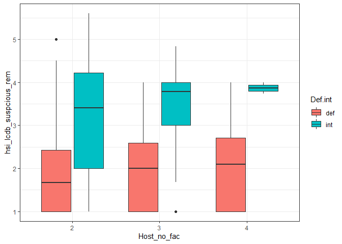<!-- -->

Next, we add the taxonomic dissimilarity of hosts in the previous stage
to the model. The relationship could be either positive (generalism
begets generalism), negative (tradeoffs), or absent (stage to stage
differences cancel out any overall effect). The term is positive but
weak.

    ## Linear mixed model fit by REML ['lmerMod']
    ## Formula: 
    ## hsi_lcdb_suspcious_rem ~ (1 | Parasite.species) + (1 | parasite_genus) +  
    ##     (1 | parasite_family) + (1 | parasite_order) + (1 | parasite_class) +  
    ##     (1 | parasite_phylum) + zstudy_effort + Def.int + Host_no_fac +  
    ##     prev_hsi + Def.int:Host_no_fac
    ##    Data: 
    ## filter(hosts_per_stage, Facultative != "postcyclic", !is.na(hsi_lcdb_suspcious_rem),  
    ##     !is.na(prev_hsi))
    ## 
    ## REML criterion at convergence: 2620
    ## 
    ## Scaled residuals: 
    ##      Min       1Q   Median       3Q      Max 
    ## -2.85028 -0.62927 -0.08197  0.63077  2.71791 
    ## 
    ## Random effects:
    ##  Groups           Name        Variance  Std.Dev. 
    ##  Parasite.species (Intercept) 2.429e-09 4.928e-05
    ##  parasite_genus   (Intercept) 7.144e-02 2.673e-01
    ##  parasite_family  (Intercept) 1.986e-02 1.409e-01
    ##  parasite_order   (Intercept) 1.892e-02 1.376e-01
    ##  parasite_class   (Intercept) 9.345e-02 3.057e-01
    ##  parasite_phylum  (Intercept) 0.000e+00 0.000e+00
    ##  Residual                     7.818e-01 8.842e-01
    ## Number of obs: 967, groups:  
    ## Parasite.species, 803; parasite_genus, 336; parasite_family, 99; parasite_order, 30; parasite_class, 6; parasite_phylum, 3
    ## 
    ## Fixed effects:
    ##                         Estimate Std. Error t value
    ## (Intercept)              1.82354    0.15946  11.436
    ## zstudy_effort            0.32408    0.04995   6.489
    ## Def.intint               1.09881    0.09544  11.513
    ## Host_no_fac3             0.06893    0.09204   0.749
    ## Host_no_fac4            -0.20990    0.19517  -1.075
    ## prev_hsi                 0.04928    0.02821   1.747
    ## Def.intint:Host_no_fac3 -0.16511    0.22104  -0.747
    ## Def.intint:Host_no_fac4  0.57369    0.69430   0.826
    ## 
    ## Correlation of Fixed Effects:
    ##             (Intr) zstdy_ Df.ntn Hst__3 Hst__4 prv_hs D.:H__3
    ## zstudy_ffrt  0.102                                           
    ## Def.intint  -0.138 -0.182                                    
    ## Host_no_fc3 -0.054 -0.054  0.330                             
    ## Host_no_fc4 -0.033 -0.102  0.240  0.200                      
    ## prev_hsi    -0.332 -0.209 -0.022 -0.264 -0.134               
    ## Df.ntn:H__3  0.068  0.009 -0.349 -0.371  0.146 -0.043        
    ## Df.ntn:H__4  0.022  0.023 -0.146 -0.050 -0.217  0.001  0.039 
    ## convergence code: 0
    ## boundary (singular) fit: see ?isSingular

Let’s allow this effect to differ by life stage. That is, perhaps the
relationship for the transition between 1st and 2nd host differs from
that between 2nd and 3rd hosts. And then we’ll expand it once more by
acknowledging that a transition to a definitive host might differ from a
transition to an intermediate host. Here are the likelihood ratio tests
showing (i) the borderline significant effect of generality at previous
stage, (ii) the significant effect of allowing this effect to vary
across the life cycle, and (iii) the weakly significant effect of
allowing the effect to depend on stage and on whether the next host is
an intermediate or definitive host.

    ## Data: filter(hosts_per_stage, Facultative != "postcyclic", !is.na(hsi_lcdb_suspcious_rem),  ...
    ## Models:
    ## reg6f: hsi_lcdb_suspcious_rem ~ (1 | Parasite.species) + (1 | parasite_genus) + 
    ## reg6f:     (1 | parasite_family) + (1 | parasite_order) + (1 | parasite_class) + 
    ## reg6f:     (1 | parasite_phylum) + zstudy_effort + Def.int + Host_no_fac + 
    ## reg6f:     Def.int:Host_no_fac
    ## reg7f: hsi_lcdb_suspcious_rem ~ (1 | Parasite.species) + (1 | parasite_genus) + 
    ## reg7f:     (1 | parasite_family) + (1 | parasite_order) + (1 | parasite_class) + 
    ## reg7f:     (1 | parasite_phylum) + zstudy_effort + Def.int + Host_no_fac + 
    ## reg7f:     prev_hsi + Def.int:Host_no_fac
    ## reg8f: hsi_lcdb_suspcious_rem ~ (1 | Parasite.species) + (1 | parasite_genus) + 
    ## reg8f:     (1 | parasite_family) + (1 | parasite_order) + (1 | parasite_class) + 
    ## reg8f:     (1 | parasite_phylum) + zstudy_effort + Def.int + Host_no_fac + 
    ## reg8f:     prev_hsi + Def.int:Host_no_fac + Host_no_fac:prev_hsi
    ## reg9f: hsi_lcdb_suspcious_rem ~ (1 | Parasite.species) + (1 | parasite_genus) + 
    ## reg9f:     (1 | parasite_family) + (1 | parasite_order) + (1 | parasite_class) + 
    ## reg9f:     (1 | parasite_phylum) + zstudy_effort + Def.int + Host_no_fac + 
    ## reg9f:     prev_hsi + Def.int:Host_no_fac + Host_no_fac:prev_hsi + Def.int:prev_hsi + 
    ## reg9f:     Def.int:Host_no_fac:prev_hsi
    ##       Df    AIC    BIC  logLik deviance   Chisq Chi Df Pr(>Chisq)    
    ## reg6f 14 2631.4 2699.7 -1301.7   2603.4                              
    ## reg7f 15 2630.4 2703.5 -1300.2   2600.4  3.0451      1  0.0809833 .  
    ## reg8f 17 2619.8 2702.7 -1292.9   2585.8 14.5584      2  0.0006897 ***
    ## reg9f 20 2615.4 2712.8 -1287.7   2575.4 10.4889      3  0.0148367 *  
    ## ---
    ## Signif. codes:  0 '***' 0.001 '**' 0.01 '*' 0.05 '.' 0.1 ' ' 1

Here is a simpler likelihood ratio test. It compares the model without
previous stage generalism with the model including previous stage and
all its interactions.

    ## Data: filter(hosts_per_stage, Facultative != "postcyclic", !is.na(hsi_lcdb_suspcious_rem),  ...
    ## Models:
    ## reg6f: hsi_lcdb_suspcious_rem ~ (1 | Parasite.species) + (1 | parasite_genus) + 
    ## reg6f:     (1 | parasite_family) + (1 | parasite_order) + (1 | parasite_class) + 
    ## reg6f:     (1 | parasite_phylum) + zstudy_effort + Def.int + Host_no_fac + 
    ## reg6f:     Def.int:Host_no_fac
    ## reg9f: hsi_lcdb_suspcious_rem ~ (1 | Parasite.species) + (1 | parasite_genus) + 
    ## reg9f:     (1 | parasite_family) + (1 | parasite_order) + (1 | parasite_class) + 
    ## reg9f:     (1 | parasite_phylum) + zstudy_effort + Def.int + Host_no_fac + 
    ## reg9f:     prev_hsi + Def.int:Host_no_fac + Host_no_fac:prev_hsi + Def.int:prev_hsi + 
    ## reg9f:     Def.int:Host_no_fac:prev_hsi
    ##       Df    AIC    BIC  logLik deviance  Chisq Chi Df Pr(>Chisq)    
    ## reg6f 14 2631.4 2699.7 -1301.7   2603.4                             
    ## reg9f 20 2615.4 2712.8 -1287.7   2575.4 28.092      6  9.028e-05 ***
    ## ---
    ## Signif. codes:  0 '***' 0.001 '**' 0.01 '*' 0.05 '.' 0.1 ' ' 1

The R2 table shows that taxonomy and study effort have clear
affects. Life cycle characteristics are also important, explaining over
10% of the variation. Adding generality at the previous stage explains
an additional 1.5% of the variation.

    ## # A tibble: 9 x 6
    ##   step                 df_used marg_r2 cond_r2 sp_var_explained tax_var_explain~
    ##   <chr>                  <dbl>   <dbl>   <dbl>            <dbl>            <dbl>
    ## 1 within-species            NA   0       0.071            0.071            0.071
    ## 2 taxonomy                   0   0       0.208            0                0.208
    ## 3 study effort               1   0.076   0.25             0                0.174
    ## 4 stage function             1   0.216   0.38             0                0.164
    ## 5 host number                2   0.218   0.383            0                0.165
    ## 6 stage x host num           2   0.216   0.384            0                0.168
    ## 7 previous stage gene~       1   0.219   0.381            0                0.162
    ## 8 previous stage x ho~       2   0.226   0.411            0                0.185
    ## 9 previous stage x ho~       3   0.231   0.419            0                0.188

To get a feel for the patterns, we can plot the model predictions. We
get the expected relationship between previous stage generalism and
current stage generalism controlling for study effort (average) and
taxonomy (unconditional predictions).

The dotted lines represent the predicted relationships at a typical
study effort. Transitions from intermediate to definitive host vary in a
way expected from the simulations in that the relationship is positive
at the beginning of the life cycle and then negative at the end.
Intermediate to intermediate transmissions tend to be positive,
consistent with the idea of generalism begetting generalism, though
there are deviations from these expectations.

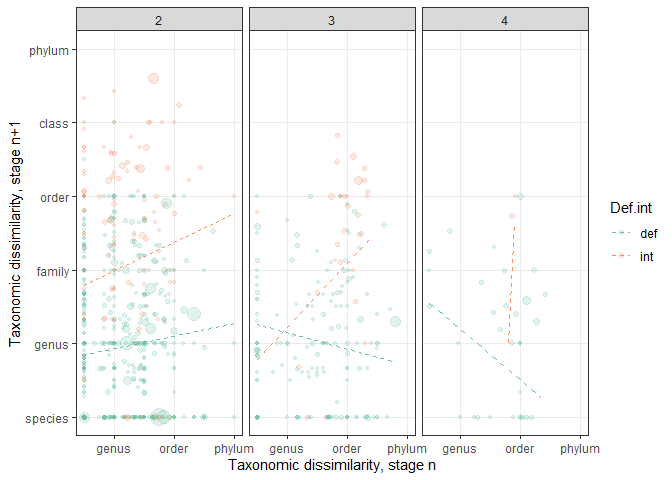<!-- -->

# Conclusions

We determined that a linear mixed model was appropriate for the data,
though the model did not account for low values well, many of which are
probably the consequence of sampling biases rather than ‘real’
specificity. However, this does not obviously bias the results, because
results were similar when we excluded stages recorded from just a few
host records or when we tried alternative model formulations like a
compound Gamma-Poisson mixture model. We fit a series of models to test
hypotheses. We found that, after accounting for study effort, generalism
was higher in intermediate than definitive hosts and it was higher in
2nd and 3rd hosts compared to 1st hosts. The interaction between stage
function (int vs def) and stage number was also significant, because
second intermediate hosts tend to be especially generalist. After
accounting for life cycle characteristics, parasite taxonomy still
explained some of the variation in generalism. Various parts of the
taxonomic hierarchy seem responsible for this effect, which differed
from [host range](stage_level_analysis_host_range_freq.Rmd), where the
effect was more concentrated at the tips. Yet, parasite taxa are not
consistently generalist across the whole life cycle. Rather, certain
stages seem to be consistently generalist in particular taxa. We
confirmed this by adding a stage by taxa (family) interaction to the
model, which explained and additional \~10% of the variation. This
suggests that particular taxa may diverge from the observed trends
across stages. Finally, we assessed cross-stage tradeoffs. We compared
whether generalism at the previous stage was related to generalism at
the current stage, which reduced the dataset by about half. The trends
followed the pattern expected from life cycle simulations, but only
weakly, suggesting that there are not obvious tradeoffs between stages.
