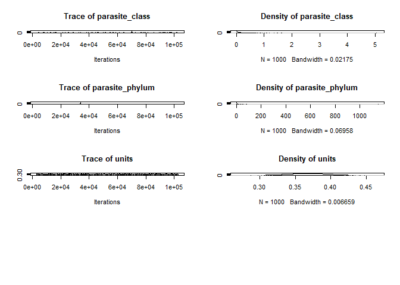
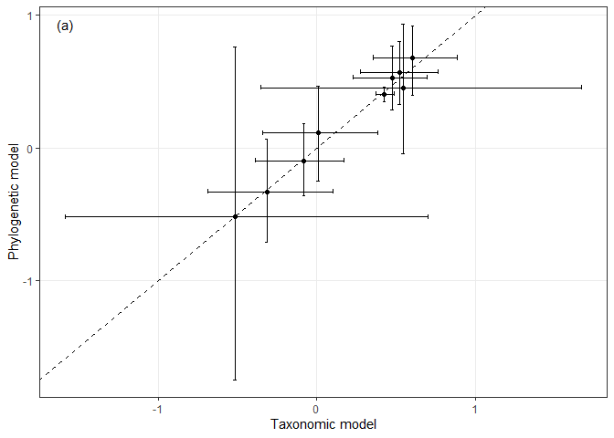
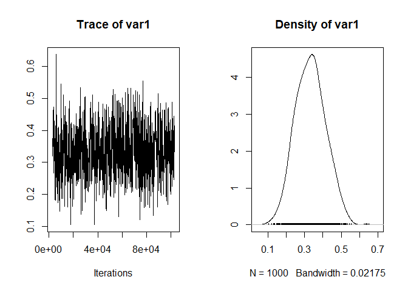
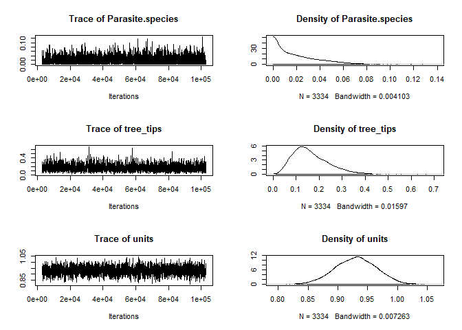

Comparing phylogenetic and taxonomic models
================
Dan Benesh
12/23/2019

In stage-level analyses [here](stage_level_analysis_host_range_freq.md)
and [here](stage_level_analysis_tax_dissim_freq.md), I fit taxonomic
mixed models. That is, I treat taxonomic levels as random effects. A
main motivation for this is the ability to determine at what taxonomic
level variation in parasite generalism is observed. However, taxonomy is
an imperfect representation of the evolutionary relationships among
species. The goal of this notebook is to ensure that taxonomic and
phylogenetic models yield similar parameter estimates for what we’re
most interested in (the effect of life cycle length). For this, I turn
to `MCMCglmm`. It can fit both phylogenetic and taxonomic mixed models
in the same framework.

# Comparing phylogenetic and taxonomic mixed models with MCMCglmm

I’m not interested in testing a series of models. Rather, I’m interested
in comparing parameter estimates for the best model that uses either
taxonomy or phylogeny as random effects. That best model was the one
with life cycle length as a factor.

## Host range

We’ll start by fitting the taxonomic model.

### Taxonomic mixed model

The chains for the random effects do not mix very well, which is not
surprising because the taxonomic terms are nested - if one explains more
variance, the other explains less. The fixed parameters (our interest)
mix well.

<!-- --><!-- -->

    ## 
    ##  Iterations = 3001:102901
    ##  Thinning interval  = 100
    ##  Sample size  = 1000 
    ## 
    ##  DIC: 8600.523 
    ## 
    ##  G-structure:  ~Parasite.species
    ## 
    ##                  post.mean l-95% CI u-95% CI eff.samp
    ## Parasite.species    0.0117 2.96e-08  0.03911     1000
    ## 
    ##                ~parasite_genus
    ## 
    ##                post.mean  l-95% CI u-95% CI eff.samp
    ## parasite_genus    0.0224 2.377e-08  0.05303     1000
    ## 
    ##                ~parasite_family
    ## 
    ##                 post.mean l-95% CI u-95% CI eff.samp
    ## parasite_family   0.04411  0.01022  0.08228     1465
    ## 
    ##                ~parasite_order
    ## 
    ##                post.mean  l-95% CI u-95% CI eff.samp
    ## parasite_order   0.02236 1.995e-07  0.06208    741.3
    ## 
    ##                ~parasite_class
    ## 
    ##                post.mean  l-95% CI u-95% CI eff.samp
    ## parasite_class    0.1189 4.438e-12   0.5277    743.5
    ## 
    ##                ~parasite_phylum
    ## 
    ##                 post.mean  l-95% CI u-95% CI eff.samp
    ## parasite_phylum      2.46 2.197e-07    5.572    855.9
    ## 
    ##  R-structure:  ~units
    ## 
    ##       post.mean l-95% CI u-95% CI eff.samp
    ## units    0.3669   0.3184    0.415     1000
    ## 
    ##  Location effects: num_hosts_suspicious_removed ~ zstudy_effort + Def.int * Host_no_fac 
    ## 
    ##                         post.mean  l-95% CI  u-95% CI eff.samp  pMCMC    
    ## (Intercept)              0.545107 -0.357328  1.672154   1396.2  0.156    
    ## zstudy_effort            0.427361  0.372475  0.489724   1000.0 <0.001 ***
    ## Def.intint               0.475154  0.225509  0.696653   1000.0 <0.001 ***
    ## Host_no_fac2             0.521190  0.277209  0.764927   1000.0 <0.001 ***
    ## Host_no_fac3             0.606220  0.353457  0.889244   1000.0 <0.001 ***
    ## Host_no_fac4             0.006889 -0.344479  0.381557   1000.0  0.960    
    ## Def.intint:Host_no_fac2 -0.081312 -0.387168  0.167975   1000.0  0.534    
    ## Def.intint:Host_no_fac3 -0.316952 -0.691686  0.098970    947.1  0.142    
    ## Def.intint:Host_no_fac4 -0.515318 -1.589497  0.702391   1000.0  0.428    
    ## ---
    ## Signif. codes:  0 '***' 0.001 '**' 0.01 '*' 0.05 '.' 0.1 ' ' 1

## Phylogenetic mixed model

Now we’ll fit the same model, but have the phylogeny as our random
effect.

The phylogenetic effect mixes ok, though it could be run longer, and the
fixed effects look ok.

<!-- -->

    ## 
    ##  Iterations = 3001:102901
    ##  Thinning interval  = 100
    ##  Sample size  = 1000 
    ## 
    ##  DIC: 8609.713 
    ## 
    ##  G-structure:  ~Parasite.species
    ## 
    ##                  post.mean  l-95% CI u-95% CI eff.samp
    ## Parasite.species   0.01828 2.754e-08  0.04828    854.7
    ## 
    ##                ~tree_tips
    ## 
    ##           post.mean l-95% CI u-95% CI eff.samp
    ## tree_tips    0.1969  0.07404   0.3364      847
    ## 
    ##  R-structure:  ~units
    ## 
    ##       post.mean l-95% CI u-95% CI eff.samp
    ## units    0.3797   0.3333   0.4337    842.4
    ## 
    ##  Location effects: num_hosts_suspicious_removed ~ zstudy_effort + Def.int * Host_no_fac 
    ## 
    ##                         post.mean l-95% CI u-95% CI eff.samp  pMCMC    
    ## (Intercept)               0.45437 -0.04269  0.93257     1000  0.068 .  
    ## zstudy_effort             0.40605  0.34635  0.45892     1000 <0.001 ***
    ## Def.intint                0.53011  0.28834  0.77211     1102 <0.001 ***
    ## Host_no_fac2              0.57107  0.32822  0.80033     1000 <0.001 ***
    ## Host_no_fac3              0.67997  0.39891  0.91929     1000 <0.001 ***
    ## Host_no_fac4              0.11284 -0.24686  0.46787     1000  0.528    
    ## Def.intint:Host_no_fac2  -0.09690 -0.35881  0.18356     1131  0.486    
    ## Def.intint:Host_no_fac3  -0.33009 -0.71050  0.06912     1000  0.090 .  
    ## Def.intint:Host_no_fac4  -0.52095 -1.74753  0.76446     1000  0.380    
    ## ---
    ## Signif. codes:  0 '***' 0.001 '**' 0.01 '*' 0.05 '.' 0.1 ' ' 1

Now let’s compare the parameter estimates from these models. They are
very similar, both in their value and their uncertainty, indicating that
the taxonomic and phylogenetic models returned very similar results.

<!-- -->

Here’s the Pearson correlation:

    ## 
    ##  Pearson's product-moment correlation
    ## 
    ## data:  df_comp$tax_post.mean and df_comp$phy_post.mean
    ## t = 18.768, df = 7, p-value = 3.028e-07
    ## alternative hypothesis: true correlation is not equal to 0
    ## 95 percent confidence interval:
    ##  0.9524145 0.9980162
    ## sample estimates:
    ##       cor 
    ## 0.9902096

Given the similar fixed effect values, we would expect the variance
explained by taxonomy and phylogeny to be similar. Here is the chain for
the phylogenetic heritability, i.e. the variance explained by the tree
as a portion of the total variance. It is clearly positive (\>0).

<!-- -->

    ## 
    ## Iterations = 3001:102901
    ## Thinning interval = 100 
    ## Number of chains = 1 
    ## Sample size per chain = 1000 
    ## 
    ## 1. Empirical mean and standard deviation for each variable,
    ##    plus standard error of the mean:
    ## 
    ##           Mean             SD       Naive SE Time-series SE 
    ##       0.332715       0.081695       0.002583       0.002583 
    ## 
    ## 2. Quantiles for each variable:
    ## 
    ##   2.5%    25%    50%    75%  97.5% 
    ## 0.1816 0.2729 0.3316 0.3879 0.4922

Now we look at the same metric from the taxonomic model. It is a little
lower, maybe closer to 0.2. Nonetheless, their closeness is reassuring,
as it indicates the information content in parasite taxonomy and
phylogeny is similar with regards to host range.

<!-- -->

    ## 
    ## Iterations = 3001:102901
    ## Thinning interval = 100 
    ## Number of chains = 1 
    ## Sample size per chain = 1000 
    ## 
    ## 1. Empirical mean and standard deviation for each variable,
    ##    plus standard error of the mean:
    ## 
    ##           Mean             SD       Naive SE Time-series SE 
    ##       0.325141       0.140461       0.004442       0.004823 
    ## 
    ## 2. Quantiles for each variable:
    ## 
    ##   2.5%    25%    50%    75%  97.5% 
    ## 0.1514 0.2274 0.2867 0.3764 0.7021

## Host taxonomic dissimilarity

Now we’ll conduct the same exercise with our second generalism metric,
taxonomic dissimilarity.

### Taxonomic mixed model

<!-- --><!-- -->

    ## 
    ##  Iterations = 3001:102901
    ##  Thinning interval  = 100
    ##  Sample size  = 1000 
    ## 
    ##  DIC: 5568.001 
    ## 
    ##  G-structure:  ~Parasite.species
    ## 
    ##                  post.mean  l-95% CI u-95% CI eff.samp
    ## Parasite.species   0.01128 1.866e-08  0.04001     1000
    ## 
    ##                ~parasite_genus
    ## 
    ##                post.mean  l-95% CI u-95% CI eff.samp
    ## parasite_genus   0.04083 1.422e-05  0.07404     1000
    ## 
    ##                ~parasite_family
    ## 
    ##                 post.mean  l-95% CI u-95% CI eff.samp
    ## parasite_family   0.01473 1.853e-09  0.04508    860.1
    ## 
    ##                ~parasite_order
    ## 
    ##                post.mean  l-95% CI u-95% CI eff.samp
    ## parasite_order   0.03633 3.728e-08  0.09505     1000
    ## 
    ##                ~parasite_class
    ## 
    ##                post.mean  l-95% CI u-95% CI eff.samp
    ## parasite_class     0.213 3.729e-09   0.7418    612.6
    ## 
    ##                ~parasite_phylum
    ## 
    ##                 post.mean  l-95% CI u-95% CI eff.samp
    ## parasite_phylum     6.436 3.093e-08    22.14    454.3
    ## 
    ##  R-structure:  ~units
    ## 
    ##       post.mean l-95% CI u-95% CI eff.samp
    ## units    0.9099   0.8438   0.9714     1000
    ## 
    ##  Location effects: hsi_lcdb_suspcious_rem ~ zstudy_effort + Def.int * Host_no_fac 
    ## 
    ##                         post.mean l-95% CI u-95% CI eff.samp  pMCMC    
    ## (Intercept)               1.41184 -0.62017  3.15839     1434  0.084 .  
    ## zstudy_effort             0.35540  0.28653  0.42760     1000 <0.001 ***
    ## Def.intint                0.57265  0.35160  0.83258     1000 <0.001 ***
    ## Host_no_fac2              0.39080  0.15749  0.64356     1000 <0.001 ***
    ## Host_no_fac3              0.44745  0.19560  0.73515     1000  0.002 ** 
    ## Host_no_fac4              0.23518 -0.15766  0.61439     1000  0.198    
    ## Def.intint:Host_no_fac2   0.48894  0.18948  0.76453     1000  0.002 ** 
    ## Def.intint:Host_no_fac3   0.42641 -0.03387  0.83188     1266  0.058 .  
    ## Def.intint:Host_no_fac4   0.95635 -0.39489  2.52589     1000  0.200    
    ## ---
    ## Signif. codes:  0 '***' 0.001 '**' 0.01 '*' 0.05 '.' 0.1 ' ' 1

## Phylogenetic mixed model

Chain mixing diagnositics looked similar to ‘host range’ above,
i.e. taxonomic groups mix poorly, tree mixes ok, and the fixed effects
mix well.

<!-- -->

    ## 
    ##  Iterations = 3001:102991
    ##  Thinning interval  = 30
    ##  Sample size  = 3334 
    ## 
    ##  DIC: 5584.51 
    ## 
    ##  G-structure:  ~Parasite.species
    ## 
    ##                  post.mean  l-95% CI u-95% CI eff.samp
    ## Parasite.species   0.02053 1.276e-08  0.05936     2847
    ## 
    ##                ~tree_tips
    ## 
    ##           post.mean l-95% CI u-95% CI eff.samp
    ## tree_tips    0.1654  0.03928   0.3223     2962
    ## 
    ##  R-structure:  ~units
    ## 
    ##       post.mean l-95% CI u-95% CI eff.samp
    ## units      0.93   0.8582   0.9931     3476
    ## 
    ##  Location effects: hsi_lcdb_suspcious_rem ~ zstudy_effort + Def.int * Host_no_fac 
    ## 
    ##                         post.mean  l-95% CI  u-95% CI eff.samp  pMCMC    
    ## (Intercept)              1.416511  0.967894  1.880469     3334 <3e-04 ***
    ## zstudy_effort            0.346834  0.277066  0.413400     3334 <3e-04 ***
    ## Def.intint               0.596341  0.337146  0.819571     3334 <3e-04 ***
    ## Host_no_fac2             0.411432  0.158485  0.651096     3334 0.0024 ** 
    ## Host_no_fac3             0.463470  0.179964  0.719388     3334 0.0012 ** 
    ## Host_no_fac4             0.279722 -0.085897  0.685655     3334 0.1464    
    ## Def.intint:Host_no_fac2  0.468705  0.180703  0.765078     3334 0.0012 ** 
    ## Def.intint:Host_no_fac3  0.467447  0.008439  0.923985     3334 0.0504 .  
    ## Def.intint:Host_no_fac4  0.994207 -0.444023  2.372247     3334 0.1872    
    ## ---
    ## Signif. codes:  0 '***' 0.001 '**' 0.01 '*' 0.05 '.' 0.1 ' ' 1

Again let’s compare the parameter estimates. They are very similar, both
in their value and their uncertainty, indicating that the taxonomic and
phylogenetic models returned very similar results.

<!-- -->

Here’s the Pearson correlation:

    ## 
    ##  Pearson's product-moment correlation
    ## 
    ## data:  df_comp$tax_post.mean and df_comp$phy_post.mean
    ## t = 43.507, df = 7, p-value = 8.849e-10
    ## alternative hypothesis: true correlation is not equal to 0
    ## 95 percent confidence interval:
    ##  0.9908973 0.9996276
    ## sample estimates:
    ##       cor 
    ## 0.9981561

Given the similar fixed effect values, we would expect the variance
explained by taxonomy and phylogeny to be similar. Here is the chain for
the phylogenetic heritability, i.e. the variance explained by the tree
as a portion of the total variance. It is not obviously different from
zero.

<!-- -->

    ## 
    ## Iterations = 3001:102991
    ## Thinning interval = 30 
    ## Number of chains = 1 
    ## Sample size per chain = 3334 
    ## 
    ## 1. Empirical mean and standard deviation for each variable,
    ##    plus standard error of the mean:
    ## 
    ##           Mean             SD       Naive SE Time-series SE 
    ##       0.147064       0.058979       0.001021       0.001118 
    ## 
    ## 2. Quantiles for each variable:
    ## 
    ##    2.5%     25%     50%     75%   97.5% 
    ## 0.05209 0.10423 0.13909 0.18554 0.27715

Now we look at the same metric from the taxonomic model. It is higher,
close to 0.2. I’m not sure why parasite taxonomy explains variation in
this metric that the tree does not. My guess is it has to do with branch
lengths (there are some short ones in the tree). The main thing is that
they return similar fixed effect parameter estimates, which is what I
wanted to ensure.

<!-- -->

    ## 
    ## Iterations = 3001:102901
    ## Thinning interval = 100 
    ## Number of chains = 1 
    ## Sample size per chain = 1000 
    ## 
    ## 1. Empirical mean and standard deviation for each variable,
    ##    plus standard error of the mean:
    ## 
    ##           Mean             SD       Naive SE Time-series SE 
    ##       0.204061       0.132609       0.004193       0.004607 
    ## 
    ## 2. Quantiles for each variable:
    ## 
    ##    2.5%     25%     50%     75%   97.5% 
    ## 0.07345 0.11977 0.16459 0.23489 0.62002

# Conclusions

Phylogenetic and taxonomic models return similar results for the fixed
effect of life cycle length. However, they may differ in how much
variation they explain in our second generalism metric, taxonomic
dissimilarity.
