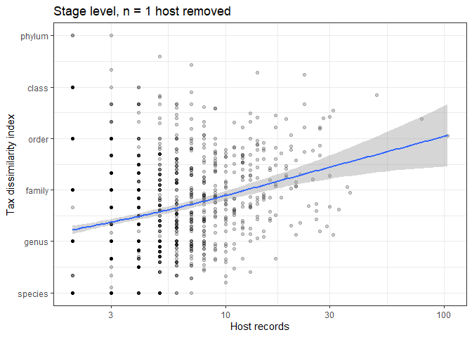
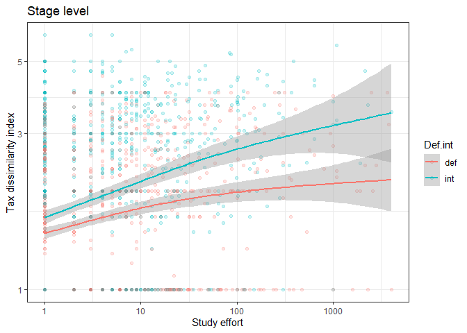
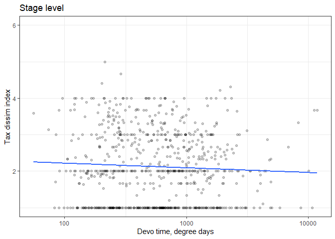
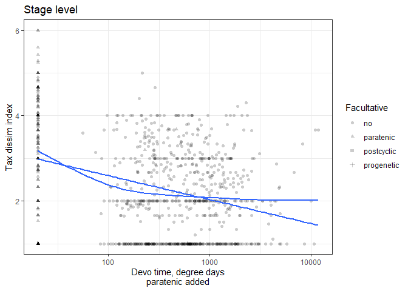
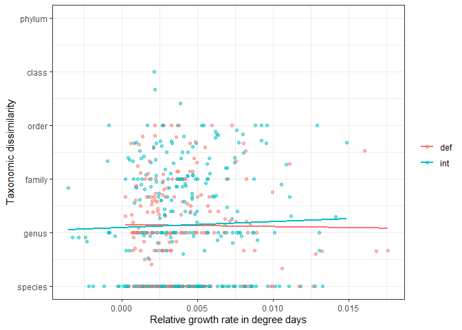
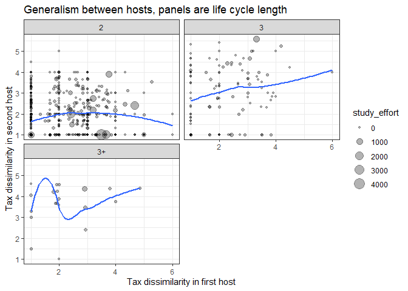

Look for tradeoffs driving host specificity
================

Why are complex life cycle parasites specific at one stage but not
another? Here I explore tradeoffs that might affect the evolution of
host specificity in complex life cycles.

[Elsewhere](../stage_level_analyses/make_stage_level_df.Rmd), I created
a data table at the level of stages within parasite species. I start by
looking at correlations between variables measured at this level, like
host records, taxonomic dissimilarity, development time, growth, etc.
Here’s a correlation matrix, but it might not be too useful, because
several variables need log transformation.

    ##                              study_effort num_hosts_suspicious_removed
    ## study_effort                         1.00                         0.07
    ## num_hosts_suspicious_removed         0.07                         1.00
    ## hsi_lcdb_suspcious_rem               0.10                         0.44
    ## avg_dd                               0.09                        -0.03
    ## rel_growth_len                       0.10                        -0.10
    ## rel_growth_biov                      0.12                        -0.04
    ##                              hsi_lcdb_suspcious_rem avg_dd rel_growth_len
    ## study_effort                                   0.10   0.09           0.10
    ## num_hosts_suspicious_removed                   0.44  -0.03          -0.10
    ## hsi_lcdb_suspcious_rem                         1.00  -0.03          -0.21
    ## avg_dd                                        -0.03   1.00           0.34
    ## rel_growth_len                                -0.21   0.34           1.00
    ## rel_growth_biov                               -0.19   0.47           0.81
    ##                              rel_growth_biov
    ## study_effort                            0.12
    ## num_hosts_suspicious_removed           -0.04
    ## hsi_lcdb_suspcious_rem                 -0.19
    ## avg_dd                                  0.47
    ## rel_growth_len                          0.81
    ## rel_growth_biov                         1.00

## Correlations among specificity variables

The host generalism measures are calculated with only the life cycle
database, because stage info is not present in the NHM data. The two
measures of generalism, number of host species and taxonomic
dissimilarity of host species, are positively correlated; stages with
more host species (host range) have been recorded from more
taxonomically diverse hosts.

<!-- -->

The pattern holds if we exclude stages recorded from just 1 host
species. Thus, the two measures are not independent.

<!-- -->

Study effort is still an important confounder of generalism measures -
the host range increases with study effort, perhaps more for
intermediate hosts, than definitive hosts. That sorta makes sense, since
fewer studies are on intermediate hosts, it could take more to add new
host records.

<!-- -->

Study effort also increases the diversity of hosts at a given stage.

<!-- -->

## Correlations among life history variables

I calculated relative and absolute growth for parasite stages, as well
as the time needed to complete development at a given stage, in days and
degree days.

There is less development time data than growth data. And growth was
calculated with two different size variables: length and biovolume.
Biovolume had more missing data, because biovolume was calculated with
lengths and widths and there were more missing widths than lengths.

    ##          avg_dt          avg_dd  abs_growth_len abs_growth_biov 
    ##            1200            1296             644             914

Increases in length are tightly correlated with increases in width, so
using length vs biovolume is likely to yield similar results.

<!-- -->

This plot simply shows stage end size as a function of starting size.
The lower right is empty because parasites do not shrink. The scatter
indicates that growth, in absolute terms, varies quite a lot. For worms
entering hosts at a small size (left side), parasites tend to grow more
in definitive than intermediate hosts. For large initial sizes (right
side), worms grow less, probably because there are limits on how large
worms can be.

<!-- -->

This upper limit on growth is evident when we plot relative growth as a
function of starting size. When starting small, parasites may grow many
orders of magnitude (or not). But when starting big, they can only
increase one or two orders of magnitude.

<!-- -->

The amount of growth a worm does at a given stage depends on how long
they spend growing - more time, more growth. We can see that when we
plot absolute growth as a function of development time. From this plot,
it appears that, for a given length of time, worms grow more in
definitive hosts.

<!-- -->
But that is mainly because they tend to enter the definitive host at a
larger size. Large initial sizes facilitate absolute growth, because a
doubling in size will result in much more mass when a worm is initially
big. When we express growth in relative terms (orders of magnitude
increase), then the growth rate appears more comparable in definitive
and intermediate hosts.

<!-- -->

There is a lot of variation in the previous plot, and one reason for
this is that development is highly temperature dependent. We can try to
remove temperature effects by converting development times to degree
days. When we make the same plot using degree days, the relationship
between growth and time is clearer. Henceforth, I use degree days as my
measure of development time.

<!-- -->

## Correlations between specificity and life history traits

Next, we look at the relationship between generalism and life history
traits. There seems to be a slight negative association between the
number of host records and relative growth, but the correlation is not
clear.

<!-- -->

A similar pattern is seen for taxonomic dissimilarity.

<!-- -->

<!-- -->

There are a number of species in the database that infect paratenic
hosts. In paratenic hosts, it is usually assumed that the parasite
undergoes little to no growth. Consequently, their size in paratenic
hosts is often not reported - it is implicitly assumed that little to no
growth occurs. Indeed, over 50% of paratenic stages in the database lack
sizes compared to only 20% of obligate stages.

    ## # A tibble: 4 x 6
    ##   Facultative total missing_size missing_growth prop_missing_si~
    ##   <chr>       <int>        <int>          <int>            <dbl>
    ## 1 no           1813          377            774            0.208
    ## 2 paratenic     172           95            112            0.552
    ## 3 postcyclic     26           26             26            1    
    ## 4 progenetic      9            2              2            0.222
    ## # ... with 1 more variable: prop_missing_growth <dbl>

In those cases where size was reported, growth in paratenic hosts is
lower than in obligate hosts.

<!-- -->

Therefore, for any paratenic host stage without growth data, I set the
growth to zero and then replotted the data. This makes the negative
relationship clearer, especially for worms in intermediate hosts (since
those are the paratenic hosts).

<!-- -->

<!-- -->

It looks like specificity and growth are linked. Parasites grow less
when they are more generalist at a given stage. What about developmental
time? Is there a tradeoff between generalism and development?

It does not look like it. Stages with long development times are as
generalist as those with short development times.

<!-- -->

<!-- -->
<!-- -->

In paratenic hosts, parasites are assumed to undergo no development.
This was implicitly assumed in many papers used to construct the life
cycle database. Let’s assume that in paratenic hosts, parasites require
a day at room temperature to become infective to the next host. When we
replot the data, we see that these species in paratenic hosts (left
side) tend to have higher generalism.

<!-- -->
<!-- -->

Here’s another way to look at it. Parasites are generalists when
infecting paratenic intermediate hosts.

<!-- -->

Instead of looking at growth and development separately, we can also
look at them together, namely as a growth rate (relative size increase
per unit time). There is not a clear relationship between growth rate
and host generalism, suggesting generalists do not grow slower than
specialists (though they grow less).

<!-- -->

## Break variables by life cycle stage

We can break this down further by looking at how our variables of
interest vary across life cycles of different lengths. This plot shows
how the middle hosts in long life cycles tend to have higher generalism.

<!-- -->

Here are the development times in degree days across the life cycle.
Development times are often higher in definitive hosts, which is
probably because many of these hosts are endotherms (high temperature,
many degree days).

<!-- -->

Note above that the middle hosts (second, third intermediate hosts) in
long life cycles exhibit long development. This pattern can be changed
dramatically by assuming that worms essentially undergo no development
in paratenic hosts. Under this assumption, we see that second and third
intermediate hosts, those most likely to be paratenic hosts, actually
have the shortest developmental times.

<!-- -->

Let’s next look at how growth, in absolute terms, varies across life
cycles. It is usually highest in definitive hosts, again because worms
tend to enter definitive hosts large, double in size a few times, and
then stop growing.

<!-- -->

When we look at relative growth, it is rather comparable across stages.

<!-- -->

However, if we assume that worms do not grow in paratenic hosts, we see
that growth is especially low in second and third intermediate hosts.

<!-- -->

# Within-species correlations

Up to this point, I have looked for general correlations across species
while controlling for ‘species effects’. However, it may be that species
that are generalist at one stage of the life cycle are less so at
another stage. Let’s look at the correlations within species.

#### Generalism

In complex life cycle worms, generalism in the first and second host is
uncorrelated (if anything it is positively correlated), which is not
consistent with a tradeoff.

<!-- -->

#### Growth

We can also look at growth in consecutive hosts.

In absolute terms, worms that grow larger in their first host tend to
also grow large in the second host. Presumably, size is just compounding
itself across hosts - large worms can more easily accumulate additional
mass in absolute terms.

<!-- -->

However, it relative terms, more growth in the first host leaves less
opportunity for large increases in growth in the next host - there is a
negative relationship between relative growth across hosts.

<!-- -->

#### Devo times

There are not many examples of development times being recorded across
multiple stages of a parasite life cycle. Still, no pattern is apparent.

<!-- -->
