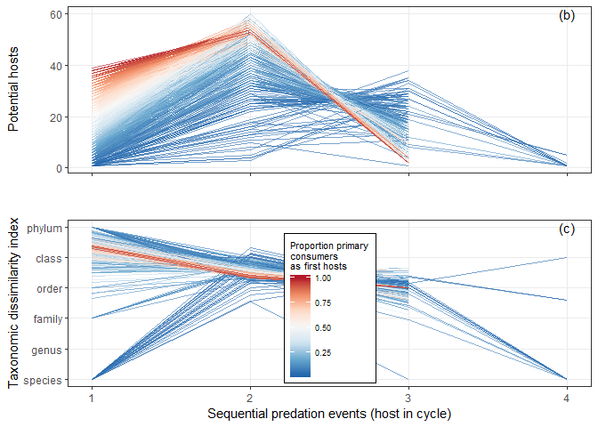

Quantifying potential host range from food webs
================
Dan Benesh
05/02/2020

In this notebook, I quantify how parasites with longer life cycles may
accumulate hosts. To do this, I used a compilation of food webs and
simulated parasite life cycles in them. The simulation steps are in this
[notebook](simulate_parasites_in_webs.Rmd).

Here is the number of generated, hypothetical life cycles:

    ## [1] 98429

They were generated from this many food webs:

    ## [1] 236

## Stage-level generalism

### Host range

After giving parasites random starting points (first hosts), how many
hosts will they encounter with each transmission event? In the plot
below, we can see how the number of *potential* hosts changes with each
transmission event. Each line is a hypothetical parasite. The parasites
are able to infect either many or few first hosts, which allows us to
visualize the two opposing forces acting on host range. If parasites
infect many first hosts (red lines), there are relatively fewer ‘next’
hosts available, such that the number of new, potential hosts
encountered decreases with multiple transmission events. By constrast,
if parasites infect few first hosts (blue lines), then the number of
‘next hosts’ can increase, at least initially. After one or two
transmission events the trophic pyramid constraint seems to take over.
The panels of the plot are webs that are known to include helminths.

<!-- -->

In many cases, the potential hosts falls to zero after multiple
transmission events, and we can also make this plot excluding the points
when there are no more ‘next hosts’. This stops the lines before a 4th
host in most cases, which emphasizes why such long life cycles are
relatively rare - parasites run out of next hosts, especially if they
start with a broad first host range. (Note: this decline is much less
precipitous if we allow intraguild predation where a host at stage 1 can
also be a host at stage 2 and so on).

<!-- -->

We can make the same plot, but make the y-axis a proportion. That is,
how much of the parasite’s total host range is at any given stage? This
once again nicely shows how the pattern across stages will depend on the
number of first hosts infected. If many first hosts are infected,
generalism should be subject to the ‘pyramid’ constraint and decrease.
If few first hosts are infected, generalism can increase with stage
number, at least initially.

<!-- -->

Now, let’s try to model this relationship to get quantitative
expectations. Potential host range changes non-linearly with
transmission events, i.e. host range does not uniformly increase or
decrease with more transmission events. Therefore, let’s treat
predation/transmission steps as a factor and see how its effect changes
depending on the number of first hosts. We’ll fit a mixed model
accounting for study and food web. The plot above suggests that one
predation step may have a different impact in different food webs, so I
allowed the effect of this factor to vary by study. The model has
Poisson errors, as that led to a much better residual plot than normally
distributed errors.

First, here is the likelihood ratio test comparing the model with and
without the random slopes term:

    ## Data: chains3_l %>% ungroup() %>% filter(hosts != 0, web_study %in%  ...
    ## Models:
    ## t0: hosts ~ steps * prop_pot_first_hosts + (1 | index) + (1 | web_study) + 
    ## t0:     (1 | fw)
    ## t1: hosts ~ steps + prop_pot_first_hosts + (1 | index) + (1 | fw) + 
    ## t1:     (steps + 0 | web_study) + steps:prop_pot_first_hosts
    ##    Df   AIC   BIC logLik deviance Chisq Chi Df Pr(>Chisq)    
    ## t0 11 76399 76478 -38188    76377                            
    ## t1 20 59720 59864 -29840    59680 16696      9  < 2.2e-16 ***
    ## ---
    ## Signif. codes:  0 '***' 0.001 '**' 0.01 '*' 0.05 '.' 0.1 ' ' 1

And here are the parameters from the better model:

    ## Generalized linear mixed model fit by maximum likelihood (Adaptive
    ##   Gauss-Hermite Quadrature, nAGQ = 0) [glmerMod]
    ##  Family: poisson  ( log )
    ## Formula: hosts ~ steps * prop_pot_first_hosts + (1 | index) + (steps +  
    ##     0 | web_study) + (1 | fw)
    ##    Data: chains3_l %>% ungroup() %>% filter(hosts != 0, web_study %in%  
    ##     webs_with_verts)
    ## Control: glmerControl(optimizer = "nloptwrap")
    ## 
    ##       AIC       BIC    logLik  deviance  df.resid 
    ## 1586459.2 1586668.8 -793209.6 1586419.2    263101 
    ## 
    ## Scaled residuals: 
    ##     Min      1Q  Median      3Q     Max 
    ## -9.5326 -0.6393 -0.0127  0.5652 24.8285 
    ## 
    ## Random effects:
    ##  Groups    Name              Variance Std.Dev. Corr          
    ##  index     (Intercept)       0.02009  0.1417                 
    ##  fw        (Intercept)       0.21811  0.4670                 
    ##  web_study stepsfirst_hosts  0.67977  0.8245                 
    ##            stepssecond_hosts 1.12604  1.0612   0.78          
    ##            stepsthird_hosts  1.33516  1.1555   0.58 0.92     
    ##            stepsfourth_hosts 0.32670  0.5716   0.38 0.67 0.59
    ## Number of obs: 263121, groups:  index, 98429; fw, 236; web_study, 22
    ## 
    ## Fixed effects:
    ##                                         Estimate Std. Error  z value Pr(>|z|)
    ## (Intercept)                             1.511066   0.189475    7.975 1.52e-15
    ## stepssecond_hosts                       1.471326   0.142925   10.294  < 2e-16
    ## stepsthird_hosts                        0.809968   0.205870    3.934 8.34e-05
    ## stepsfourth_hosts                       0.116533   0.180475    0.646    0.518
    ## prop_pot_first_hosts                    2.276506   0.003253  699.822  < 2e-16
    ## stepssecond_hosts:prop_pot_first_hosts -1.892877   0.003214 -588.963  < 2e-16
    ## stepsthird_hosts:prop_pot_first_hosts  -4.045420   0.006069 -666.549  < 2e-16
    ## stepsfourth_hosts:prop_pot_first_hosts -5.911482   0.045769 -129.160  < 2e-16
    ##                                           
    ## (Intercept)                            ***
    ## stepssecond_hosts                      ***
    ## stepsthird_hosts                       ***
    ## stepsfourth_hosts                         
    ## prop_pot_first_hosts                   ***
    ## stepssecond_hosts:prop_pot_first_hosts ***
    ## stepsthird_hosts:prop_pot_first_hosts  ***
    ## stepsfourth_hosts:prop_pot_first_hosts ***
    ## ---
    ## Signif. codes:  0 '***' 0.001 '**' 0.01 '*' 0.05 '.' 0.1 ' ' 1
    ## 
    ## Correlation of Fixed Effects:
    ##             (Intr) stpss_ stpst_ stpsf_ prp___ stpss_:___ stpst_:___
    ## stpsscnd_hs -0.003                                                  
    ## stpsthrd_hs -0.151  0.896                                           
    ## stpsfrth_hs -0.653  0.399  0.410                                    
    ## prp_pt_frs_ -0.010  0.009  0.007  0.008                             
    ## stpssc_:___  0.007 -0.013 -0.007 -0.008 -0.591                      
    ## stpsth_:___  0.004 -0.005 -0.012 -0.005 -0.334  0.363               
    ## stpsfr_:___ -0.001 -0.001 -0.001 -0.033 -0.053  0.051      0.042

We can use this model to overlay expectations on Figure 3, the observed
generalism patterns across the life cycle. For different starting
conditions (number of first hosts), I calculated the expected host range
across life stages for an “average” food web.

Here is that plot. Worms generally infect fewer host species than we
might expect, but the simulated life cycles do reproduce the non-linear
pattern observed for long life cycles.

<!-- -->

### Taxonomic dissimilarity

Moving on to the second generalism metric, taxonomic dissimilarity,
let’s examine how it changes at the stage level across transmission
steps. Usually, it starts very high (primary consumers are diverse)
before decreasing slightly after one or two transmission steps (high
trophic level hosts are slightly more homogenous taxonomically).

<!-- -->

We can fit essentially the same mixed model to this generalism metric,
although since it is not a count, we assume normally-distributed errors.

Here are the parameters:

    ## Linear mixed model fit by REML ['lmerMod']
    ## Formula: hsi ~ steps * prop_pot_first_hosts + (1 | index) + (steps + 0 |  
    ##     web_study) + (1 | fw)
    ##    Data: chains3_l %>% ungroup() %>% filter(hosts != 0, web_study %in%  
    ##     webs_with_verts)
    ## 
    ## REML criterion at convergence: 708775.9
    ## 
    ## Scaled residuals: 
    ##     Min      1Q  Median      3Q     Max 
    ## -4.7920 -0.2380  0.0524  0.3634  5.6828 
    ## 
    ## Random effects:
    ##  Groups    Name              Variance Std.Dev. Corr             
    ##  index     (Intercept)       0.0000   0.0000                    
    ##  fw        (Intercept)       0.4066   0.6377                    
    ##  web_study stepsfirst_hosts  0.8854   0.9410                    
    ##            stepssecond_hosts 0.1306   0.3615    0.04            
    ##            stepsthird_hosts  2.1227   1.4570    0.23  0.53      
    ##            stepsfourth_hosts 1.2030   1.0968   -0.66  0.23  0.48
    ##  Residual                    0.9623   0.9810                    
    ## Number of obs: 252595, groups:  index, 98391; fw, 236; web_study, 22
    ## 
    ## Fixed effects:
    ##                                        Estimate Std. Error  t value
    ## (Intercept)                             3.76656    0.21388   17.611
    ## stepssecond_hosts                       0.71822    0.21248    3.380
    ## stepsthird_hosts                        0.13700    0.33936    0.404
    ## stepsfourth_hosts                      -0.64535    0.40703   -1.585
    ## prop_pot_first_hosts                    1.06105    0.01199   88.470
    ## stepssecond_hosts:prop_pot_first_hosts -0.72046    0.01699  -42.396
    ## stepsthird_hosts:prop_pot_first_hosts  -2.12690    0.02078 -102.337
    ## stepsfourth_hosts:prop_pot_first_hosts -3.97325    0.06112  -65.011
    ## 
    ## Correlation of Fixed Effects:
    ##             (Intr) stpss_ stpst_ stpsf_ prp___ stpss_:___ stpst_:___
    ## stpsscnd_hs -0.875                                                  
    ## stpsthrd_hs -0.359  0.527                                           
    ## stpsfrth_hs -0.821  0.868  0.689                                    
    ## prp_pt_frs_ -0.028  0.028  0.018  0.015                             
    ## stpssc_:___  0.020 -0.040 -0.013 -0.010 -0.705                      
    ## stpsth_:___  0.016 -0.016 -0.027 -0.008 -0.577  0.407               
    ## stpsfr_:___  0.002 -0.006 -0.003 -0.029 -0.196  0.138      0.116    
    ## convergence code: 0
    ## boundary (singular) fit: see ?isSingular

And we again use the model to plot expectations relative to observed
data. Expected generalism values are calculated for an ‘average’ web for
all possible starting conditions.

When we do that, we see that parasites usually use a more restricted
range of hosts than expected from feeding relationships. In other words,
the available set of hosts (things that might eat the parasite larvae)
is usually more diverse than the realized host range. The only
exceptions might be paratenic hosts (2nd and 3rd intermediate hosts in
long life cycles). A typical parasite stage infects hosts from different
genera (same family), but an average infective stage will be ingested by
animals from different orders or classes.

<!-- -->

Then to mirror figure 3, we put the two plots with expectations over
observations together and export it.

<!-- -->

Additionally, in Figure 1, we want to use the Carpinteria Salt Marsh
food web as an illustration for how generalism changes with successive
transmission steps. To that end, we plot host range and taxonomic
dissimilarity for simulated cycles for just this food web, stack them,
and export the figure.

<!-- -->

## Species-level generalism

### Host range

How does stage-level generalism translate to the parasite species level?
How should the total *potential* host range change with longer life
cycles? I now plot the cumulative number of potential hosts encountered
across our hypothetical parasite cycles. The number of hosts levels off
earlier if parasites are allowed to infect more first hosts (red lines),
as the pyramid constraint works earlier.

<!-- -->

We want to compare how available host range increases in food webs with
how realized host range increases with life cycle length in real
parasites. As above, we’ll fit a mixed model accounting for study and
food web. The model has Poisson errors, since we are dealing with counts
(the residual plot is much better with Poisson errors). We’ll start by
fitting predation event as a continuous variable, so the model returns
the increase in host number with each predation event.

    ## Generalized linear mixed model fit by maximum likelihood (Laplace
    ##   Approximation) [glmerMod]
    ##  Family: poisson  ( log )
    ## Formula: 
    ## cum_hosts ~ step_int * prop_pot_first_hosts + (step_int | web_study) +  
    ##     (1 | fw)
    ##    Data: chains3_l %>% ungroup() %>% filter(hosts != 0, web_study %in%  
    ##     webs_with_verts, index %in% spp)
    ## 
    ##      AIC      BIC   logLik deviance df.resid 
    ## 103558.8 103616.1 -51771.4 103542.8     9623 
    ## 
    ## Scaled residuals: 
    ##      Min       1Q   Median       3Q      Max 
    ## -11.2945  -1.1115  -0.1473   0.8697  15.9970 
    ## 
    ## Random effects:
    ##  Groups    Name        Variance Std.Dev. Corr 
    ##  fw        (Intercept) 0.17025  0.4126        
    ##  web_study (Intercept) 0.98538  0.9927        
    ##            step_int    0.01262  0.1124   -0.40
    ## Number of obs: 9631, groups:  fw, 223; web_study, 22
    ## 
    ## Fixed effects:
    ##                                Estimate Std. Error z value Pr(>|z|)    
    ## (Intercept)                    1.739343   0.223505   7.782 7.13e-15 ***
    ## step_int                       0.556378   0.025776  21.585  < 2e-16 ***
    ## prop_pot_first_hosts           1.681645   0.013142 127.959  < 2e-16 ***
    ## step_int:prop_pot_first_hosts -0.183027   0.005135 -35.643  < 2e-16 ***
    ## ---
    ## Signif. codes:  0 '***' 0.001 '**' 0.01 '*' 0.05 '.' 0.1 ' ' 1
    ## 
    ## Correlation of Fixed Effects:
    ##             (Intr) stp_nt prp___
    ## step_int    -0.381              
    ## prp_pt_frs_ -0.034  0.104       
    ## stp_nt:p___  0.031 -0.108 -0.930

The estimated slope is 0.556, which corresponds to a percent change of
74.43% total hosts per transmission event.

This is weaker than observed in the parasite data, suggesting host range
expands quicker than we would expect from food webs. However, the slope
is also dependent on how many first hosts are infected. And the increase
is non-linear. To account for this non-linearity, we’ll take the same
approach as in the manuscript: treat transmission steps as a categorical
instead of continuous variable.

This results in a much better model.

    ## Data: chains3_l %>% ungroup() %>% filter(hosts != 0, web_study %in%  ...
    ## Models:
    ## t3: cum_hosts ~ step_int * prop_pot_first_hosts + (step_int | web_study) + 
    ## t3:     (1 | fw)
    ## t3.1: cum_hosts ~ steps * prop_pot_first_hosts + (steps + 0 | web_study) + 
    ## t3.1:     (1 | fw)
    ##      Df    AIC    BIC logLik deviance Chisq Chi Df Pr(>Chisq)    
    ## t3    8 103559 103616 -51771   103543                            
    ## t3.1 19  70522  70658 -35242    70484 33059     11  < 2.2e-16 ***
    ## ---
    ## Signif. codes:  0 '***' 0.001 '**' 0.01 '*' 0.05 '.' 0.1 ' ' 1

As an aside, the model with the random slopes is much better than one
without it.

    ## Data: chains3_l %>% ungroup() %>% filter(hosts != 0, web_study %in%  ...
    ## Models:
    ## t3.0: cum_hosts ~ steps * prop_pot_first_hosts + (1 | web_study) + 
    ## t3.0:     (1 | fw)
    ## t3.1: cum_hosts ~ steps * prop_pot_first_hosts + (steps + 0 | web_study) + 
    ## t3.1:     (1 | fw)
    ##      Df   AIC   BIC logLik deviance Chisq Chi Df Pr(>Chisq)    
    ## t3.0 10 77219 77291 -38599    77199                            
    ## t3.1 19 70522 70658 -35242    70484  6715      9  < 2.2e-16 ***
    ## ---
    ## Signif. codes:  0 '***' 0.001 '**' 0.01 '*' 0.05 '.' 0.1 ' ' 1

Here is the model for species-level host range.

    ## Generalized linear mixed model fit by maximum likelihood (Laplace
    ##   Approximation) [glmerMod]
    ##  Family: poisson  ( log )
    ## Formula: cum_hosts ~ steps * prop_pot_first_hosts + (steps + 0 | web_study) +  
    ##     (1 | fw)
    ##    Data: chains3_l %>% ungroup() %>% filter(hosts != 0, web_study %in%  
    ##     webs_with_verts)
    ## 
    ##       AIC       BIC    logLik  deviance  df.resid 
    ## 1923415.5 1923614.6 -961688.7 1923377.5    263102 
    ## 
    ## Scaled residuals: 
    ##      Min       1Q   Median       3Q      Max 
    ## -12.8185  -0.5836   0.1038   0.6786  19.2720 
    ## 
    ## Random effects:
    ##  Groups    Name              Variance Std.Dev. Corr          
    ##  fw        (Intercept)       0.2089   0.4571                 
    ##  web_study stepsfirst_hosts  0.7964   0.8924                 
    ##            stepssecond_hosts 1.0159   1.0079   0.92          
    ##            stepsthird_hosts  1.0948   1.0463   0.89 1.00     
    ##            stepsfourth_hosts 1.0025   1.0012   0.87 0.98 0.99
    ## Number of obs: 263121, groups:  fw, 236; web_study, 22
    ## 
    ## Fixed effects:
    ##                                         Estimate Std. Error  z value Pr(>|z|)
    ## (Intercept)                             1.598243   0.164549    9.713   <2e-16
    ## stepssecond_hosts                       1.584616   0.069575   22.776   <2e-16
    ## stepsthird_hosts                        1.812198   0.082364   22.002   <2e-16
    ## stepsfourth_hosts                       1.750828   0.087770   19.948   <2e-16
    ## prop_pot_first_hosts                    2.135804   0.002381  897.063   <2e-16
    ## stepssecond_hosts:prop_pot_first_hosts -1.061614   0.002782 -381.664   <2e-16
    ## stepsthird_hosts:prop_pot_first_hosts  -1.293260   0.002804 -461.202   <2e-16
    ## stepsfourth_hosts:prop_pot_first_hosts -1.225369   0.006391 -191.725   <2e-16
    ##                                           
    ## (Intercept)                            ***
    ## stepssecond_hosts                      ***
    ## stepsthird_hosts                       ***
    ## stepsfourth_hosts                      ***
    ## prop_pot_first_hosts                   ***
    ## stepssecond_hosts:prop_pot_first_hosts ***
    ## stepsthird_hosts:prop_pot_first_hosts  ***
    ## stepsfourth_hosts:prop_pot_first_hosts ***
    ## ---
    ## Signif. codes:  0 '***' 0.001 '**' 0.01 '*' 0.05 '.' 0.1 ' ' 1
    ## 
    ## Correlation of Fixed Effects:
    ##             (Intr) stpss_ stpst_ stpsf_ prp___ stpss_:___ stpst_:___
    ## stpsscnd_hs  0.141                                                  
    ## stpsthrd_hs  0.143  0.980                                           
    ## stpsfrth_hs  0.029  0.869  0.900                                    
    ## prp_pt_frs_ -0.003  0.015  0.011  0.010                             
    ## stpssc_:___  0.002 -0.018 -0.009 -0.008 -0.856                      
    ## stpsth_:___  0.002 -0.012 -0.013 -0.008 -0.849  0.727               
    ## stpsfr_:___ -0.002 -0.005 -0.004 -0.015 -0.372  0.319      0.317    
    ## convergence code: 0
    ## Model failed to converge with max|grad| = 0.002687 (tol = 0.001, component 1)
    ## Model is nearly unidentifiable: very large eigenvalue
    ##  - Rescale variables?

After fitting that model, we can plot the expectations from this model,
as we did above, but this time on the species-level data (i.e. Figure 2
in ms).

The observed data do not match the expectations well. In particular,
species counts continue to increase from 2 to 3 and 3 to 4 host cycles,
whereas these level off in most food webs. In most food webs, there are
few additional upstream hosts after two predation events.

<!-- -->

### Taxonomic dissimilarity

How does taxonomic dissimilarity accumulate? This metric is actually not
cumulative. If two host species are from different phyla, and we add a
third species from another phylum, the dissimilarity metric does not
increase further because it is already at its maximum (i.e. host species
are still, on average, from different phyla). When we plot taxonomic
dissimilarity as parasites extend their life cycles, we see that it is
pretty flat. Already in first hosts parasites tend to infect hosts from
different classes or orders. Then, as they move to higher-level hosts
the taxonomic dissimilarity stay constant, though it might decreases
slightly as higher-level predators in a food web (i.e. vertebrates) are
more taxonomically similar than lower-level consumers
(i.e. invertebrates).

<!-- -->

We’ll fit the same mixed model to this data to generate predictions for
a typical food web.

As for host range, this model is better when a random slopes term is
included (life cycle step x study).

    ## Data: chains3_l %>% ungroup() %>% filter(hosts != 0, web_study %in%  ...
    ## Models:
    ## t4.0: cum_hsi ~ steps * prop_pot_first_hosts + (1 | web_study) + (1 | 
    ## t4.0:     fw)
    ## t4: cum_hsi ~ steps * prop_pot_first_hosts + (steps + 0 | web_study) + 
    ## t4:     (1 | fw)
    ##      Df   AIC   BIC  logLik deviance  Chisq Chi Df Pr(>Chisq)    
    ## t4.0 11 17699 17778 -8838.4    17677                             
    ## t4   20 17191 17335 -8575.7    17151 525.37      9  < 2.2e-16 ***
    ## ---
    ## Signif. codes:  0 '***' 0.001 '**' 0.01 '*' 0.05 '.' 0.1 ' ' 1

Here are the parameters for the model:

    ## Linear mixed model fit by REML ['lmerMod']
    ## Formula: cum_hsi ~ steps * prop_pot_first_hosts + (steps + 0 | web_study) +  
    ##     (1 | fw)
    ##    Data: chains3_l %>% ungroup() %>% filter(hosts != 0, web_study %in%  
    ##     webs_with_verts)
    ## 
    ## REML criterion at convergence: 470097.8
    ## 
    ## Scaled residuals: 
    ##     Min      1Q  Median      3Q     Max 
    ## -8.0200 -0.1677  0.0280  0.2466  6.1740 
    ## 
    ## Random effects:
    ##  Groups    Name              Variance Std.Dev. Corr             
    ##  fw        (Intercept)       0.1269   0.3562                    
    ##  web_study stepsfirst_hosts  1.2589   1.1220                    
    ##            stepssecond_hosts 0.3013   0.5489    0.89            
    ##            stepsthird_hosts  0.1924   0.4387    0.46  0.80      
    ##            stepsfourth_hosts 0.3166   0.5627   -0.25  0.19  0.72
    ##  Residual                    0.3492   0.5909                    
    ## Number of obs: 262362, groups:  fw, 236; web_study, 22
    ## 
    ## Fixed effects:
    ##                                         Estimate Std. Error t value
    ## (Intercept)                             3.856898   0.245568  15.706
    ## stepssecond_hosts                       0.907589   0.146157   6.210
    ## stepsthird_hosts                        0.973720   0.213895   4.552
    ## stepsfourth_hosts                       1.037556   0.294845   3.519
    ## prop_pot_first_hosts                    1.052925   0.007225 145.735
    ## stepssecond_hosts:prop_pot_first_hosts -0.936201   0.010224 -91.566
    ## stepsthird_hosts:prop_pot_first_hosts  -0.810772   0.011864 -68.342
    ## stepsfourth_hosts:prop_pot_first_hosts -0.863867   0.033917 -25.470
    ## 
    ## Correlation of Fixed Effects:
    ##             (Intr) stpss_ stpst_ stpsf_ prp___ stpss_:___ stpst_:___
    ## stpsscnd_hs -0.904                                                  
    ## stpsthrd_hs -0.896  0.992                                           
    ## stpsfrth_hs -0.891  0.984  0.993                                    
    ## prp_pt_frs_ -0.015  0.025  0.017  0.012                             
    ## stpssc_:___  0.010 -0.035 -0.012 -0.009 -0.706                      
    ## stpsth_:___  0.009 -0.015 -0.025 -0.007 -0.609  0.430               
    ## stpsfr_:___  0.003 -0.005 -0.004 -0.024 -0.213  0.151      0.133    
    ## convergence code: 0
    ## Model failed to converge with max|grad| = 0.0102934 (tol = 0.002, component 1)

When we overlay expectations from the model on observed species-level
generalism, we see that parasites usually use a more restricted range of
hosts than expected from feeding relationships.

<!-- -->

### Correlation across stages

### Host range

What is the correlation across stages for our hypothetical parasites
traversing food webs? If worms infect more first hosts, they are exposed
to more potential second hosts. However, the relationship weakens and
flattens as more first hosts are infected.

<!-- -->

In the next life cycle step, second to third host, the trend is often
reversed, because parasites run out of next hosts.

<!-- -->

Thus, the correlation between parasite stages caused by feeding
relationships depends on whether parasites are at the bottom (positive
correlations) or top (negative correlations) of the trophic pyramid and
on whether many first hosts (negative) or few first hosts (positive) are
infected.

For illustration, I’ll plot one food web as a supplementary figure,
again the Carpinteria Salt Marsh.

<!-- -->

<!-- -->

### Taxonomic dissimilarity

Unlike for species counts, the taxonomic dissimilarity of predators
(second hosts) does not increase with that of prey (first hosts). In
other words, parasites’ potential next hosts are consistently from
different orders or classes.

<!-- -->
<!-- -->

And for illustration, I’ll plot just a single food web as a
supplementary figure, again the Carpinteria Salt Marsh.

<!-- -->
<!-- -->

# Conclusions

We placed hypothetical parasites into empirical food webs, varied the
numbers of primary consumers they infected, and then examined how many
*potential* hosts they encountered with sequential trophic transmission
events. This exercise leads to concrete expectations about how parasite
generalism may vary across life cycles. Let’s compare expectations with
observations

## Species-level generalism

### Host range

**Expected**: Host range should increase initially before levelling off
after 1 or 2 transmission events.

**Observed**: Host range does not level off as quickly as expected,
probably because worms with long life cycles use long trophic chains
that may be underrepresented in the food web data.

### Taxonomic dissimilarity

**Expected**: If parasites randomly infected available hosts, they would
usually infect hosts from different classes.

**Observed**: Parasites tend to infect more taxonomically restricted
range of hosts, especially when they have short life cycles.

## Stage-level generalism

### Host range

**Expected**: Stage-level generalism can decrease with stage if many
first hosts are infected, or it can initially increase if few hosts are
infected before decreasing in latter stages.

**Observed**: Confirming expectations, at least qualitatively, we
observed high generalism in ‘middle’ hosts.

### Taxonomic dissimilarity

**Expected**: Taxonomic dissimilarity was initially variable, then
consistently high, before dropping off at latter stages.

**Observed**: Taxonomic dissimilarity was, overall, lower than expected
from food webs. The peak in ‘middle’ hosts was also observed.

## Correlations amongst stages

### Host range

**Expected**: A positive correlation at the beginning of the life cycle,
if parasites infect few first hosts (i.e. generalism radiates
unconstrained), or a negative correlation at the end of the life cycle
or if parasites infect many first hosts (i.e. generalism is constrained
to decrease).

**Observed**: No consistent correlations, though the expected
correlations may emerge at higher taxonomic levels subject to less
noise.

### Taxonomic dissimilarity

**Expected**: No correlation.

**Observed**: No correlation.

On the one hand, these analyses indicate that food web structure
influences parasite host ranges. In particular, the peak generalism in
‘middle’ hosts is consistent with two opposing food web patterns
(i.e. predators eating multiple prey and fewer predators at higher
trophic levels). On the other hand, there is also evidence of
constraints. Parasites consistently infect fewer host taxa than they
likely encounter.
